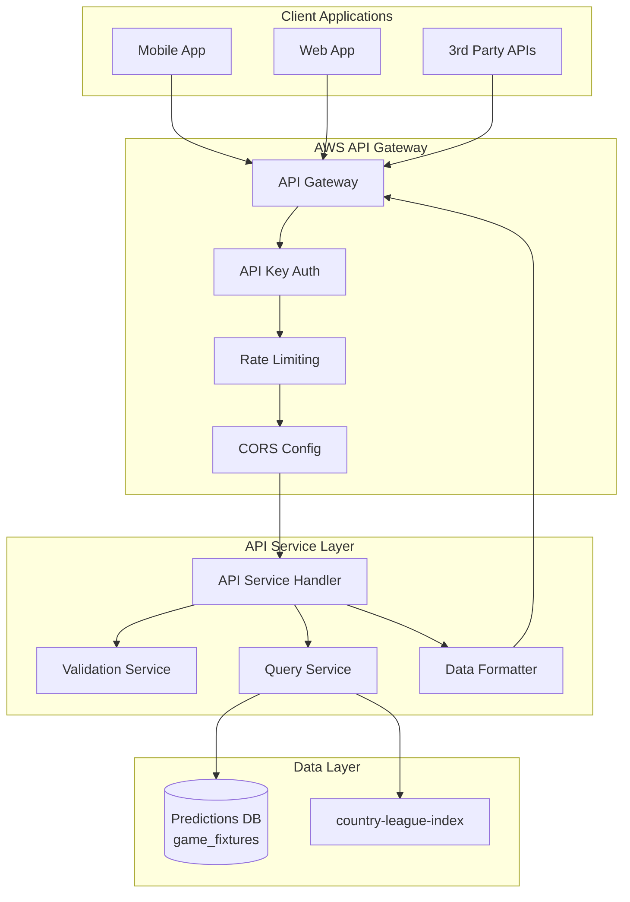
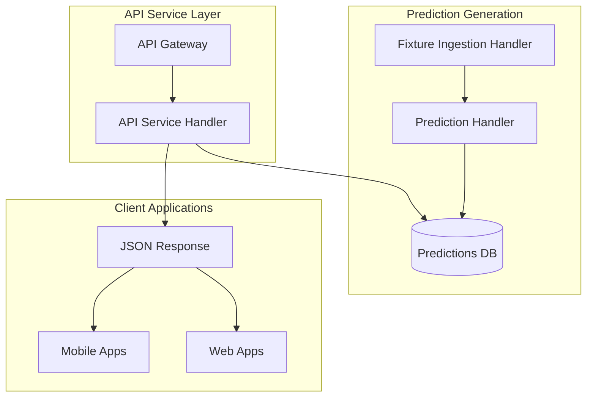
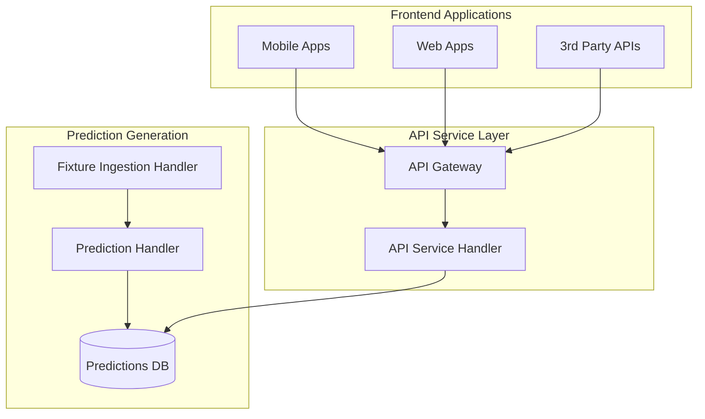

# API Service Layer Implementation Guide

**Document Version:** 1.0  
**Created:** 2025-10-04  
**Status:** 🔧 Implementation Required  
**Priority:** 🎯 **HIGH** - Essential for serving predictions to frontend applications  

## 📋 Executive Summary

This document provides complete implementation guidelines for building the API service layer that serves prediction data to mobile apps and web frontends. The implementation is based on [`code-samples/analysis_backend_mobile.py`](../code-samples/analysis_backend_mobile.py) but architected for the new modular system with enhanced security, scalability, and integration with AWS API Gateway.

**PURPOSE:** Create a production-ready REST API that allows external applications to query prediction data from the football fixture predictions system.

## 🔍 Analysis of Reference Code

### Current Code Sample Analysis
From [`code-samples/analysis_backend_mobile.py`](../code-samples/analysis_backend_mobile.py:15):

**Key Features Identified:**
- ✅ **API Key Authentication** via `MOBILE_APP_KEY` environment variable
- ✅ **Flexible Querying** - by fixture ID or by country/league with date ranges
- ✅ **Secondary Index Usage** - `country-league-index` for efficient queries
- ✅ **Data Filtering** - Returns only essential fields for frontend consumption
- ✅ **Pagination Support** - Handles `LastEvaluatedKey` for large result sets
- ✅ **CORS Headers** - Ready for web frontend integration
- ✅ **Error Handling** - Comprehensive try/catch with appropriate status codes

**Query Patterns Supported:**
1. **Single Fixture:** `GET /predictions?fixture_id=123456`
2. **League Fixtures:** `GET /predictions?country=England&league=Premier League&startDate=2024-01-01&endDate=2024-01-07`

### Data Structure Returned
```json
{
  "items": [
    {
      "fixture_id": 123456,
      "timestamp": 1704117600,
      "date": "2024-01-01T15:00:00+00:00",
      "has_best_bet": true,
      "home": {
        "team_id": 1,
        "team_name": "Team A",
        "team_logo": "logo_url",
        "predicted_goals": 1.5,
        "predicted_goals_alt": 1.3,
        "home_performance": 0.65
      },
      "away": {
        "team_id": 2,
        "team_name": "Team B", 
        "team_logo": "logo_url",
        "predicted_goals": 0.9,
        "predicted_goals_alt": 1.1,
        "away_performance": 0.45
      }
    }
  ],
  "last_evaluated_key": null
}
```

## 🏗️ Implementation Architecture

### API Service Architecture



### Integration with Existing System



## 📁 Implementation Structure

```
src/
├── handlers/
│   └── api_service_handler.py          # NEW - Main API handler
├── services/
│   ├── query_service.py                # NEW - Database query logic
│   ├── data_formatter.py               # NEW - Response formatting
│   └── validation_service.py           # NEW - Input validation
├── config/
│   └── api_config.py                   # NEW - API configuration
├── utils/
│   ├── api_utils.py                    # NEW - API utilities
│   └── constants.py                    # UPDATE - Add API constants
└── infrastructure/
    └── api_gateway_setup.py            # NEW - API Gateway deployment
```

## 🔧 Detailed Implementation

### 1. Main API Service Handler

**File:** `src/handlers/api_service_handler.py`

```python
"""
API Service Handler - REST API for serving prediction data to frontend applications.
Based on code-samples/analysis_backend_mobile.py but architected for modular system.
"""

import json
import os
from datetime import datetime, timedelta
from typing import Dict, List, Optional, Any

from ..services.query_service import QueryService
from ..services.data_formatter import DataFormatter
from ..services.validation_service import ValidationService
from ..config.api_config import APIConfig
from ..utils.api_utils import APIResponse, APIError
from ..utils.converters import decimal_default


class APIServiceHandler:
    """Main handler for prediction API requests."""
    
    def __init__(self):
        self.query_service = QueryService()
        self.data_formatter = DataFormatter()
        self.validation_service = ValidationService()
        self.config = APIConfig()
        
    def handle_request(self, event: Dict, context: Any) -> Dict:
        """
        Main request handler for API Gateway events.
        
        Args:
            event: API Gateway event data
            context: Lambda context
            
        Returns:
            Dict: API Gateway response with statusCode, headers, and body
        """
        print(f"API Request: {json.dumps(event, default=str)}")
        
        try:
            # Authenticate request
            if not self._authenticate_request(event):
                return APIResponse.unauthorized("Authentication failed")
            
            print("API request authenticated successfully")
            
            # Extract and validate parameters
            query_params = event.get('queryStringParameters') or {}
            
            validation_result = self.validation_service.validate_query_params(query_params)
            if not validation_result.is_valid:
                return APIResponse.bad_request(validation_result.error_message)
            
            # Determine query type and execute
            if 'fixture_id' in query_params:
                return self._handle_fixture_query(query_params)
            else:
                return self._handle_league_query(query_params)
                
        except Exception as e:
            print(f"API Error: {str(e)}")
            return APIResponse.server_error(f"Server error: {str(e)}")
    
    def _authenticate_request(self, event: Dict) -> bool:
        """
        Authenticate API request using API key.
        
        Args:
            event: API Gateway event
            
        Returns:
            bool: True if authenticated, False otherwise
        """
        try:
            # Get API key from request context (API Gateway managed)
            request_context = event.get('requestContext', {})
            identity = request_context.get('identity', {})
            api_key = identity.get('apiKey', '')
            
            # Validate against configured API key
            expected_key = os.getenv('MOBILE_APP_KEY')
            if not expected_key:
                print("MOBILE_APP_KEY environment variable not configured")
                return False
                
            return api_key == expected_key
            
        except Exception as e:
            print(f"Authentication error: {e}")
            return False
    
    def _handle_fixture_query(self, query_params: Dict) -> Dict:
        """
        Handle single fixture query.
        
        Args:
            query_params: Query parameters from request
            
        Returns:
            Dict: API response
        """
        try:
            fixture_id = int(query_params['fixture_id'])
            
            # Query single fixture
            fixture_data = self.query_service.get_fixture_by_id(fixture_id)
            
            if not fixture_data:
                return APIResponse.not_found(f"Fixture {fixture_id} not found")
            
            # Format response
            formatted_data = self.data_formatter.format_fixture_response(fixture_data)
            
            response_body = {
                'items': formatted_data,
                'last_evaluated_key': None,
                'query_type': 'single_fixture',
                'total_items': len(formatted_data)
            }
            
            return APIResponse.success(response_body)
            
        except ValueError:
            return APIResponse.bad_request("Invalid fixture_id format")
        except Exception as e:
            print(f"Fixture query error: {e}")
            return APIResponse.server_error("Error retrieving fixture data")
    
    def _handle_league_query(self, query_params: Dict) -> Dict:
        """
        Handle league-based fixture query with date filtering.
        
        Args:
            query_params: Query parameters from request
            
        Returns:
            Dict: API response
        """
        try:
            # Extract required parameters
            country = query_params.get('country')
            league = query_params.get('league')
            
            if not country or not league:
                return APIResponse.bad_request(
                    "Both 'country' and 'league' parameters are required"
                )
            
            # Parse date parameters or use defaults
            date_range = self._parse_date_range(query_params)
            
            print(f"Querying league: {country} - {league} from {date_range['start']} to {date_range['end']}")
            
            # Execute query
            fixtures_data = self.query_service.get_league_fixtures(
                country=country,
                league=league,
                start_time=date_range['start_timestamp'],
                end_time=date_range['end_timestamp'],
                limit=query_params.get('limit'),
                last_key=query_params.get('last_key')
            )
            
            # Format response
            formatted_data = self.data_formatter.format_league_response(fixtures_data)
            
            response_body = {
                'items': formatted_data['items'],
                'last_evaluated_key': formatted_data['last_evaluated_key'],
                'query_type': 'league_fixtures',
                'total_items': len(formatted_data['items']),
                'date_range': {
                    'start': date_range['start'],
                    'end': date_range['end']
                },
                'filters': {
                    'country': country,
                    'league': league
                }
            }
            
            return APIResponse.success(response_body)
            
        except Exception as e:
            print(f"League query error: {e}")
            return APIResponse.server_error("Error retrieving league fixtures")
    
    def _parse_date_range(self, query_params: Dict) -> Dict:
        """
        Parse date range parameters or provide defaults.
        
        Args:
            query_params: Query parameters
            
        Returns:
            Dict: Date range with timestamps
        """
        start_date_str = query_params.get('startDate')
        end_date_str = query_params.get('endDate')
        
        if start_date_str and end_date_str:
            try:
                start_time = int(datetime.strptime(start_date_str, '%Y-%m-%d').timestamp())
                end_time = int(datetime.strptime(end_date_str, '%Y-%m-%d').timestamp())
                return {
                    'start': start_date_str,
                    'end': end_date_str,
                    'start_timestamp': start_time,
                    'end_timestamp': end_time
                }
            except ValueError as e:
                raise ValueError(f"Invalid date format: {e}")
        else:
            # Default range: current day to 4 days in future
            current_time = datetime.utcnow()
            start_time = int(current_time.timestamp())
            end_time = int((current_time + timedelta(days=4)).timestamp())
            
            return {
                'start': current_time.strftime('%Y-%m-%d'),
                'end': (current_time + timedelta(days=4)).strftime('%Y-%m-%d'),
                'start_timestamp': start_time,
                'end_timestamp': end_time
            }


def lambda_handler(event, context):
    """
    Lambda handler entry point for API Gateway.
    
    Args:
        event: API Gateway event
        context: Lambda context
        
    Returns:
        Dict: API Gateway response
    """
    handler = APIServiceHandler()
    return handler.handle_request(event, context)
```

### 2. Query Service Module

**File:** `src/services/query_service.py`

```python
"""
Query Service - Database query operations for API service.
Handles DynamoDB queries with proper error handling and optimization.
"""

import boto3
from boto3.dynamodb.conditions import Key
from decimal import Decimal
from typing import List, Dict, Optional, Any

from ..utils.constants import GAME_FIXTURES_TABLE
from ..utils.converters import convert_for_json


class QueryService:
    """Service for database query operations."""
    
    def __init__(self):
        self.dynamodb = boto3.resource('dynamodb')
        self.table = self.dynamodb.Table(GAME_FIXTURES_TABLE)
    
    def get_fixture_by_id(self, fixture_id: int) -> List[Dict]:
        """
        Get a specific fixture by ID.
        
        Args:
            fixture_id: Fixture identifier
            
        Returns:
            List of fixture records (usually 1 item)
        """
        try:
            response = self.table.query(
                KeyConditionExpression=Key('fixture_id').eq(fixture_id),
                Limit=1,
                ScanIndexForward=False  # Get latest version first
            )
            
            return response.get('Items', [])
            
        except Exception as e:
            print(f"Error querying fixture {fixture_id}: {e}")
            return []
    
    def get_league_fixtures(self, country: str, league: str, 
                           start_time: int, end_time: int,
                           limit: Optional[str] = None,
                           last_key: Optional[str] = None) -> Dict:
        """
        Get fixtures for a league within date range.
        
        Args:
            country: Country name
            league: League name
            start_time: Start timestamp
            end_time: End timestamp
            limit: Maximum items to return
            last_key: Last evaluated key for pagination
            
        Returns:
            Dict with items and pagination info
        """
        try:
            # Build query parameters
            params = {
                'IndexName': 'country-league-index',
                'KeyConditionExpression': '#ct = :country AND #lg = :league',
                'ExpressionAttributeNames': {
                    '#ct': 'country',
                    '#lg': 'league',
                    '#ts': 'timestamp'
                },
                'ExpressionAttributeValues': {
                    ':country': country,
                    ':league': league,
                    ':start_ts': Decimal(start_time),
                    ':end_ts': Decimal(end_time)
                },
                'FilterExpression': '#ts BETWEEN :start_ts AND :end_ts'
            }
            
            # Add limit if specified
            if limit:
                try:
                    params['Limit'] = int(limit)
                except ValueError:
                    pass  # Ignore invalid limit
            
            # Add pagination key if specified
            if last_key:
                try:
                    # Decode last_key (would need proper implementation)
                    # For now, assuming it's a JSON string
                    import json
                    params['ExclusiveStartKey'] = json.loads(last_key)
                except:
                    pass  # Ignore invalid last_key
            
            # Execute query with pagination
            all_items = []
            last_evaluated_key = None
            
            while True:
                if last_evaluated_key:
                    params['ExclusiveStartKey'] = last_evaluated_key
                else:
                    params.pop('ExclusiveStartKey', None)
                
                response = self.table.query(**params)
                items = response.get('Items', [])
                all_items.extend(items)
                
                last_evaluated_key = response.get('LastEvaluatedKey')
                
                # Break if no more pages or if we have a limit
                if not last_evaluated_key or (limit and len(all_items) >= int(limit)):
                    break
            
            return {
                'items': all_items,
                'last_evaluated_key': last_evaluated_key
            }
            
        except Exception as e:
            print(f"Error querying league fixtures: {e}")
            return {'items': [], 'last_evaluated_key': None}
```

### 3. Data Formatter Module

**File:** `src/services/data_formatter.py`

```python
"""
Data Formatter - Format database records for API responses.
Ensures consistent data structure and removes sensitive information.
"""

from typing import List, Dict, Any, Optional
from decimal import Decimal


class DataFormatter:
    """Service for formatting API response data."""
    
    def format_fixture_response(self, fixtures: List[Dict]) -> List[Dict]:
        """
        Format fixture data for single fixture response.
        
        Args:
            fixtures: Raw fixture data from database
            
        Returns:
            List of formatted fixture dictionaries
        """
        return [self._format_single_fixture(fixture) for fixture in fixtures]
    
    def format_league_response(self, query_result: Dict) -> Dict:
        """
        Format league fixtures query result.
        
        Args:
            query_result: Result from query service
            
        Returns:
            Dict with formatted items and pagination info
        """
        formatted_items = []
        
        for item in query_result.get('items', []):
            formatted_item = self._format_single_fixture(item)
            formatted_items.append(formatted_item)
        
        return {
            'items': formatted_items,
            'last_evaluated_key': query_result.get('last_evaluated_key')
        }
    
    def _format_single_fixture(self, item: Dict) -> Dict:
        """
        Format a single fixture record.
        Based on the filtering logic from analysis_backend_mobile.py.
        
        Args:
            item: Raw fixture record from database
            
        Returns:
            Dict: Formatted fixture data
        """
        # Check if fixture has best bet information
        has_best_bet = (
            'best_bet' in item and 
            item['best_bet'] and 
            len(item.get('best_bet', [])) > 0
        )
        
        # Extract home team data
        home_data = item.get('home', {})
        home_team = {
            'team_id': home_data.get('team_id'),
            'team_name': home_data.get('team_name'),
            'team_logo': home_data.get('team_logo'),
            'predicted_goals': self._safe_decimal_convert(home_data.get('predicted_goals')),
            'predicted_goals_alt': self._safe_decimal_convert(home_data.get('predicted_goals_alt')),
            'home_performance': self._safe_decimal_convert(home_data.get('home_performance'))
        }
        
        # Extract away team data
        away_data = item.get('away', {})
        away_team = {
            'team_id': away_data.get('team_id'),
            'team_name': away_data.get('team_name'),
            'team_logo': away_data.get('team_logo'),
            'predicted_goals': self._safe_decimal_convert(away_data.get('predicted_goals')),
            'predicted_goals_alt': self._safe_decimal_convert(away_data.get('predicted_goals_alt')),
            'away_performance': self._safe_decimal_convert(away_data.get('away_performance'))
        }
        
        # Build formatted response
        formatted_fixture = {
            'fixture_id': item.get('fixture_id'),
            'timestamp': self._safe_decimal_convert(item.get('timestamp')),
            'date': item.get('date'),
            'has_best_bet': has_best_bet,
            'home': home_team,
            'away': away_team
        }
        
        # Add additional fields if available
        if 'league' in item:
            formatted_fixture['league'] = item['league']
        
        if 'country' in item:
            formatted_fixture['country'] = item['country']
        
        # Add best bet information if available
        if has_best_bet:
            formatted_fixture['best_bet'] = item.get('best_bet')
        
        # Add prediction confidence if available
        if 'prediction_confidence' in item:
            formatted_fixture['prediction_confidence'] = self._safe_decimal_convert(
                item['prediction_confidence']
            )
        
        return formatted_fixture
    
    def _safe_decimal_convert(self, value: Any) -> Any:
        """
        Safely convert Decimal values to appropriate types.
        
        Args:
            value: Value to convert
            
        Returns:
            Converted value (int, float, or original)
        """
        if isinstance(value, Decimal):
            if value % 1 == 0:
                return int(value)
            else:
                return float(value)
        return value
```

### 4. Validation Service Module

**File:** `src/services/validation_service.py`

```python
"""
Validation Service - Input validation for API requests.
Ensures data integrity and security.
"""

import re
from typing import Dict, NamedTuple
from datetime import datetime


class ValidationResult(NamedTuple):
    """Result of validation check."""
    is_valid: bool
    error_message: str = ""


class ValidationService:
    """Service for validating API request parameters."""
    
    def __init__(self):
        # Allowed parameter patterns
        self.country_pattern = re.compile(r'^[A-Za-z\s\-]{1,50}$')
        self.league_pattern = re.compile(r'^[A-Za-z0-9\s\-\.]{1,100}$')
        self.date_pattern = re.compile(r'^\d{4}-\d{2}-\d{2}$')
    
    def validate_query_params(self, params: Dict) -> ValidationResult:
        """
        Validate query parameters for API request.
        
        Args:
            params: Query parameters dictionary
            
        Returns:
            ValidationResult with validation status
        """
        # Check for fixture_id query
        if 'fixture_id' in params:
            return self._validate_fixture_id(params['fixture_id'])
        
        # Check for league query parameters
        if 'country' in params or 'league' in params:
            return self._validate_league_params(params)
        
        return ValidationResult(
            is_valid=False,
            error_message="Either 'fixture_id' or both 'country' and 'league' parameters are required"
        )
    
    def _validate_fixture_id(self, fixture_id: str) -> ValidationResult:
        """Validate fixture ID parameter."""
        try:
            fixture_id_int = int(fixture_id)
            if fixture_id_int <= 0:
                return ValidationResult(
                    is_valid=False,
                    error_message="fixture_id must be a positive integer"
                )
            return ValidationResult(is_valid=True)
        except ValueError:
            return ValidationResult(
                is_valid=False,
                error_message="fixture_id must be a valid integer"
            )
    
    def _validate_league_params(self, params: Dict) -> ValidationResult:
        """Validate league query parameters."""
        country = params.get('country', '').strip()
        league = params.get('league', '').strip()
        
        # Check required parameters
        if not country:
            return ValidationResult(
                is_valid=False,
                error_message="'country' parameter is required and cannot be empty"
            )
        
        if not league:
            return ValidationResult(
                is_valid=False,
                error_message="'league' parameter is required and cannot be empty"
            )
        
        # Validate country format
        if not self.country_pattern.match(country):
            return ValidationResult(
                is_valid=False,
                error_message="'country' parameter contains invalid characters or is too long"
            )
        
        # Validate league format
        if not self.league_pattern.match(league):
            return ValidationResult(
                is_valid=False,
                error_message="'league' parameter contains invalid characters or is too long"
            )
        
        # Validate date parameters if provided
        start_date = params.get('startDate')
        end_date = params.get('endDate')
        
        if start_date:
            date_validation = self._validate_date_format(start_date, 'startDate')
            if not date_validation.is_valid:
                return date_validation
        
        if end_date:
            date_validation = self._validate_date_format(end_date, 'endDate')
            if not date_validation.is_valid:
                return date_validation
        
        # Validate date range if both provided
        if start_date and end_date:
            range_validation = self._validate_date_range(start_date, end_date)
            if not range_validation.is_valid:
                return range_validation
        
        # Validate optional limit parameter
        limit = params.get('limit')
        if limit:
            try:
                limit_int = int(limit)
                if limit_int <= 0 or limit_int > 1000:
                    return ValidationResult(
                        is_valid=False,
                        error_message="'limit' must be between 1 and 1000"
                    )
            except ValueError:
                return ValidationResult(
                    is_valid=False,
                    error_message="'limit' must be a valid integer"
                )
        
        return ValidationResult(is_valid=True)
    
    def _validate_date_format(self, date_str: str, param_name: str) -> ValidationResult:
        """Validate date format (YYYY-MM-DD)."""
        if not self.date_pattern.match(date_str):
            return ValidationResult(
                is_valid=False,
                error_message=f"'{param_name}' must be in YYYY-MM-DD format"
            )
        
        try:
            datetime.strptime(date_str, '%Y-%m-%d')
            return ValidationResult(is_valid=True)
        except ValueError:
            return ValidationResult(
                is_valid=False,
                error_message=f"'{param_name}' is not a valid date"
            )
    
    def _validate_date_range(self, start_date: str, end_date: str) -> ValidationResult:
        """Validate date range logic."""
        try:
            start = datetime.strptime(start_date, '%Y-%m-%d')
            end = datetime.strptime(end_date, '%Y-%m-%d')
            
            if start >= end:
                return ValidationResult(
                    is_valid=False,
                    error_message="'startDate' must be before 'endDate'"
                )
            
            # Check if date range is reasonable (e.g., not more than 1 year)
            if (end - start).days > 365:
                return ValidationResult(
                    is_valid=False,
                    error_message="Date range cannot exceed 365 days"
                )
            
            return ValidationResult(is_valid=True)
            
        except ValueError:
            return ValidationResult(
                is_valid=False,
                error_message="Invalid date format in date range"
            )
```

### 5. API Utilities Module

**File:** `src/utils/api_utils.py`

```python
"""
API Utilities - Helper classes and functions for API responses.
Standardizes API response format and error handling.
"""

import json
from typing import Dict, Any
from ..utils.converters import decimal_default


class APIResponse:
    """Standard API response builder."""
    
    @staticmethod
    def _build_response(status_code: int, body: Any, 
                       additional_headers: Dict = None) -> Dict:
        """Build standardized API Gateway response."""
        headers = {
            'Access-Control-Allow-Origin': '*',
            'Access-Control-Allow-Headers': 'Content-Type,X-Amz-Date,Authorization,X-Api-Key,X-Amz-Security-Token',
            'Access-Control-Allow-Methods': 'OPTIONS,GET,POST',
            'Content-Type': 'application/json'
        }
        
        if additional_headers:
            headers.update(additional_headers)
        
        return {
            'statusCode': status_code,
            'headers': headers,
            'body': json.dumps(body, default=decimal_default)
        }
    
    @staticmethod
    def success(data: Any, additional_headers: Dict = None) -> Dict:
        """Return successful response with data."""
        return APIResponse._build_response(200, data, additional_headers)
    
    @staticmethod
    def bad_request(message: str) -> Dict:
        """Return 400 Bad Request response."""
        return APIResponse._build_response(400, {'error': message})
    
    @staticmethod
    def unauthorized(message: str) -> Dict:
        """Return 401 Unauthorized response."""
        return APIResponse._build_response(401, {'error': message})
    
    @staticmethod
    def not_found(message: str) -> Dict:
        """Return 404 Not Found response."""
        return APIResponse._build_response(404, {'error': message})
    
    @staticmethod
    def server_error(message: str) -> Dict:
        """Return 500 Server Error response."""
        return APIResponse._build_response(500, {'error': message})


class APIError(Exception):
    """Custom API error class."""
    
    def __init__(self, message: str, status_code: int = 500):
        self.message = message
        self.status_code = status_code
        super().__init__(self.message)
```

## ⚙️ AWS API Gateway Configuration

### 1. API Gateway Setup

**File:** `src/infrastructure/api_gateway_setup.py`

```python
"""
API Gateway setup and configuration.
Deploy and configure API Gateway for the prediction API service.
"""

import boto3
import json
from typing import Dict, Any


class APIGatewaySetup:
    """Setup and configure API Gateway for the prediction service."""
    
    def __init__(self, region_name: str = 'eu-west-2'):
        self.apigateway = boto3.client('apigateway', region_name=region_name)
        self.lambda_client = boto3.client('lambda', region_name=region_name)
        
    def create_api(self, api_name: str = 'football-predictions-api') -> str:
        """
        Create REST API in API Gateway.
        
        Args:
            api_name: Name of the API
            
        Returns:
            str: API ID
        """
        try:
            response = self.apigateway.create_rest_api(
                name=api_name,
                description='Football Prediction API for mobile and web applications',
                endpointConfiguration={
                    'types': ['REGIONAL']
                },
                tags={
                    'Environment': 'production',
                    'Service': 'football-predictions',
                    'Component': 'api-gateway'
                }
            )
            
            api_id = response['id']
            print(f"Created API Gateway: {api_id}")
            return api_id
            
        except Exception as e:
            print(f"Error creating API Gateway: {e}")
            raise
    
    def setup_resources_and_methods(self, api_id: str, lambda_function_arn: str) -> Dict:
        """
        Set up API resources, methods, and integrations.
        
        Args:
            api_id: API Gateway ID
            lambda_function_arn: ARN of the Lambda function
            
        Returns:
            Dict: Resource and method configuration
        """
        try:
            # Get root resource
            resources = self.apigateway.get_resources(restApiId=api_id)
            root_resource_id = None
            
            for resource in resources['items']:
                if resource['path'] == '/':
                    root_resource_id = resource['id']
                    break
            
            if not root_resource_id:
                raise Exception("Root resource not found")
            
            # Create /predictions resource
            predictions_resource = self.apigateway.create_resource(
                restApiId=api_id,
                parentId=root_resource_id,
                pathPart='predictions'
            )
            predictions_resource_id = predictions_resource['id']
            
            # Create GET method
            self.apigateway.put_method(
                restApiId=api_id,
                resourceId=predictions_resource_id,
                httpMethod='GET',
                authorizationType='NONE',
                apiKeyRequired=True,  # Require API key
                requestParameters={
                    'method.request.querystring.country': False,
                    'method.request.querystring.league': False,
                    'method.request.querystring.fixture_id': False,
                    'method.request.querystring.startDate': False,
                    'method.request.querystring.endDate': False,
                    'method.request.querystring.limit': False
                }
            )
            
            # Set up Lambda integration
            integration_uri = f"arn:aws:apigateway:{boto3.Session().region_name}:lambda:path/2015-03-31/functions/{lambda_function_arn}/invocations"
            
            self.apigateway.put_integration(
                restApiId=api_id,
                resourceId=predictions_resource_id,
                httpMethod='GET',
                type='AWS_PROXY',
                integrationHttpMethod='POST',
                uri=integration_uri
            )
            
            # Create OPTIONS method for CORS
            self.apigateway.put_method(
                restApiId=api_id,
                resourceId=predictions_resource_id,
                httpMethod='OPTIONS',
                authorizationType='NONE',
                apiKeyRequired=False
            )
            
            # Set up OPTIONS integration for CORS
            self.apigateway.put_integration(
                restApiId=api_id,
                resourceId=predictions_resource_id,
                httpMethod='OPTIONS',
                type='MOCK',
                requestTemplates={
                    'application/json': '{"statusCode": 200}'
                }
            )
            
            # Set up OPTIONS method response
            self.apigateway.put_method_response(
                restApiId=api_id,
                resourceId=predictions_resource_id,
                httpMethod='OPTIONS',
                statusCode='200',
                responseParameters={
                    'method.response.header.Access-Control-Allow-Origin': True,
                    'method.response.header.Access-Control-Allow-Headers': True,
                    'method.response.header.Access-Control-Allow-Methods': True
                }
            )
            
            # Set up OPTIONS integration response
            self.apigateway.put_integration_response(
                restApiId=api_id,
                resourceId=predictions_resource_id,
                httpMethod='OPTIONS',
                statusCode='200',
                responseParameters={
                    'method.response.header.Access-Control-Allow-Origin': "'*'",
                    'method.response.header.Access-Control-Allow-Headers': "'Content-Type,X-Amz-Date,Authorization,X-Api-Key,X-Amz-Security-Token'",
                    'method.response.header.Access-Control-Allow-Methods': "'OPTIONS,GET'"
                }
            )
            
            return {
                'predictions_resource_id': predictions_resource_id,
                'api_id': api_id
            }
            
        except Exception as e:
            print(f"Error setting up resources and methods: {e}")
            raise
    
    def create_usage_plan_and_api_key(self, api_id: str, stage_name: str = 'prod') -> Dict:
        """
        Create usage plan and API key for rate limiting and access control.
        
        Args:
            api_id: API Gateway ID
            stage_name: Deployment stage name
            
        Returns:
            Dict: Usage plan and API key information
        """
        try:
            # Create usage plan
            usage_plan = self.apigateway.create_usage_plan(
                name='football-predictions-usage-plan',
                description='Usage plan for football predictions API',
                throttle={
                    'rateLimit': 10.0,  # 10 requests per second
                    'burstLimit': 20    # 20 requests burst
                },
                quota={
                    'limit': 10000,     # 10,000 requests per month
                    'period': 'MONTH'
                }
            )
            
            usage_plan_id = usage_plan['id']
            
            # Associate API stage with usage plan
            self.apigateway.create_usage_plan_key(
                usagePlanId=usage_plan_id,
                keyId=api_id,
                keyType='API_KEY'
            )
            
            # Create API key
            api_key_response = self.apigateway.create_api_key(
                name='football-predictions-mobile-key',
                description='API key for mobile and web applications',
                enabled=True,
                tags={
                    'Environment': 'production',
                    'Service': 'football-predictions'
                }
            )
            
            api_key_id = api_key_response['id']
            api_key_value = api_key_response['value']
            
            # Associate API key with usage plan
            self.apigateway.create_usage_plan_key(
                usagePlanId=usage_plan_id,
                keyId=api_key_id,
                keyType='API_KEY'
            )
            
            return {
                'usage_plan_id': usage_plan_id,
                'api_key_id': api_key_id,
                'api_key_value': api_key_value
            }
            
        except Exception as e:
            print(f"Error creating usage plan and API key: {e}")
            raise
    
    def deploy_api(self, api_id: str, stage_name: str = 'prod') -> str:
        """
        Deploy API to a stage.
        
        Args:
            api_id: API Gateway ID
            stage_name: Stage name for deployment
            
        Returns:
            str: API endpoint URL
        """
        try:
            # Create deployment
            deployment = self.apigateway.create_deployment(
                restApiId=api_id,
                stageName=stage_name,
                description=f'Production deployment of football predictions API'
            )
            
            # Get API endpoint URL
            region = boto3.Session().region_name
            endpoint_url = f"https://{api_id}.execute-api.{region}.amazonaws.com/{stage_name}"
            
            print(f"API deployed to: {endpoint_url}")
            return endpoint_url
            
        except Exception as e:
            print(f"Error deploying API: {e}")
            raise


def deploy_complete_api_gateway(lambda_function_arn: str) -> Dict:
    """
    Deploy complete API Gateway setup.
    
    Args:
        lambda_function_arn: ARN of the Lambda function
        
    Returns:
        Dict: Complete deployment information
    """
    setup = APIGatewaySetup()
    
    try:
        # Create API
        api_id = setup.create_api()
        
        # Set up resources and methods
        resources = setup.setup_resources_and_methods(api_id, lambda_function_arn)
        
        # Deploy API
        endpoint_url = setup.deploy_api(api_id)
        
        # Create usage plan and API key
        usage_plan_info = setup.create_usage_plan_and_api_key(api_id)
        
        return {
            'api_id': api_id,
            'endpoint_url': endpoint_url,
            'usage_plan_id': usage_plan_info['usage_plan_id'],
            'api_key_id': usage_plan_info['api_key_id'],
            'api_key_value': usage_plan_info['api_key_value'],
            'full_endpoint': f"{endpoint_url}/predictions"
        }
        
    except Exception as e:
        print(f"Error deploying complete API Gateway: {e}")
        raise


if __name__ == "__main__":
    # Example deployment
    lambda_arn = "arn:aws:lambda:eu-west-2:123456789012:function:football-api-service"
    result = deploy_complete_api_gateway(lambda_arn)
    print(json.dumps(result, indent=2))
```

### 2. Terraform Configuration (Alternative)

**File:** `terraform/api_gateway.tf`

```hcl
# API Gateway configuration
resource "aws_api_gateway_rest_api" "football_predictions_api" {
  name        = "football-predictions-api"
  description = "Football Prediction API for mobile and web applications"
  
  endpoint_configuration {
    types = ["REGIONAL"]
  }

  tags = {
    Environment = "production"
    Service     = "football-predictions"
    Component   = "api-gateway"
  }
}

# Predictions resource
resource "aws_api_gateway_resource" "predictions" {
  rest_api_id = aws_api_gateway_rest_api.football_predictions_api.id
  parent_id   = aws_api_gateway_rest_api.football_predictions_api.root_resource_id
  path_part   = "predictions"
}

# GET method
resource "aws_api_gateway_method" "get_predictions" {
  rest_api_id   = aws_api_gateway_rest_api.football_predictions_api.id
  resource_id   = aws_api_gateway_resource.predictions.id
  http_method   = "GET"
  authorization = "NONE"
  api_key_required = true

  request_parameters = {
    "method.request.querystring.country"    = false
    "method.request.querystring.league"     = false
    "method.request.querystring.fixture_id" = false
    "method.request.querystring.startDate"  = false
    "method.request.querystring.endDate"    = false
    "method.request.querystring.limit"      = false
  }
}

# Lambda integration
resource "aws_api_gateway_integration" "lambda_integration" {
  rest_api_id = aws_api_gateway_rest_api.football_predictions_api.id
  resource_id = aws_api_gateway_resource.predictions.id
  http_method = aws_api_gateway_method.get_predictions.http_method

  integration_http_method = "POST"
  type                   = "AWS_PROXY"
  uri                    = aws_lambda_function.api_service.invoke_arn
}

# CORS OPTIONS method
resource "aws_api_gateway_method" "options_predictions" {
  rest_api_id   = aws_api_gateway_rest_api.football_predictions_api.id
  resource_id   = aws_api_gateway_resource.predictions.id
  http_method   = "OPTIONS"
  authorization = "NONE"
}

# Lambda function
resource "aws_lambda_function" "api_service" {
  filename         = "api_service_deployment.zip"
  function_name    = "football-api-service"
  role            = aws_iam_role.lambda_role.arn
  handler         = "src.handlers.api_service_handler.lambda_handler"
  runtime         = "python3.11"
  timeout         = 30
  memory_size     = 256

  environment {
    variables = {
      MOBILE_APP_KEY      = var.mobile_app_key
      GAME_FIXTURES_TABLE = var.game_fixtures_table
    }
  }

  tags = {
    Environment = "production"
    Service     = "football-predictions"
    Component   = "api-service"
  }
}

# Usage plan
resource "aws_api_gateway_usage_plan" "football_api_usage_plan" {
  name         = "football-predictions-usage-plan"
  description  = "Usage plan for football predictions API"

  api_stages {
    api_id = aws_api_gateway_rest_api.football_predictions_api.id
    stage  = aws_api_gateway_deployment.prod.stage_name
  }

  throttle_settings {
    rate_limit  = 10
    burst_limit = 20
  }

  quota_settings {
    limit  = 10000
    period = "MONTH"
  }
}

# API key
resource "aws_api_gateway_api_key" "mobile_app_key" {
  name        = "football-predictions-mobile-key"
  description = "API key for mobile and web applications"
  enabled     = true

  tags = {
    Environment = "production"
    Service     = "football-predictions"
  }
}

# Associate API key with usage plan
resource "aws_api_gateway_usage_plan_key" "mobile_app_key_association" {
  key_id        = aws_api_gateway_api_key.mobile_app_key.id
  key_type      = "API_KEY"
  usage_plan_id = aws_api_gateway_usage_plan.football_api_usage_plan.id
}

# Deployment
resource "aws_api_gateway_deployment" "prod" {
  depends_on = [
    aws_api_gateway_method.get_predictions,
    aws_api_gateway_integration.lambda_integration,
    aws_api_gateway_method.options_predictions
  ]

  rest_api_id = aws_api_gateway_rest_api.football_predictions_api.id
  stage_name  = "prod"

  lifecycle {
    create_before_destroy = true
  }
}

# Lambda permission for API Gateway
resource "aws_lambda_permission" "api_gateway_invoke" {
  statement_id  = "AllowExecutionFromAPIGateway"
  action        = "lambda:InvokeFunction"
  function_name = aws_lambda_function.api_service.function_name
  principal     = "apigateway.amazonaws.com"
  source_arn    = "${aws_api_gateway_rest_api.football_predictions_api.execution_arn}/*/*"
}

# Outputs
output "api_endpoint_url" {
  value = "https://${aws_api_gateway_rest_api.football_predictions_api.id}.execute-api.${data.aws_region.current.name}.amazonaws.com/prod/predictions"
}

output "api_key_value" {
  value     = aws_api_gateway_api_key.mobile_app_key.value
  sensitive = true
}
```

## 🧪 Testing Strategy

### 1. Unit Tests

**File:** `tests/test_api_service.py`

```python
import pytest
import json
from unittest.mock import Mock, patch, MagicMock
from src.handlers.api_service_handler import APIServiceHandler, lambda_handler


class TestAPIServiceHandler:
    """Test cases for API Service Handler."""
    
    def setup_method(self):
        """Set up test fixtures."""
        self.handler = APIServiceHandler()
        
    @patch.dict('os.environ', {'MOBILE_APP_KEY': 'test-key-12345'})
    def test_authentication_success(self):
        """Test successful API key authentication."""
        event = {
            'requestContext': {
                'identity': {
                    'apiKey': 'test-key-12345'
                }
            },
            'queryStringParameters': {'fixture_id': '123456'}
        }
        
        assert self.handler._authenticate_request(event) == True
    
    @patch.dict('os.environ', {'MOBILE_APP_KEY': 'test-key-12345'})
    def test_authentication_failure(self):
        """Test failed API key authentication."""
        event = {
            'requestContext': {
                'identity': {
                    'apiKey': 'invalid-key'
                }
            },
            'queryStringParameters': {'fixture_id': '123456'}
        }
        
        assert self.handler._authenticate_request(event) == False
    
    @patch('src.handlers.api_service_handler.APIServiceHandler._authenticate_request')
    @patch('src.services.query_service.QueryService.get_fixture_by_id')
    def test_fixture_query_success(self, mock_query, mock_auth):
        """Test successful single fixture query."""
        # Mock authentication
        mock_auth.return_value = True
        
        # Mock query result
        mock_fixture_data = [{
            'fixture_id': 123456,
            'timestamp': 1704117600,
            'date': '2024-01-01T15:00:00+00:00',
            'home': {
                'team_id': 1,
                'team_name': 'Team A',
                'predicted_goals': 1.5
            },
            'away': {
                'team_id': 2,
                'team_name': 'Team B',
                'predicted_goals': 0.9
            }
        }]
        mock_query.return_value = mock_fixture_data
        
        event = {
            'queryStringParameters': {'fixture_id': '123456'}
        }
        context = Mock()
        
        response = self.handler.handle_request(event, context)
        
        assert response['statusCode'] == 200
        body = json.loads(response['body'])
        assert len(body['items']) == 1
        assert body['items'][0]['fixture_id'] == 123456
    
    @patch('src.handlers.api_service_handler.APIServiceHandler._authenticate_request')
    def test_validation_failure(self, mock_auth):
        """Test request validation failure."""
        mock_auth.return_value = True
        
        event = {
            'queryStringParameters': {'country': 'England'}  # Missing league
        }
        context = Mock()
        
        response = self.handler.handle_request(event, context)
        
        assert response['statusCode'] == 400
        body = json.loads(response['body'])
        assert 'error' in body


class TestAPIIntegration:
    """Integration tests for API service."""
    
    @patch('boto3.resource')
    @patch.dict('os.environ', {'MOBILE_APP_KEY': 'test-key', 'GAME_FIXTURES_TABLE': 'test-table'})
    def test_lambda_handler_integration(self, mock_dynamodb):
        """Test complete Lambda handler integration."""
        # Mock DynamoDB response
        mock_table = Mock()
        mock_dynamodb.return_value.Table.return_value = mock_table
        mock_table.query.return_value = {
            'Items': [{
                'fixture_id': 123456,
                'timestamp': 1704117600,
                'date': '2024-01-01T15:00:00+00:00',
                'home': {'team_name': 'Team A'},
                'away': {'team_name': 'Team B'}
            }]
        }
        
        event = {
            'requestContext': {
                'identity': {'apiKey': 'test-key'}
            },
            'queryStringParameters': {'fixture_id': '123456'}
        }
        context = Mock()
        
        response = lambda_handler(event, context)
        
        assert response['statusCode'] == 200
        assert 'Access-Control-Allow-Origin' in response['headers']
        body = json.loads(response['body'])
        assert 'items' in body
```

### 2. API Testing Script

**File:** `tests/api_manual_test.py`

```python
"""
Manual API testing script for validating deployed API Gateway endpoints.
"""

import requests
import json
from datetime import datetime, timedelta


class APITester:
    """Test deployed API endpoints."""
    
    def __init__(self, base_url: str, api_key: str):
        self.base_url = base_url.rstrip('/')
        self.api_key = api_key
        self.headers = {
            'X-API-Key': api_key,
            'Content-Type': 'application/json'
        }
    
    def test_single_fixture(self, fixture_id: int):
        """Test single fixture query."""
        url = f"{self.base_url}/predictions"
        params = {'fixture_id': fixture_id}
        
        print(f"Testing single fixture query: {fixture_id}")
        response = requests.get(url, headers=self.headers, params=params)
        
        print(f"Status Code: {response.status_code}")
        print(f"Response: {json.dumps(response.json(), indent=2)}")
        return response
    
    def test_league_query(self, country: str, league: str, 
                         start_date: str = None, end_date: str = None):
        """Test league fixtures query."""
        url = f"{self.base_url}/predictions"
        params = {
            'country': country,
            'league': league
        }
        
        if start_date:
            params['startDate'] = start_date
        if end_date:
            params['endDate'] = end_date
        
        print(f"Testing league query: {country} - {league}")
        response = requests.get(url, headers=self.headers, params=params)
        
        print(f"Status Code: {response.status_code}")
        print(f"Response: {json.dumps(response.json(), indent=2)}")
        return response
    
    def test_authentication_failure(self):
        """Test API without proper authentication."""
        url = f"{self.base_url}/predictions"
        params = {'fixture_id': 123456}
        headers = {'Content-Type': 'application/json'}  # No API key
        
        print("Testing authentication failure")
        response = requests.get(url, headers=headers, params=params)
        
        print(f"Status Code: {response.status_code}")
        print(f"Response: {json.dumps(response.json(), indent=2)}")
        return response
    
    def test_validation_errors(self):
        """Test various validation error scenarios."""
        test_cases = [
            {'params': {}, 'description': 'No parameters'},
            {'params': {'country': 'England'}, 'description': 'Missing league'},
            {'params': {'fixture_id': 'invalid'}, 'description': 'Invalid fixture ID'},
            {'params': {'country': 'England', 'league': 'Premier League', 'startDate': 'invalid'}, 'description': 'Invalid date format'}
        ]
        
        for case in test_cases:
            print(f"Testing validation: {case['description']}")
            url = f"{self.base_url}/predictions"
            response = requests.get(url, headers=self.headers, params=case['params'])
            
            print(f"Status Code: {response.status_code}")
            print(f"Response: {json.dumps(response.json(), indent=2)}")
            print("-" * 50)


def run_comprehensive_tests():
    """Run comprehensive API tests."""
    # Configuration - update these values
    API_ENDPOINT = "https://your-api-id.execute-api.eu-west-2.amazonaws.com/prod"
    API_KEY = "your-api-key-here"
    
    tester = APITester(API_ENDPOINT, API_KEY)
    
    print("=" * 60)
    print("FOOTBALL PREDICTIONS API - COMPREHENSIVE TEST SUITE")
    print("=" * 60)
    
    # Test 1: Single fixture query
    try:
        tester.test_single_fixture(123456)
    except Exception as e:
        print(f"Single fixture test failed: {e}")
    
    print("\n" + "=" * 60)
    
    # Test 2: League query
    try:
        today = datetime.now()
        start_date = today.strftime('%Y-%m-%d')
        end_date = (today + timedelta(days=7)).strftime('%Y-%m-%d')
        
        tester.test_league_query('England', 'Premier League', start_date, end_date)
    except Exception as e:
        print(f"League query test failed: {e}")
    
    print("\n" + "=" * 60)
    
    # Test 3: Authentication failure
    try:
        tester.test_authentication_failure()
    except Exception as e:
        print(f"Authentication test failed: {e}")
    
    print("\n" + "=" * 60)
    
    # Test 4: Validation errors
    try:
        tester.test_validation_errors()
    except Exception as e:
        print(f"Validation tests failed: {e}")
    
    print("\n" + "=" * 60)
    print("TEST SUITE COMPLETED")


if __name__ == "__main__":
    run_comprehensive_tests()
```

## 📋 Deployment Checklist

### Phase 1: Development and Testing (Days 1-3)
- [ ] Create API service handler: `src/handlers/api_service_handler.py`
- [ ] Create query service: `src/services/query_service.py`
- [ ] Create data formatter: `src/services/data_formatter.py`
- [ ] Create validation service: `src/services/validation_service.py`
- [ ] Create API utilities: `src/utils/api_utils.py`
- [ ] Update constants: `src/utils/constants.py`
- [ ] Write comprehensive unit tests
- [ ] Test with mock data locally

### Phase 2: AWS Infrastructure Deployment (Days 4-5)
- [ ] Deploy Lambda function with proper IAM roles
- [ ] Create API Gateway using setup script or Terraform
- [ ] Configure API Gateway resources and methods
- [ ] Set up usage plans and API keys
- [ ] Configure CORS for web frontend access
- [ ] Test API Gateway endpoints manually

### Phase 3: Integration Testing (Days 6-7)
- [ ] Test API with real DynamoDB data
- [ ] Verify response formats match frontend expectations
- [ ] Test rate limiting and error handling
- [ ] Validate security and authentication
- [ ] Performance testing with concurrent requests
- [ ] Update documentation with final endpoints

### Phase 4: Production Deployment (Day 8)
- [ ] Deploy to production environment
- [ ] Configure production API keys
- [ ] Set up monitoring and alerting
- [ ] Create operational runbooks
- [ ] Provide API documentation to frontend teams

## 🎯 Integration with Existing Architecture

### Update Main Architecture Document

Add the following section to [`docs/EVENT_DRIVEN_PREDICTION_SYSTEM_ARCHITECTURE.md`](EVENT_DRIVEN_PREDICTION_SYSTEM_ARCHITECTURE.md):

```markdown
## API Service Layer

### Architecture Addition


### Additional Infrastructure Components

| Component | Purpose | Configuration |
|-----------|---------|---------------|
| **API Gateway** | REST API endpoint | Regional endpoint with API key auth |
| **Usage Plan** | Rate limiting | 10 req/sec, 20 burst, 10k/month quota |
| **API Keys** | Access control | Separate keys for mobile/web/3rd party |
| **Lambda Function** | API request processing | 256MB, 30s timeout, Python 3.11 |
```

## 📊 Monitoring and Alerting

### CloudWatch Metrics
- **API Gateway Metrics:** Request count, latency, 4XX/5XX errors
- **Lambda Metrics:** Duration, memory usage, error rate, throttles
- **Usage Plan Metrics:** API key usage, quota consumption
- **Custom Business Metrics:** Popular leagues, prediction requests per hour

### Critical Alerts
```json
{
  "AlarmName": "APIServiceHighErrorRate",
  "MetricName": "4XXError",
  "Namespace": "AWS/ApiGateway", 
  "Threshold": 10,
  "ComparisonOperator": "GreaterThanThreshold",
  "AlarmActions": ["arn:aws:sns:region:account:api-service-alerts"]
}
```

## 🎯 Success Criteria

### Immediate Success (Week 1)
- ✅ **API endpoints** responding with proper JSON format
- ✅ **Authentication working** with API key validation
- ✅ **CORS configured** for web frontend access
- ✅ **Error handling** returning appropriate status codes

### Production Success (Month 1)  
- ✅ **>99.5% API availability** with proper monitoring
- ✅ **<500ms average response time** for fixture queries
- ✅ **Rate limiting working** preventing abuse
- ✅ **Frontend integration** successful for mobile and web apps

---

## 📚 References

- **Original Code Sample:** [`code-samples/analysis_backend_mobile.py`](../code-samples/analysis_backend_mobile.py)
- **Database Schema:** [`src/utils/constants.py`](../src/utils/constants.py) - `GAME_FIXTURES_TABLE`
- **System Architecture:** [`docs/EVENT_DRIVEN_PREDICTION_SYSTEM_ARCHITECTURE.md`](EVENT_DRIVEN_PREDICTION_SYSTEM_ARCHITECTURE.md)
- **Prediction Handler:** [`src/handlers/prediction_handler.py`](../src/handlers/prediction_handler.py)

**Next Action:** Begin implementation with Phase 1 development, focusing on creating the modular API service that integrates seamlessly with the existing prediction system while providing a robust, scalable interface for frontend applications.