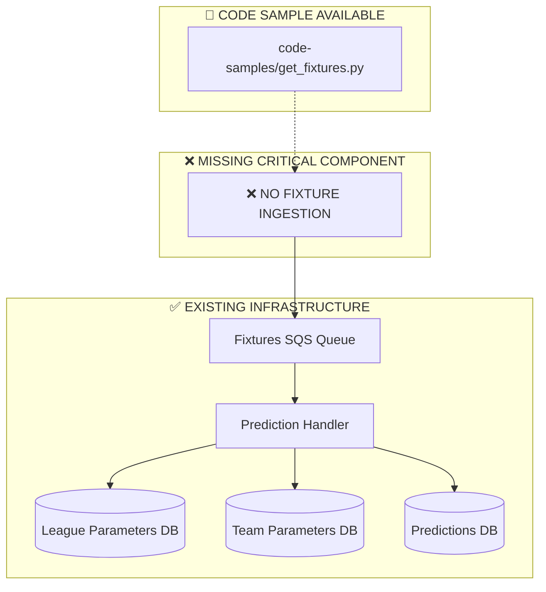
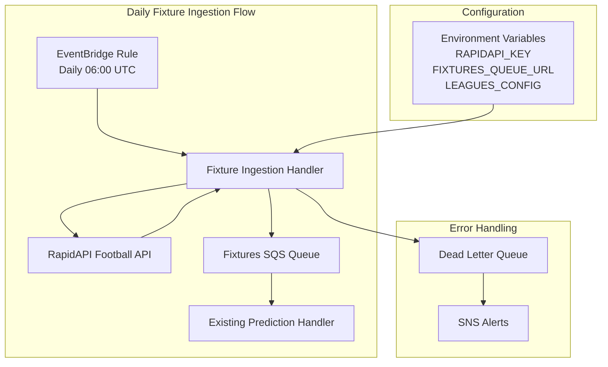

# Fixture Ingestion System Implementation Guide

**Document Version:** 1.0  
**Created:** 2025-10-04  
**Status:** 🔧 Implementation Required  
**Priority:** 🚨 **CRITICAL** - Entry point for entire prediction system  

## 📋 Executive Summary

This document provides a complete implementation guide for building the fixture ingestion system that serves as the entry point to the football prediction pipeline. The system will be based on the [`code-samples/get_fixtures.py`](../code-samples/get_fixtures.py) reference implementation but adapted for the new modular architecture.

**CRITICAL FINDING:** The current system has complete prediction processing infrastructure but **no automated fixture retrieval mechanism**. This implementation fills that critical gap.

## 🎯 Implementation Objective

Create a production-ready fixture ingestion Lambda function that:
- ✅ **Automatically retrieves upcoming fixtures** from RapidAPI daily
- ✅ **Populates SQS queue** for prediction processing
- ✅ **Integrates with existing modular architecture**
- ✅ **Handles errors gracefully** with retry logic
- ✅ **Supports event-driven triggers** via EventBridge

## 📊 Current System Analysis

### What Exists (Processing Infrastructure)


### Reference Code Analysis
From [`code-samples/get_fixtures.py`](../code-samples/get_fixtures.py:14):
```python
def lambda_handler(event, context):
    # Key components to replicate:
    # 1. League iteration from allLeagues configuration
    # 2. Date range calculation (12 hours ahead to 2-3 days)
    # 3. RapidAPI fixture retrieval
    # 4. Data formatting and SQS queue population
```

## 🏗️ Implementation Architecture

### New Component: Fixture Ingestion Handler



## 📁 File Structure

```
src/
├── handlers/
│   ├── fixture_ingestion_handler.py     # NEW - Main implementation
│   └── prediction_handler.py            # EXISTING - Will receive fixtures
├── data/
│   ├── fixture_retrieval.py             # NEW - API interaction logic  
│   └── api_client.py                     # EXISTING - Extend if needed
├── utils/
│   ├── fixture_formatter.py             # NEW - Data formatting
│   └── constants.py                      # UPDATE - Add new constants
└── config/
    └── leagues_config.py                 # NEW - League configuration
```

## 🔧 Implementation Details

### 1. Main Handler Implementation

**File:** `src/handlers/fixture_ingestion_handler.py`

```python
"""
Fixture Ingestion Handler - Daily fixture retrieval for prediction system.
Based on code-samples/get_fixtures.py but integrated with modular architecture.
"""

import json
import boto3
from datetime import datetime, timedelta
from typing import List, Dict, Optional

from ..data.fixture_retrieval import FixtureRetriever
from ..utils.fixture_formatter import FixtureFormatter
from ..config.leagues_config import get_all_leagues
from ..utils.constants import FIXTURES_QUEUE_URL
from ..utils.converters import convert_for_json


def lambda_handler(event, context) -> Dict:
    """
    Main Lambda handler for daily fixture ingestion.
    
    Triggered by EventBridge rule daily at 06:00 UTC.
    Retrieves upcoming fixtures and populates SQS queue for prediction processing.
    
    Args:
        event: EventBridge event data
        context: Lambda context
        
    Returns:
        Dict: Processing summary with success/failure counts
    """
    
    print(f"Fixture ingestion started at {datetime.now().isoformat()}")
    
    # Initialize components
    retriever = FixtureRetriever()
    formatter = FixtureFormatter()
    sqs = boto3.client('sqs')
    
    # Processing summary
    summary = {
        'processed_leagues': 0,
        'total_fixtures': 0,
        'successful_leagues': 0,
        'failed_leagues': 0,
        'errors': []
    }
    
    # Get all configured leagues
    try:
        all_leagues = get_all_leagues()
        print(f"Processing {len(all_leagues)} leagues")
    except Exception as e:
        error_msg = f"Failed to load leagues configuration: {e}"
        print(error_msg)
        return {
            'statusCode': 500,
            'body': json.dumps({'error': error_msg})
        }
    
    # Calculate date range (based on original logic)
    current_day = datetime.today().weekday()
    to_start = 12  # Hours ahead to start looking
    
    # Determine end range based on day of week
    if current_day == 0:  # Monday
        to_end = 2
    elif current_day == 3:  # Thursday  
        to_end = 3
    else:
        to_end = 2
    
    start_date = (datetime.now() + timedelta(hours=to_start)).strftime('%Y-%m-%d')
    end_date = (datetime.now() + timedelta(days=to_end, hours=to_start)).strftime('%Y-%m-%d')
    
    print(f"Retrieving fixtures from {start_date} to {end_date}")
    
    # Process each league
    for league in all_leagues:
        summary['processed_leagues'] += 1
        league_id = league['id']
        league_name = league['name']
        country = league.get('country', 'Unknown')
        
        try:
            print(f"Processing {league_name} (ID: {league_id})")
            
            # Retrieve fixtures for this league
            fixtures = retriever.get_league_fixtures(
                league_id=league_id,
                start_date=start_date,
                end_date=end_date
            )
            
            if not fixtures:
                print(f"No fixtures found for {league_name}")
                continue
                
            # Format fixtures for processing
            formatted_fixtures = formatter.format_fixtures_for_queue(
                fixtures=fixtures,
                league_info={
                    'id': league_id,
                    'name': league_name,
                    'country': country
                }
            )
            
            # Send to SQS queue
            queue_response = send_fixtures_to_queue(
                sqs_client=sqs,
                fixtures=formatted_fixtures,
                league_info={
                    'id': league_id,
                    'name': league_name,
                    'country': country
                }
            )
            
            if queue_response['success']:
                summary['successful_leagues'] += 1
                summary['total_fixtures'] += len(fixtures)
                print(f"Successfully queued {len(fixtures)} fixtures for {league_name}")
            else:
                summary['failed_leagues'] += 1
                summary['errors'].append(f"{league_name}: {queue_response['error']}")
                
        except Exception as e:
            error_msg = f"Failed to process {league_name}: {e}"
            print(error_msg)
            summary['failed_leagues'] += 1
            summary['errors'].append(error_msg)
            continue
    
    # Final summary
    print(f"Fixture ingestion completed. Processed {summary['total_fixtures']} fixtures from {summary['successful_leagues']}/{summary['processed_leagues']} leagues")
    
    if summary['errors']:
        print(f"Errors encountered: {summary['errors']}")
    
    return {
        'statusCode': 200 if summary['successful_leagues'] > 0 else 500,
        'body': json.dumps(convert_for_json(summary))
    }


def send_fixtures_to_queue(sqs_client: boto3.client, fixtures: List[Dict], 
                          league_info: Dict) -> Dict:
    """
    Send formatted fixtures to SQS queue for processing.
    
    Args:
        sqs_client: Boto3 SQS client
        fixtures: List of formatted fixture data
        league_info: League metadata
        
    Returns:
        Dict: Success status and error message if applicable
    """
    try:
        message_body = {
            'payload': fixtures,
            'league_info': league_info,
            'timestamp': int(datetime.now().timestamp()),
            'source': 'fixture_ingestion_handler'
        }
        
        response = sqs_client.send_message(
            QueueUrl=FIXTURES_QUEUE_URL,
            MessageBody=json.dumps(message_body),
            MessageAttributes={
                'league_id': {
                    'StringValue': str(league_info['id']),
                    'DataType': 'String'
                },
                'fixture_count': {
                    'StringValue': str(len(fixtures)),
                    'DataType': 'Number'
                },
                'source': {
                    'StringValue': 'fixture_ingestion',
                    'DataType': 'String'
                }
            }
        )
        
        return {
            'success': True,
            'message_id': response['MessageId']
        }
        
    except Exception as e:
        return {
            'success': False,
            'error': str(e)
        }
```

### 2. Fixture Retrieval Module

**File:** `src/data/fixture_retrieval.py`

```python
"""
Fixture retrieval from RapidAPI Football API.
Extracted from code-samples/get_fixtures.py for modular architecture.
"""

import os
import requests
import time
from typing import List, Dict, Optional
from datetime import datetime


class FixtureRetriever:
    """Handles fixture retrieval from RapidAPI Football API."""
    
    def __init__(self):
        self.api_key = os.getenv('RAPIDAPI_KEY')
        if not self.api_key:
            raise ValueError("RAPIDAPI_KEY environment variable is required")
            
        self.headers = {
            "X-RapidAPI-Key": self.api_key,
            "X-RapidAPI-Host": "api-football-v1.p.rapidapi.com"
        }
        self.base_url = "https://api-football-v1.p.rapidapi.com/v3"
        
    def get_league_fixtures(self, league_id: int, start_date: str, 
                           end_date: str) -> List[Dict]:
        """
        Retrieve fixtures for a specific league within date range.
        
        Args:
            league_id: League identifier
            start_date: Start date in YYYY-MM-DD format
            end_date: End date in YYYY-MM-DD format
            
        Returns:
            List of fixture dictionaries
        """
        try:
            # Get current season for the league
            season = self._get_league_season(league_id)
            if not season:
                print(f"Could not determine season for league {league_id}")
                return []
                
            # Retrieve fixtures
            url = f"{self.base_url}/fixtures"
            params = {
                "league": str(league_id),
                "season": str(season),
                "from": start_date,
                "to": end_date
            }
            
            response = requests.get(url, headers=self.headers, params=params)
            
            if response.status_code == 429:
                print(f"Rate limit hit for league {league_id}, waiting...")
                time.sleep(60)  # Wait 1 minute on rate limit
                response = requests.get(url, headers=self.headers, params=params)
                
            if response.status_code != 200:
                print(f"API error for league {league_id}: {response.status_code}")
                return []
                
            data = response.json()
            if 'response' not in data:
                print(f"Unexpected API response format for league {league_id}")
                return []
                
            fixtures = []
            for game in data['response']:
                fixture_data = {
                    'fixture_id': game['fixture']['id'],
                    'date': game['fixture']['date'], 
                    'timestamp': game['fixture']['timestamp'],
                    'home_team': game['teams']['home']['name'],
                    'home_id': game['teams']['home']['id'],
                    'away_team': game['teams']['away']['name'],
                    'away_id': game['teams']['away']['id'],
                    'league_id': game['league']['id'],
                    'season': game['league']['season']
                }
                fixtures.append(fixture_data)
                
            print(f"Retrieved {len(fixtures)} fixtures for league {league_id}")
            return fixtures
            
        except Exception as e:
            print(f"Error retrieving fixtures for league {league_id}: {e}")
            return []
    
    def _get_league_season(self, league_id: int) -> Optional[str]:
        """
        Get the current season year for a league.
        Based on get_league_start_date function from original code.
        
        Args:
            league_id: League identifier
            
        Returns:
            Season year as string or None if not found
        """
        try:
            url = f"{self.base_url}/leagues"
            params = {"id": league_id, "current": "true"}
            
            response = requests.get(url, headers=self.headers, params=params)
            
            if response.status_code == 429:
                print(f"Rate limit hit getting season for league {league_id}")
                time.sleep(60)
                response = requests.get(url, headers=self.headers, params=params)
                
            if response.status_code != 200:
                print(f"Error getting season for league {league_id}: {response.status_code}")
                return None
                
            data = response.json()
            
            if "response" not in data or not data["response"]:
                print(f"No league data found for league {league_id}")
                return None
                
            # Extract current season start date
            seasons = data["response"][0].get("seasons", [])
            for season in seasons:
                if season.get("current"):
                    start_date = season.get("start")
                    if start_date:
                        return start_date[:4]  # Return year only
                        
            return None
            
        except Exception as e:
            print(f"Error getting season for league {league_id}: {e}")
            return None
```

### 3. Fixture Formatter Module

**File:** `src/utils/fixture_formatter.py`

```python
"""
Fixture data formatting utilities.
Ensures consistent data structure for prediction processing.
"""

from typing import List, Dict
from datetime import datetime


class FixtureFormatter:
    """Formats fixture data for consistent processing across the system."""
    
    def format_fixtures_for_queue(self, fixtures: List[Dict], 
                                 league_info: Dict) -> List[Dict]:
        """
        Format raw fixture data for SQS queue consumption.
        Ensures compatibility with existing prediction_handler.py.
        
        Args:
            fixtures: Raw fixture data from API
            league_info: League metadata
            
        Returns:
            List of formatted fixture dictionaries
        """
        formatted = []
        
        for fixture in fixtures:
            try:
                # Format according to prediction_handler expectations
                formatted_fixture = {
                    'fixture_id': fixture['fixture_id'],
                    'date': fixture['date'],
                    'timestamp': fixture['timestamp'], 
                    'home_team': fixture['home_team'],
                    'home_id': fixture['home_id'],
                    'away_team': fixture['away_team'],
                    'away_id': fixture['away_id'],
                    'league_id': fixture['league_id'],
                    'season': fixture['season'],
                    # Add metadata for enhanced processing
                    'ingestion_timestamp': int(datetime.now().timestamp()),
                    'source': 'fixture_ingestion_handler'
                }
                
                # Validate required fields
                if self._validate_fixture(formatted_fixture):
                    formatted.append(formatted_fixture)
                else:
                    print(f"Invalid fixture data, skipping fixture {fixture.get('fixture_id', 'unknown')}")
                    
            except Exception as e:
                print(f"Error formatting fixture {fixture.get('fixture_id', 'unknown')}: {e}")
                continue
                
        return formatted
    
    def _validate_fixture(self, fixture: Dict) -> bool:
        """
        Validate that fixture has all required fields.
        
        Args:
            fixture: Fixture dictionary to validate
            
        Returns:
            True if valid, False otherwise
        """
        required_fields = [
            'fixture_id', 'date', 'timestamp', 'home_team', 'home_id',
            'away_team', 'away_id', 'league_id', 'season'
        ]
        
        for field in required_fields:
            if field not in fixture or fixture[field] is None:
                print(f"Missing or null required field: {field}")
                return False
                
        # Validate data types
        try:
            int(fixture['fixture_id'])
            int(fixture['home_id'])
            int(fixture['away_id'])
            int(fixture['league_id'])
            int(fixture['timestamp'])
        except (ValueError, TypeError):
            print("Invalid data type for numeric field")
            return False
            
        return True
```

### 4. League Configuration Module

**File:** `src/config/leagues_config.py`

```python
"""
League configuration for fixture ingestion.
Centralizes league data from the original allLeagues configuration.
"""

# Import the original leagues configuration
try:
    from leagues import allLeagues
except ImportError:
    # Fallback configuration if leagues.py not available
    allLeagues = {
        'England': [
            {'id': 39, 'name': 'Premier League'},
            {'id': 40, 'name': 'Championship'}
        ],
        'Spain': [
            {'id': 140, 'name': 'La Liga'}
        ],
        # Add more leagues as needed
    }


def get_all_leagues():
    """
    Get all configured leagues in flattened format.
    Maintains compatibility with original code structure.
    
    Returns:
        List of league dictionaries with country information
    """
    leagues_flat = []
    
    for country, leagues in allLeagues.items():
        for league in leagues:
            league_with_country = {
                **league,
                'country': country
            }
            leagues_flat.append(league_with_country)
            
    return leagues_flat


def get_leagues_by_country(country: str):
    """
    Get leagues for a specific country.
    
    Args:
        country: Country name
        
    Returns:
        List of league dictionaries for the country
    """
    return allLeagues.get(country, [])


def get_league_info(league_id: int):
    """
    Get information for a specific league.
    
    Args:
        league_id: League identifier
        
    Returns:
        League dictionary with country info, or None if not found
    """
    for country, leagues in allLeagues.items():
        for league in leagues:
            if league['id'] == league_id:
                return {
                    **league,
                    'country': country
                }
    return None
```

### 5. Constants Update

**File:** `src/utils/constants.py` (additions)

```python
# Add these constants to the existing file

# Fixture Ingestion Configuration
FIXTURE_INGESTION_SETTINGS = {
    'default_hours_ahead': 12,
    'default_days_range': {
        'monday': 2,
        'thursday': 3,
        'default': 2
    },
    'rate_limit_wait_seconds': 60,
    'max_retries': 3
}

# Queue Configuration
FIXTURES_QUEUE_CONFIG = {
    'batch_size': 1,  # Process one league at a time
    'visibility_timeout': 300,  # 5 minutes
    'message_retention_period': 1209600  # 14 days
}

# Environment Variables
REQUIRED_ENV_VARS = [
    'RAPIDAPI_KEY',
    'FIXTURES_QUEUE_URL'
]
```

## ⚙️ AWS Infrastructure Setup

### 1. Lambda Function Configuration

```yaml
# terraform/lambda.tf or CloudFormation template
FunctionName: football-fixture-ingestion
Runtime: python3.11
Handler: src.handlers.fixture_ingestion_handler.lambda_handler
MemorySize: 256
Timeout: 300  # 5 minutes
Environment:
  Variables:
    RAPIDAPI_KEY: ${RAPIDAPI_KEY}
    FIXTURES_QUEUE_URL: ${FIXTURES_QUEUE_URL}
```

### 2. EventBridge Rule

```json
{
  "Name": "daily-fixture-ingestion",
  "Description": "Daily fixture retrieval at 06:00 UTC",
  "ScheduleExpression": "cron(0 6 * * ? *)",
  "State": "ENABLED",
  "Targets": [
    {
      "Id": "1",
      "Arn": "arn:aws:lambda:region:account:function:football-fixture-ingestion",
      "Input": "{\"trigger_type\": \"daily_schedule\", \"source\": \"eventbridge\"}"
    }
  ]
}
```

### 3. IAM Policy

```json
{
  "Version": "2012-10-17",
  "Statement": [
    {
      "Effect": "Allow",
      "Action": [
        "sqs:SendMessage",
        "sqs:GetQueueAttributes"
      ],
      "Resource": [
        "arn:aws:sqs:*:*:fixturesQueue"
      ]
    },
    {
      "Effect": "Allow", 
      "Action": [
        "logs:CreateLogGroup",
        "logs:CreateLogStream",
        "logs:PutLogEvents"
      ],
      "Resource": "arn:aws:logs:*:*:*"
    }
  ]
}
```

## 🧪 Testing Strategy

### 1. Unit Tests

**File:** `tests/test_fixture_ingestion.py`

```python
import pytest
from unittest.mock import Mock, patch
from src.handlers.fixture_ingestion_handler import lambda_handler
from src.data.fixture_retrieval import FixtureRetriever


class TestFixtureIngestion:
    
    @patch('src.data.fixture_retrieval.requests.get')
    def test_retrieve_fixtures_success(self, mock_get):
        """Test successful fixture retrieval."""
        # Mock API response
        mock_response = Mock()
        mock_response.status_code = 200
        mock_response.json.return_value = {
            'response': [
                {
                    'fixture': {'id': 123, 'date': '2024-01-01T15:00:00+00:00', 'timestamp': 1704117600},
                    'teams': {'home': {'id': 1, 'name': 'Team A'}, 'away': {'id': 2, 'name': 'Team B'}},
                    'league': {'id': 39, 'season': 2024}
                }
            ]
        }
        mock_get.return_value = mock_response
        
        retriever = FixtureRetriever()
        fixtures = retriever.get_league_fixtures(39, '2024-01-01', '2024-01-02')
        
        assert len(fixtures) == 1
        assert fixtures[0]['fixture_id'] == 123
        
    def test_validate_fixture_data(self):
        """Test fixture validation logic."""
        from src.utils.fixture_formatter import FixtureFormatter
        
        formatter = FixtureFormatter()
        
        # Valid fixture
        valid_fixture = {
            'fixture_id': 123,
            'date': '2024-01-01T15:00:00+00:00',
            'timestamp': 1704117600,
            'home_team': 'Team A',
            'home_id': 1,
            'away_team': 'Team B', 
            'away_id': 2,
            'league_id': 39,
            'season': 2024
        }
        assert formatter._validate_fixture(valid_fixture) == True
        
        # Invalid fixture - missing field
        invalid_fixture = {
            'fixture_id': 123,
            'date': '2024-01-01T15:00:00+00:00'
            # Missing required fields
        }
        assert formatter._validate_fixture(invalid_fixture) == False
```

### 2. Integration Tests

**File:** `tests/test_fixture_integration.py`

```python
import boto3
import json
from moto import mock_sqs
from src.handlers.fixture_ingestion_handler import send_fixtures_to_queue


@mock_sqs
def test_sqs_integration():
    """Test SQS message sending."""
    # Create mock SQS queue
    sqs = boto3.client('sqs', region_name='us-east-1')
    queue_url = sqs.create_queue(QueueName='test-fixtures-queue')['QueueUrl']
    
    # Test data
    fixtures = [
        {'fixture_id': 123, 'home_team': 'Team A', 'away_team': 'Team B'}
    ]
    league_info = {'id': 39, 'name': 'Premier League', 'country': 'England'}
    
    # Send message
    result = send_fixtures_to_queue(sqs, fixtures, league_info)
    
    assert result['success'] == True
    assert 'message_id' in result
    
    # Verify message was sent
    messages = sqs.receive_message(QueueUrl=queue_url)
    assert 'Messages' in messages
    
    message_body = json.loads(messages['Messages'][0]['Body'])
    assert len(message_body['payload']) == 1
    assert message_body['league_info']['name'] == 'Premier League'
```

## 📋 Deployment Checklist

### Phase 1: Development Setup (Days 1-2)
- [ ] Create new handler file: `src/handlers/fixture_ingestion_handler.py`
- [ ] Create fixture retrieval module: `src/data/fixture_retrieval.py`
- [ ] Create formatter module: `src/utils/fixture_formatter.py`
- [ ] Create leagues config: `src/config/leagues_config.py`
- [ ] Update constants: `src/utils/constants.py`
- [ ] Write comprehensive unit tests
- [ ] Test with mock data locally

### Phase 2: AWS Infrastructure (Days 3-4)
- [ ] Deploy Lambda function with proper configuration
- [ ] Create EventBridge rule for daily scheduling
- [ ] Configure IAM roles and policies
- [ ] Set up CloudWatch monitoring and alarms
- [ ] Test EventBridge trigger manually

### Phase 3: Integration Testing (Day 5)
- [ ] Test with live RapidAPI calls (be mindful of rate limits)
- [ ] Verify SQS message format compatibility with prediction handler
- [ ] Test error handling and retry logic
- [ ] Verify complete end-to-end flow from fixture ingestion to prediction

### Phase 4: Production Deployment (Days 6-7)
- [ ] Deploy to production environment
- [ ] Monitor first few daily runs
- [ ] Verify fixture processing pipeline is working
- [ ] Document any production issues and resolutions
- [ ] Create operational runbook

## 🚨 Critical Success Factors

### 1. Data Compatibility
- **CRITICAL:** Ensure fixture format matches exactly what [`prediction_handler.py`](../src/handlers/prediction_handler.py) expects
- **Test:** Send sample messages through the queue and verify processing succeeds

### 2. Rate Limiting
- **CRITICAL:** RapidAPI has strict rate limits - implement proper backoff logic
- **Monitor:** Track API usage and response codes

### 3. Error Recovery
- **CRITICAL:** Failed fixture ingestion means no predictions for that day
- **Implement:** Robust retry logic and alerting

### 4. Queue Integration
- **CRITICAL:** Messages must match existing SQS queue format and processing expectations
- **Verify:** Integration with [`FIXTURES_QUEUE_URL`](../src/utils/constants.py:88)

## 📊 Monitoring & Alerting

### CloudWatch Metrics
- **Fixture Ingestion Success Rate:** Percentage of successful league processing
- **API Response Times:** Track RapidAPI performance 
- **Queue Message Count:** Monitor SQS queue depth
- **Processing Duration:** Track Lambda execution time

### Critical Alerts
```json
{
  "AlarmName": "FixtureIngestionFailure",
  "MetricName": "Errors",
  "Namespace": "AWS/Lambda",
  "Dimensions": [{"Name": "FunctionName", "Value": "football-fixture-ingestion"}],
  "Threshold": 1,
  "ComparisonOperator": "GreaterThanOrEqualToThreshold",
  "AlarmActions": ["arn:aws:sns:region:account:fixture-ingestion-alerts"]
}
```

## 🎯 Success Criteria

### Immediate Success (Week 1)
- ✅ **Daily fixture retrieval** running automatically at 06:00 UTC
- ✅ **SQS queue populated** with properly formatted fixture data
- ✅ **Prediction handler processing** fixtures successfully
- ✅ **Zero critical errors** in production

### Long-term Success (Month 1)
- ✅ **>99% fixture ingestion success rate**
- ✅ **<5 minute average processing time**
- ✅ **Proper error handling** with automatic recovery
- ✅ **Complete integration** with existing prediction pipeline

---

## 📚 References

- **Original Code Sample:** [`code-samples/get_fixtures.py`](../code-samples/get_fixtures.py)
- **Target Integration:** [`src/handlers/prediction_handler.py`](../src/handlers/prediction_handler.py)
- **Queue Configuration:** [`src/utils/constants.py`](../src/utils/constants.py)
- **System Architecture:** [`docs/EVENT_DRIVEN_PREDICTION_SYSTEM_ARCHITECTURE.md`](EVENT_DRIVEN_PREDICTION_SYSTEM_ARCHITECTURE.md)

**Next Action:** Begin implementation with Phase 1 development setup, focusing on creating the core handler that replicates the functionality from the code sample while integrating properly with the existing modular architecture.