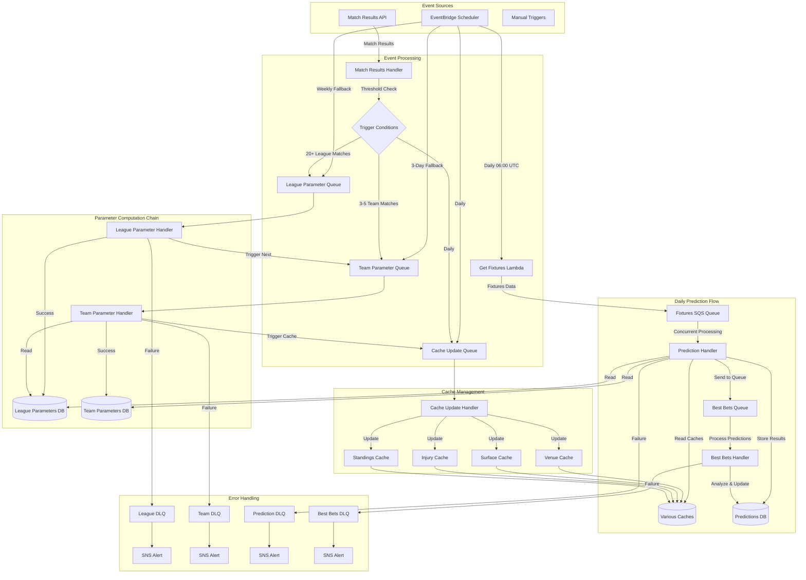
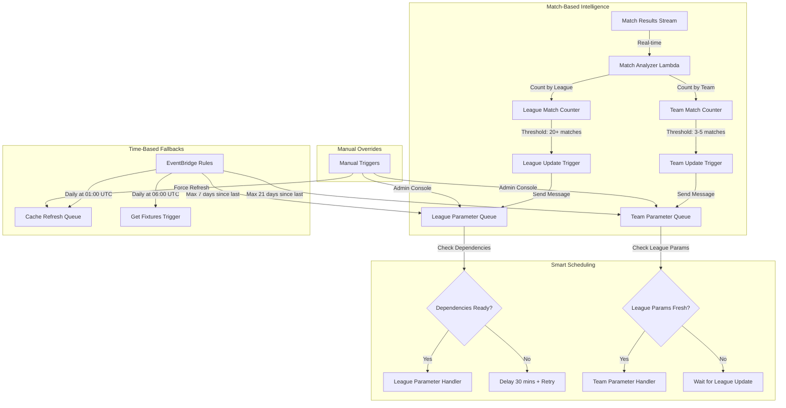
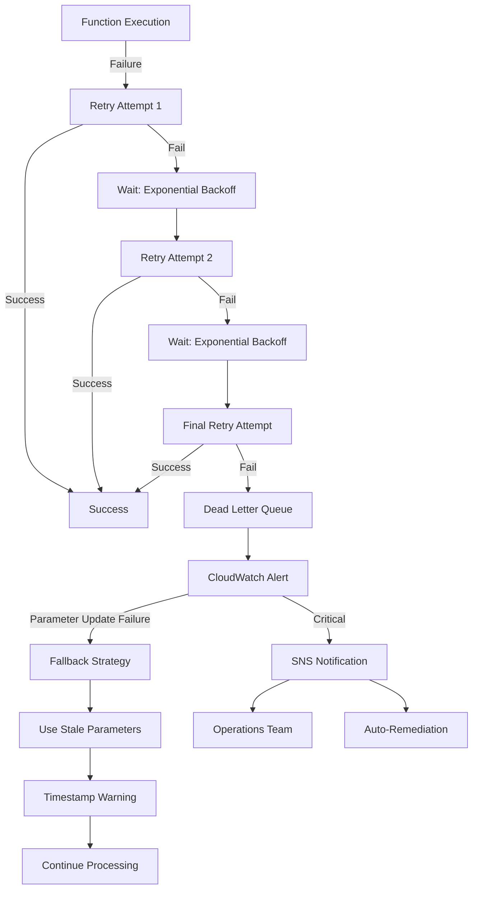
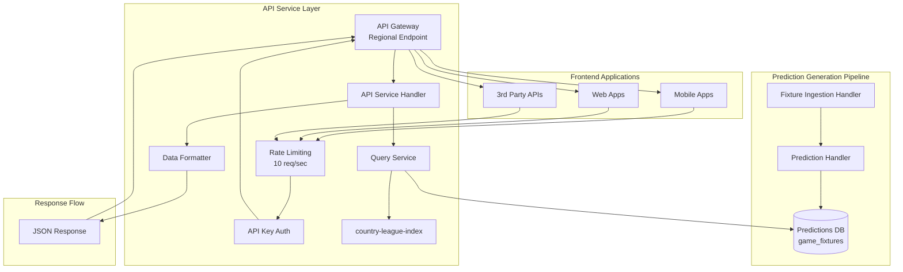

# Event-Driven Football Prediction System Architecture

**Document Version:** 1.0  
**Created:** 2025-10-04  
**Status:** ✅ Approved Implementation Plan  
**Implementation Timeline:** 3 weeks  

## 📋 Executive Summary

This document outlines the complete architecture for transforming the current football prediction system into an event-driven, scalable, and maintainable solution. The new system leverages match-based triggers, intelligent parameter computation scheduling, and AWS serverless infrastructure to ensure predictions are always based on the most current and relevant data.

## 🔍 Current System Analysis

### Legacy Components Status
| Component | File | Status | Lines of Code | Action Required |
|-----------|------|--------|---------------|----------------|
| League Parameters | [`computeLeagueParameters.py`](../computeLeagueParameters.py:27) | 🔴 Active Legacy | 648 | Move to retired-code/ |
| Team Parameters | [`computeTeamParameters.py`](../computeTeamParameters.py:28) | 🔴 Active Legacy | ~500 | Move to retired-code/ |
| Predictions | [`makeTeamRankings.py`](../makeTeamRankings.py:26) | 🔴 Active Legacy | ~800 | Move to retired-code/ |
| Score Checking | [`checkScores.py`](../checkScores.py:29) | 🔴 Active Legacy | ~300 | Move to retired-code/ |

### New Modular Handlers (Ready for Production)
| Handler | File | Purpose | Status |
|---------|------|---------|--------|
| League Parameter Handler | [`src/handlers/league_parameter_handler.py`](../src/handlers/league_parameter_handler.py:17) | League parameter computation | ✅ Ready |
| Team Parameter Handler | [`src/handlers/team_parameter_handler.py`](../src/handlers/team_parameter_handler.py:17) | Team parameter computation | ✅ Ready |
| Prediction Handler | [`src/handlers/prediction_handler.py`](../src/handlers/prediction_handler.py:36) | Match predictions | ✅ Ready |
| Match Data Handler | [`src/handlers/match_data_handler.py`](../src/handlers/match_data_handler.py:20) | Match data processing | ✅ Ready |

## 🏗️ System Architecture

### Overall Architecture Diagram



### Parameter Update Trigger System



## 🔧 Technical Specifications

### AWS Infrastructure Components

#### SQS Queue Configuration

| Queue Name | Purpose | Visibility Timeout | Max Receive Count | Dead Letter Queue | Batch Size |
|------------|---------|-------------------|-------------------|-------------------|------------|
| `football-league-parameter-updates` | League parameter computation | 15 minutes | 3 | `football-league-dlq` | 1 |
| `football-team-parameter-updates` | Team parameter computation | 20 minutes | 3 | `football-team-dlq` | 1 |
| `football-fixture-predictions` | Daily fixture predictions | 5 minutes | 2 | `football-prediction-dlq` | 10 |
| `football-best-bets` | Best bet analysis from predictions | 2 minutes | 3 | `football-best-bets-dlq` | 10 |
| `football-cache-updates` | Cache refresh operations | 2 minutes | 2 | `football-cache-dlq` | 5 |
| `football-match-results` | Match result processing | 1 minute | 3 | `football-results-dlq` | 10 |

#### EventBridge Rules

```json
{
  "Rules": [
    {
      "Name": "daily-fixtures-trigger",
      "Description": "Trigger daily fixture retrieval at 06:00 UTC",
      "ScheduleExpression": "cron(0 6 * * ? *)",
      "State": "ENABLED",
      "Targets": [
        {
          "Id": "1",
          "Arn": "arn:aws:lambda:region:account:function:get-fixtures",
          "Input": "{\"trigger_type\": \"daily_schedule\"}"
        }
      ]
    },
    {
      "Name": "league-parameter-fallback",
      "Description": "Weekly fallback for league parameter updates",
      "ScheduleExpression": "cron(0 2 ? * SUN *)",
      "State": "ENABLED",
      "Targets": [
        {
          "Id": "1",
          "Arn": "arn:aws:sqs:region:account:football-league-parameter-updates",
          "SqsParameters": {
            "MessageBody": "{\"trigger_type\": \"weekly_fallback\", \"force\": false}"
          }
        }
      ]
    },
    {
      "Name": "team-parameter-fallback",
      "Description": "Every 3 days fallback for team parameter updates",
      "ScheduleExpression": "cron(0 4 */3 * ? *)",
      "State": "ENABLED",
      "Targets": [
        {
          "Id": "1",
          "Arn": "arn:aws:sqs:region:account:football-team-parameter-updates",
          "SqsParameters": {
            "MessageBody": "{\"trigger_type\": \"fallback_schedule\", \"force\": false}"
          }
        }
      ]
    },
    {
      "Name": "cache-refresh-daily",
      "Description": "Daily cache refresh at 01:00 UTC",
      "ScheduleExpression": "cron(0 1 * * ? *)",
      "State": "ENABLED",
      "Targets": [
        {
          "Id": "1",
          "Arn": "arn:aws:sqs:region:account:football-cache-updates",
          "SqsParameters": {
            "MessageBody": "{\"cache_types\": [\"venue\", \"surface\", \"standings\", \"injuries\"]}"
          }
        }
      ]
    }
  ]
}
```

#### Lambda Function Configuration

| Function Name | Handler | Runtime | Memory | Timeout | Environment Variables |
|---------------|---------|---------|--------|---------|----------------------|
| `football-get-fixtures` | `get_fixtures.lambda_handler` | Python 3.11 | 256 MB | 5 min | `RAPIDAPI_KEY`, `FIXTURES_QUEUE_URL` |
| `football-league-parameters` | `src.handlers.league_parameter_handler.lambda_handler` | Python 3.11 | 512 MB | 15 min | `RAPIDAPI_KEY`, `LEAGUE_PARAMS_TABLE` |
| `football-team-parameters` | `src.handlers.team_parameter_handler.lambda_handler` | Python 3.11 | 1024 MB | 20 min | `RAPIDAPI_KEY`, `TEAM_PARAMS_TABLE` |
| `football-predictions` | `src.handlers.prediction_handler.lambda_handler` | Python 3.11 | 512 MB | 5 min | `RAPIDAPI_KEY`, `PREDICTIONS_TABLE`, `BEST_BETS_QUEUE_URL` |
| `football-best-bets` | `src.handlers.best_bets_handler.lambda_handler` | Python 3.11 | 512 MB | 2 min | `TABLE_PREFIX`, `TABLE_SUFFIX` |
| `football-match-analyzer` | `src.handlers.match_analyzer.lambda_handler` | Python 3.11 | 256 MB | 2 min | `LEAGUE_QUEUE_URL`, `TEAM_QUEUE_URL` |

### Update Frequency Matrix

| Parameter Type | Match-Based Trigger | Time-Based Fallback | TTL/Cache Duration | Dependencies |
|----------------|---------------------|--------------------|--------------------|--------------|
| **League Parameters** | 20+ new matches | Weekly (Sunday 02:00) | 7 days | API data only |
| **Team Parameters** | 3-5 matches per team | Every 3 days (04:00) | 21 days | League parameters |
| **Segmented Parameters** | 6-9 matches per tier | Weekly | 30 days | Team parameters |
| **Venue Cache** | Manual/API changes | Daily (01:00) | 30 days | API data |
| **Surface Cache** | Manual/API changes | Daily (01:00) | 30 days | API data |
| **Injury Cache** | Real-time before prediction | Before each prediction | None | API data |
| **Standings Cache** | After match results | Daily (01:00) | 24 hours | API data |
| **Form Analysis** | Real-time | Before each prediction | None | Match history |
| **Multipliers** | Every 15-20 predictions | Monthly | 60 days | Prediction results |

## 🔄 Implementation Phases

### Phase 1: Infrastructure Setup & Legacy Retirement (Week 1)

#### Day 1-2: Legacy Code Management
```bash
# Create retired code directory
mkdir -p retired-code/legacy-lambda-functions
mv computeLeagueParameters.py retired-code/legacy-lambda-functions/
mv computeTeamParameters.py retired-code/legacy-lambda-functions/
mv makeTeamRankings.py retired-code/legacy-lambda-functions/
mv checkScores.py retired-code/legacy-lambda-functions/

# Create migration documentation
touch retired-code/MIGRATION_LOG.md
```

#### Day 3-4: AWS Infrastructure Deployment
1. **SQS Queues Creation**
   - Deploy all queues with DLQ configuration
   - Set appropriate visibility timeouts and retry policies
   - Configure queue policies for cross-service access

2. **EventBridge Rules Setup**
   - Create scheduled rules for daily/weekly triggers
   - Configure targets (Lambda functions and SQS queues)
   - Test rule execution with mock events

3. **Lambda Function Deployment**
   - Package new handlers with dependencies
   - Deploy with appropriate IAM roles and policies
   - Configure environment variables and VPC settings

#### Day 5-7: Monitoring & Testing Setup
1. **CloudWatch Monitoring**
   - Create custom dashboards for system health
   - Set up alarms for DLQ message counts
   - Configure log retention policies

2. **Integration Testing**
   - Test individual Lambda functions
   - Verify queue message flow
   - Validate EventBridge rule execution

### Phase 2: Event-Driven Parameter Updates (Week 2)

#### Day 8-10: Match-Based Trigger Implementation
```python
# src/handlers/match_analyzer.py
import json
import boto3
from datetime import datetime, timedelta
from collections import defaultdict

def lambda_handler(event, context):
    """
    Analyze match results and trigger parameter updates based on thresholds.
    """
    sqs = boto3.client('sqs')
    
    # Track match counts by league and team
    league_match_counts = defaultdict(int)
    team_match_counts = defaultdict(int)
    
    for record in event['Records']:
        match_data = json.loads(record['body'])
        league_id = match_data['league_id']
        home_team_id = match_data['home_team_id']
        away_team_id = match_data['away_team_id']
        
        # Increment counters
        league_match_counts[league_id] += 1
        team_match_counts[home_team_id] += 1
        team_match_counts[away_team_id] += 1
    
    # Check thresholds and trigger updates
    for league_id, count in league_match_counts.items():
        if count >= 20:  # League threshold
            trigger_league_update(sqs, league_id)
    
    for team_id, count in team_match_counts.items():
        if count >= 3:  # Team threshold  
            trigger_team_update(sqs, team_id)
    
    return {'statusCode': 200, 'body': 'Analysis complete'}
```

#### Day 11-12: Dependency Chain Management
1. **Step Functions Implementation** (Optional for complex orchestration)
2. **Queue Message Routing** with dependency checking
3. **Failure Recovery Mechanisms**

#### Day 13-14: Parameter Computation Enhancement
1. **Enhanced League Parameter Handler**
   - Integrate with match-based triggers
   - Add dependency validation
   - Implement smart caching strategies

2. **Enhanced Team Parameter Handler**  
   - Add league parameter dependency checks
   - Implement fallback to stale parameters
   - Add batch processing capabilities

### Phase 3: Enhanced Prediction Flow (Week 3)

#### Day 15-17: Get Fixtures Enhancement
```python
# Enhanced get_fixtures.py
import json
import boto3
from datetime import datetime, timedelta

def lambda_handler(event, context):
    """
    Enhanced fixture retrieval with improved SQS integration.
    """
    sqs = boto3.client('sqs')
    queue_url = os.getenv('FIXTURES_QUEUE_URL')
    
    # Get fixtures with league-specific batching
    all_leagues_flat = get_all_leagues()
    
    for league in all_leagues_flat:
        fixtures = get_league_fixtures(league)
        
        if fixtures:
            # Send to SQS with league-specific routing
            message_body = {
                'league_id': league['id'],
                'league_name': league['name'],
                'country': league['country'],
                'fixtures': fixtures,
                'timestamp': int(datetime.now().timestamp())
            }
            
            response = sqs.send_message(
                QueueUrl=queue_url,
                MessageBody=json.dumps(message_body),
                MessageAttributes={
                    'league_id': {
                        'StringValue': str(league['id']),
                        'DataType': 'String'
                    },
                    'priority': {
                        'StringValue': 'normal',
                        'DataType': 'String'
                    }
                }
            )
            
            print(f"Sent {len(fixtures)} fixtures for {league['name']}")
    
    return {'statusCode': 200, 'processed_leagues': len(all_leagues_flat)}
```

#### Day 18-19: Concurrent Prediction Processing
1. **Enhanced Prediction Handler**
   - Implement concurrent processing with rate limiting
   - Add intelligent parameter retrieval
   - Enhance error handling and retry logic

2. **Real-time Cache Integration**
   - Implement cache-aside pattern
   - Add cache warming strategies
   - Configure TTL-based invalidation

#### Day 20-21: System Integration & Testing
1. **End-to-End Testing**
   - Full system workflow validation
   - Load testing with concurrent processing
   - Failure scenario testing

2. **Performance Optimization**
   - Query optimization for parameter retrieval
   - Connection pooling for database access
   - Memory usage optimization

## 🚨 Failure Handling Strategy

### Error Handling Flow



### Recovery Strategies

| Failure Type | Immediate Action | Fallback Action | Alert Level |
|--------------|------------------|-----------------|-------------|
| **League Parameter Update** | Retry 3x with backoff | Use parameters up to 14 days old | Warning |
| **Team Parameter Update** | Retry 3x with backoff | Use parameters up to 30 days old | Warning |
| **Prediction Processing** | Retry 2x immediately | Skip fixture, log for manual review | Error |
| **Cache Update** | Retry 3x with backoff | Use stale cache, flag for refresh | Info |
| **Queue Processing** | Auto-retry via SQS | Send to DLQ after max attempts | Error |
| **API Rate Limiting** | Exponential backoff | Queue for later processing | Warning |

## 📊 Monitoring & Alerting

### CloudWatch Dashboards

#### System Health Dashboard
- **Queue Metrics**: Message counts, processing times, DLQ alerts
- **Lambda Metrics**: Invocation counts, duration, error rates, throttles
- **Database Metrics**: Read/write capacity, throttles, response times
- **API Metrics**: Request counts, rate limits, error responses

#### Business Metrics Dashboard
- **Parameter Freshness**: Age of league/team parameters by league
- **Prediction Coverage**: Percentage of fixtures with successful predictions
- **Accuracy Tracking**: Historical prediction performance
- **System Throughput**: Fixtures processed per hour/day

### Alerting Configuration

```json
{
  "CloudWatchAlarms": [
    {
      "AlarmName": "LeagueParameterProcessingFailure",
      "MetricName": "ApproximateNumberOfVisibleMessages", 
      "Namespace": "AWS/SQS",
      "Dimensions": [{"Name": "QueueName", "Value": "football-league-dlq"}],
      "Threshold": 1,
      "ComparisonOperator": "GreaterThanOrEqualToThreshold",
      "EvaluationPeriods": 1,
      "AlarmActions": ["arn:aws:sns:region:account:football-alerts"]
    },
    {
      "AlarmName": "PredictionProcessingLatency",
      "MetricName": "Duration",
      "Namespace": "AWS/Lambda", 
      "Dimensions": [{"Name": "FunctionName", "Value": "football-predictions"}],
      "Threshold": 240000,
      "ComparisonOperator": "GreaterThanThreshold",
      "EvaluationPeriods": 2,
      "AlarmActions": ["arn:aws:sns:region:account:football-alerts"]
    },
    {
      "AlarmName": "StaleParameterWarning",
      "MetricName": "ParameterAge",
      "Namespace": "Football/Parameters",
      "Threshold": 604800000,
      "ComparisonOperator": "GreaterThanThreshold", 
      "EvaluationPeriods": 1,
      "AlarmActions": ["arn:aws:sns:region:account:football-warnings"]
    }
  ]
}
```

## 🔐 Security Considerations

### IAM Roles & Policies

#### Lambda Execution Roles
```json
{
  "Version": "2012-10-17",
  "Statement": [
    {
      "Effect": "Allow",
      "Action": [
        "dynamodb:GetItem",
        "dynamodb:PutItem", 
        "dynamodb:UpdateItem",
        "dynamodb:Query",
        "dynamodb:Scan"
      ],
      "Resource": [
        "arn:aws:dynamodb:*:*:table/league_parameters",
        "arn:aws:dynamodb:*:*:table/team_parameters",
        "arn:aws:dynamodb:*:*:table/game_fixtures"
      ]
    },
    {
      "Effect": "Allow", 
      "Action": [
        "sqs:SendMessage",
        "sqs:ReceiveMessage", 
        "sqs:DeleteMessage",
        "sqs:GetQueueAttributes"
      ],
      "Resource": [
        "arn:aws:sqs:*:*:football-*"
      ]
    }
  ]
}
```

### API Security
- **API Key Rotation**: Automated rotation of RapidAPI keys
- **Rate Limit Management**: Intelligent backoff and retry strategies  
- **Secrets Management**: Use AWS Secrets Manager for sensitive configuration
- **Network Security**: VPC endpoints for internal AWS service communication

## 💰 Cost Optimization

### Resource Utilization

| Service | Monthly Cost Estimate | Optimization Strategy |
|---------|----------------------|----------------------|
| **Lambda** | $50-100 | Right-size memory, optimize execution time |
| **SQS** | $10-20 | Batch processing, appropriate visibility timeouts |
| **EventBridge** | $5-10 | Consolidate rules, optimize scheduling |
| **DynamoDB** | $100-200 | On-demand billing, optimize queries |
| **CloudWatch** | $20-40 | Log retention policies, metric filtering |
| **SNS** | $5 | Targeted alerting, avoid notification spam |

### Cost Control Measures
- **Reserved Capacity**: Consider reserved capacity for DynamoDB
- **Lambda Provisioned Concurrency**: Only for critical functions
- **S3 Lifecycle Policies**: For log archival and data retention
- **Automated Scaling**: Right-size resources based on usage patterns

## 📈 Scalability Planning  

### Load Testing Scenarios
1. **Peak Match Day**: 100+ concurrent fixtures, 50+ leagues
2. **Season Start**: Massive parameter updates across all leagues
3. **API Rate Limits**: Graceful degradation and queuing
4. **Database Throttling**: Connection pooling and retry strategies

### Growth Accommodation
- **Multi-Region Deployment**: For global expansion
- **Read Replicas**: For improved read performance
- **Caching Layers**: ElastiCache for frequently accessed data
- **CDN Integration**: For static assets and API responses

## ✅ Success Metrics

### Technical KPIs
- **System Uptime**: >99.9% availability
- **Prediction Coverage**: >95% of fixtures processed
- **Parameter Freshness**: <7 days average age for league parameters
- **Processing Latency**: <2 minutes average for predictions
- **Error Rate**: <1% of all operations

### Business KPIs  
- **Prediction Accuracy**: Maintain or improve current performance
- **Cost Efficiency**: 30% reduction in operational costs
- **Maintenance Overhead**: 50% reduction in manual interventions
- **Feature Delivery**: Faster implementation of new prediction features

## 📋 Implementation Checklist

### Pre-Implementation
- [ ] Backup current system state
- [ ] Document current system performance baselines
- [ ] Set up development and staging environments
- [ ] Prepare rollback procedures

### Phase 1 Checklist
- [ ] Move legacy functions to retired-code/
- [ ] Deploy SQS queues with proper configuration
- [ ] Set up EventBridge rules and test scheduling
- [ ] Deploy new Lambda functions with handlers
- [ ] Configure CloudWatch monitoring and alerts
- [ ] Perform integration testing

### Phase 2 Checklist
- [ ] Implement match-based trigger system
- [ ] Deploy dependency chain management
- [ ] Test failure handling and recovery
- [ ] Validate parameter update workflows
- [ ] Configure queue message routing
- [ ] Test end-to-end parameter updates

### Phase 3 Checklist
- [ ] Enhance get_fixtures function with SQS integration
- [ ] Implement concurrent prediction processing
- [ ] Deploy real-time cache integration
- [ ] Configure rate limiting for API calls
- [ ] Perform load testing and optimization
- [ ] Complete end-to-end system validation

### Post-Implementation
- [ ] Monitor system performance for 1 week
- [ ] Document lessons learned and optimizations
- [ ] Create operational runbooks
- [ ] Train team on new system operations
- [ ] Archive legacy system components

---

## 📚 Additional Resources

- **AWS Documentation**: [EventBridge](https://docs.aws.amazon.com/eventbridge/), [SQS](https://docs.aws.amazon.com/sqs/), [Lambda](https://docs.aws.amazon.com/lambda/)
- **System Dependencies**: [`src/handlers/`](../src/handlers/) directory for modular components
- **Legacy Code**: [`retired-code/`](../retired-code/) directory for archived functions
- **Monitoring**: CloudWatch dashboards and alarm configurations
- **Testing**: Integration test suites for system validation

**Document Approval**: ✅ Approved for Implementation  
**Next Action**: Begin Phase 1 implementation following the detailed checklist above.

---

## 📡 API Service Layer Integration

**Status:** 📋 **Implementation Guide Available** - [`docs/API_SERVICE_IMPLEMENTATION_GUIDE.md`](API_SERVICE_IMPLEMENTATION_GUIDE.md)  
**Added:** 2025-10-04  
**Based on:** [`code-samples/analysis_backend_mobile.py`](../code-samples/analysis_backend_mobile.py)

### API Service Architecture



### API Features & Endpoints

**Key Capabilities:**
- ✅ **REST API Endpoints** - Modular architecture based on reference sample
- ✅ **API Key Authentication** - Secure access control with usage plans
- ✅ **Flexible Querying** - Single fixture or league-based with date ranges
- ✅ **Rate Limiting** - 10 req/sec, 20 burst, 10k/month quota
- ✅ **CORS Support** - Ready for web frontend integration
- ✅ **Comprehensive Error Handling** - Proper HTTP status codes and messages

**API Endpoints:**
```
GET /predictions?fixture_id=123456
GET /predictions?country=England&league=Premier%20League&startDate=2024-01-01&endDate=2024-01-07
```

**Response Format:**
```json
{
  "items": [
    {
      "fixture_id": 123456,
      "timestamp": 1704117600,
      "date": "2024-01-01T15:00:00+00:00",
      "has_best_bet": true,
      "home": {
        "team_id": 1,
        "team_name": "Team A",
        "team_logo": "logo_url",
        "predicted_goals": 1.5,
        "predicted_goals_alt": 1.3,
        "home_performance": 0.65
      },
      "away": {
        "team_id": 2,
        "team_name": "Team B",
        "team_logo": "logo_url", 
        "predicted_goals": 0.9,
        "predicted_goals_alt": 1.1,
        "away_performance": 0.45
      }
    }
  ],
  "last_evaluated_key": null,
  "total_items": 1
}
```

### AWS Infrastructure Integration

**Additional Components Required:**

| Component | Purpose | Configuration | Status |
|-----------|---------|---------------|---------|
| **API Gateway** | REST API endpoint | Regional endpoint with API key auth | 📋 Ready to deploy |
| **Usage Plan** | Rate limiting | 10 req/sec, 20 burst, 10k/month quota | 📋 Config provided |
| **API Keys** | Access control | Separate keys for mobile/web/3rd party | 📋 Setup included |
| **Lambda Function** | API request processing | 256MB, 30s timeout, Python 3.11 | 📋 Code complete |

**Integration Points:**
- **Database:** Uses existing `game_fixtures` table with `country-league-index`
- **Authentication:** API key-based with AWS API Gateway management
- **Monitoring:** CloudWatch metrics for API Gateway + Lambda
- **Error Handling:** Standardized JSON error responses with proper HTTP codes

### Implementation Priority

**Phase 3B: API Service Layer (Week 3, Days 4-7)**
- Deploy API service Lambda function
- Create and configure API Gateway
- Set up usage plans and API keys  
- Test with frontend applications
- Monitor and optimize performance

**Success Metrics:**
- ✅ **API Availability:** >99.5% uptime
- ✅ **Response Time:** <500ms average for fixture queries
- ✅ **Error Rate:** <1% of requests
- ✅ **Frontend Integration:** Mobile and web apps successfully consuming API

---