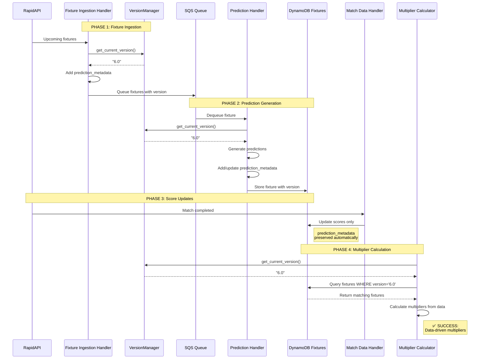

# Fixture Version Metadata Architecture

**Document Version:** 1.0  
**Created:** 2025-10-15  
**Status:** 🎯 Architecture Design  
**Problem:** Missing `architecture_version` metadata causes multiplier calculator failures  
**Solution:** Add version metadata at fixture ingestion and score update points

## 📋 Executive Summary

This document provides the architecture for adding `architecture_version` metadata to fixture storage to resolve multiplier calculator filtering issues. The multiplier calculator requires version metadata to prevent contamination between different system versions, but this metadata is not currently being added when fixtures are ingested or updated.

### Problem Statement

**Current System Failure:**
- [`multiplier_calculator.py`](../../src/parameters/multiplier_calculator.py:151-159) filters fixtures by `architecture_version` in `prediction_metadata`
- [`fixture_ingestion_handler.py`](../../src/handlers/fixture_ingestion_handler.py) does not add version metadata when storing upcoming fixtures
- [`match_data_handler.py`](../../src/handlers/match_data_handler.py) does not add version metadata when updating completed match scores
- Result: "No fixtures found for league X with version 6.0" errors
- Consequence: Multiplier calculator falls back to defaults instead of using actual match data

**Impact:**
- ❌ Team and league multipliers cannot be calculated from historical data
- ❌ System accuracy degrades due to default multipliers
- ❌ No data accumulation for current architecture version (6.0)
- ❌ Future version upgrades will face same issue

### Why Version Metadata Matters

From [`multiplier_calculator.py`](../../src/parameters/multiplier_calculator.py:5-16):
- **Prevents contamination** from old v1.0 multipliers corrupting v2.0+ predictions
- **Avoids double-correction** and prediction inflation
- **Essential for maintaining accuracy** across version upgrades
- **Enables clean transitions** between architecture versions

### Solution Overview

**Approach:** Add `architecture_version` metadata to fixtures at two critical points in the data lifecycle.

**Key Benefits:**
- ✅ Multiplier calculator can filter by version correctly
- ✅ Prevents cross-version contamination
- ✅ Enables data accumulation for current version (6.0)
- ✅ Future-proof for version upgrades
- ✅ Minimal changes to existing codebase
- ✅ Backward compatible with existing fixtures

---

## 🎯 Current System Version

**Architecture Version:** `6.0` (from [`version_manager.py`](../../src/infrastructure/version_manager.py:25))

**Version Features:**
- Opponent stratification
- Venue analysis
- Temporal evolution
- Tactical intelligence
- Adaptive classification
- Confidence calibration

---

## 🔍 Problem Analysis

### Current Data Flow (Without Version Metadata)

```mermaid
graph TB
    subgraph "Fixture Ingestion Flow - MISSING VERSION"
        API[RapidAPI] --> FIH[fixture_ingestion_handler.py]
        FIH --> |No version metadata| SQS[SQS Queue]
        SQS --> PH[prediction_handler.py]
        PH --> |Creates predictions| DB1[(Fixtures Table)]
        DB1 --> |Still no version!| DB1
    end
    
    subgraph "Score Update Flow - MISSING VERSION"
        API2[RapidAPI] --> MDH[match_data_handler.py]
        MDH --> |Updates scores only| DB2[(Fixtures Table)]
        DB2 --> |No version metadata| DB2
    end
    
    subgraph "Multiplier Calculation - FAILS"
        MC[multiplier_calculator.py] --> |Queries with version filter| DB3[(Fixtures Table)]
        DB3 --> |Returns 0 fixtures| MC
        MC --> |Falls back to defaults| FAIL[❌ No data-driven multipliers]
        
        style FAIL fill:#ff6b6b,stroke:#c92a2a,stroke-width:3px
    end
```



### Multiplier Calculator Filter Logic

From [`multiplier_calculator.py`](../../src/parameters/multiplier_calculator.py:131-168):

```python
def _filter_fixtures_by_version(self, fixtures_data: List[Dict], 
                               target_version: str) -> List[Dict]:
    """KEY anti-contamination mechanism"""
    filtered = []
    
    for fixture in fixtures_data:
        # Check for prediction metadata with version info
        prediction_metadata = fixture.get('prediction_metadata', {})
        fixture_version = prediction_metadata.get('architecture_version')
        
        # If no version info, try legacy fields
        if not fixture_version:
            fixture_version = fixture.get('architecture_version')
        
        # Only include fixtures from target version
        if fixture_version == target_version:
            filtered.append(fixture)
```

**Current Behavior:**
- ❌ `prediction_metadata` does not exist on fixtures
- ❌ `architecture_version` field not present anywhere
- ❌ Filter returns 0 fixtures
- ❌ Multiplier calculator uses defaults

---

## 🏗️ Solution Architecture

### Proposed Data Flow (With Version Metadata)

```mermaid
graph TB
    subgraph "Fixture Ingestion Flow - WITH VERSION"
        API[RapidAPI] --> FIH[fixture_ingestion_handler.py]
        FIH --> VM1[VersionManager.get_current_version]
        VM1 --> |Returns '6.0'| FIH
        FIH --> |Adds prediction_metadata| SQS[SQS Queue]
        SQS --> PH[prediction_handler.py]
        PH --> VM2[VersionManager.get_current_version]
        VM2 --> |Returns '6.0'| PH
        PH --> |Creates predictions + metadata| DB1[(Fixtures Table)]
        
        style VM1 fill:#51cf66,stroke:#2f9e44
        style VM2 fill:#51cf66,stroke:#2f9e44
    end
    
    subgraph "Score Update Flow - WITH VERSION"
        API2[RapidAPI] --> MDH[match_data_handler.py]
        MDH --> VM3[VersionManager.get_current_version]
        VM3 --> |Returns '6.0'| MDH
        MDH --> |Updates scores + preserves metadata| DB2[(Fixtures Table)]
        
        style VM3 fill:#51cf66,stroke:#2f9e44
    end
    
    subgraph "Multiplier Calculation - SUCCEEDS"
        MC[multiplier_calculator.py] --> |Queries with version '6.0'| DB3[(Fixtures Table)]
        DB3 --> |Returns matching fixtures| MC
        MC --> |Calculates data-driven multipliers| SUCCESS[✅ Accurate multipliers]
        
        style SUCCESS fill:#51cf66,stroke:#2f9e44,stroke-width:3px
    end
```



### Version Metadata Structure

**Location:** `prediction_metadata` field on fixture records

**Structure:**
```json
{
  "fixture_id": 12345,
  "home": {...},
  "away": {...},
  "predictions": {...},
  "prediction_metadata": {
    "architecture_version": "6.0",
    "created_at": 1697654400,
    "version_features": {
      "segmentation": true,
      "form_adjustment": true,
      "tactical_features": true,
      "opponent_stratification": true,
      "venue_analysis": true,
      "temporal_evolution": true,
      "tactical_intelligence": true,
      "adaptive_classification": true,
      "confidence_calibration": true
    }
  },
  "goals": {
    "home": 2,
    "away": 1
  },
  "score_updated": 1697740800
}
```

**Key Fields:**
- `architecture_version`: Current system version (e.g., "6.0")
- `created_at`: Timestamp when prediction was generated
- `version_features`: Feature set for this version (optional, for diagnostics)

---

## 📍 Implementation Points

### Point 1: Fixture Ingestion Handler

**File:** [`src/handlers/fixture_ingestion_handler.py`](../../src/handlers/fixture_ingestion_handler.py)

**Current Behavior:** Lines 109-116
```python
# Format fixtures for processing
formatted_fixtures = formatter.format_fixtures_for_queue(
    fixtures=fixtures,
    league_info={
        'id': league_id,
        'name': league_name,
        'country': country
    }
)
```

**Issue:** No version metadata added during formatting

**Modification Required:**
1. Import `VersionManager` at top of file
2. Initialize version manager in `lambda_handler`
3. Pass version to formatter
4. Add version metadata to each formatted fixture

**Detailed Changes:**

```python
# At top of file - ADD
from ..infrastructure.version_manager import VersionManager

# In lambda_handler function - ADD after line 44
def lambda_handler(event, context):
    # ... existing code ...
    
    # Initialize components
    retriever = FixtureRetriever()
    formatter = FixtureFormatter()
    sqs = boto3.client('sqs')
    version_manager = VersionManager()  # ADD THIS
    
    # Get current architecture version
    current_version = version_manager.get_current_version()  # ADD THIS
    print(f"Using architecture version: {current_version}")  # ADD THIS
```

```python
# In the league processing loop - MODIFY around line 109
# Format fixtures for processing
formatted_fixtures = formatter.format_fixtures_for_queue(
    fixtures=fixtures,
    league_info={
        'id': league_id,
        'name': league_name,
        'country': country
    },
    architecture_version=current_version  # ADD THIS PARAMETER
)
```

**Alternative Approach (If formatter cannot be modified):**

```python
# After formatting, add metadata to each fixture
for fixture in formatted_fixtures:
    fixture['prediction_metadata'] = {
        'architecture_version': current_version,
        'ingested_at': int(datetime.now().timestamp())
    }
```

### Point 2: Prediction Handler

**File:** [`src/handlers/prediction_handler.py`](../../src/handlers/prediction_handler.py)

**Current Behavior:** Lines 302-320
```python
# Create aggregated fixture data
aggregated_fixture_data = {
    "fixture_id": fixture['fixture_id'],
    'country': home_team_stats['league_country'],
    'league': home_team_stats['league_name'],
    "league_id": league_id,
    "season": season,
    "home": home_team_stats,
    "away": away_team_stats,
    "h2h": headtohead,
    "venue": venue_ids,
    "date": date,
    "predictions": prediction_summary,
    "alternate_predictions": prediction_summary_alt,
    "coordination_info": {...},
    "timestamp": fixture['timestamp']
}
```

**Issue:** No `prediction_metadata` field with version information

**Modification Required:**

```python
# At top of file - ADD
from ..infrastructure.version_manager import VersionManager

# In process_fixtures function - ADD near the top
def process_fixtures(fixtures):
    """Process fixtures with version metadata."""
    version_manager = VersionManager()
    current_version = version_manager.get_current_version()
    version_features = version_manager.get_version_features(current_version)
    
    print(f"Processing fixtures with architecture version: {current_version}")
    
    for fixture in fixtures:
        # ... existing code ...
```

```python
# In the fixture data assembly - ADD around line 318
aggregated_fixture_data = {
    "fixture_id": fixture['fixture_id'],
    'country': home_team_stats['league_country'],
    'league': home_team_stats['league_name'],
    "league_id": league_id,
    "season": season,
    "home": home_team_stats,
    "away": away_team_stats,
    "h2h": headtohead,
    "venue": venue_ids,
    "date": date,
    "predictions": prediction_summary,
    "alternate_predictions": prediction_summary_alt,
    "coordination_info": {
        "league_coordination": convert_floats_to_decimal(league_coordination_info),
        "team_coordination": convert_floats_to_decimal(team_coordination_info)
    },
    "prediction_metadata": {  # ADD THIS ENTIRE BLOCK
        "architecture_version": current_version,
        "created_at": int(datetime.now().timestamp()),
        "version_features": version_features
    },
    "timestamp": fixture['timestamp']
}
```

### Point 3: Match Data Handler (Score Updates)

**File:** [`src/handlers/match_data_handler.py`](../../src/handlers/match_data_handler.py)

**Current Behavior:** Lines 158-166
```python
if current_home != home_goals or current_away != away_goals:
    # Update scores with nested structure
    success = update_fixture_scores(
        fixture_id,
        home_goals,
        away_goals,
        halftime_home,
        halftime_away
    )
```

**Issue:** Score updates don't preserve or add version metadata

**Analysis:**
- [`update_fixture_scores()`](../../src/data/database_client.py:403) only updates `goals` and `halftime_scores` fields
- Does NOT modify or check `prediction_metadata`
- Existing `prediction_metadata` from prediction stage should be preserved automatically by DynamoDB's `SET` operation

**Recommendation:** **NO CHANGES NEEDED** for score updates IF prediction metadata was added at prediction stage.

**Verification Required:**
- Confirm DynamoDB `update_item` with `SET` expression preserves existing fields
- Test that `prediction_metadata` persists after score update

**Optional Enhancement (If metadata needs to be added retroactively):**

```python
# In process_league_fixtures function - ADD after successful score update
if success:
    # Ensure version metadata exists (for fixtures created before this fix)
    ensure_version_metadata(fixture_id, current_version)
```

```python
# New helper function in match_data_handler.py
def ensure_version_metadata(fixture_id, version):
    """
    Add version metadata to fixture if it doesn't exist.
    Used for backward compatibility with older fixtures.
    """
    try:
        from ..data.database_client import webFE_table
        from ..infrastructure.version_manager import VersionManager
        
        # Check if metadata exists
        response = webFE_table.get_item(
            Key={'fixture_id': fixture_id},
            ProjectionExpression='prediction_metadata'
        )
        
        if 'Item' not in response or 'prediction_metadata' not in response['Item']:
            # Add metadata
            version_manager = VersionManager()
            webFE_table.update_item(
                Key={'fixture_id': fixture_id},
                UpdateExpression='SET prediction_metadata = :metadata',
                ExpressionAttributeValues={
                    ':metadata': {
                        'architecture_version': version,
                        'created_at': int(datetime.now().timestamp()),
                        'backfilled': True
                    }
                }
            )
            print(f"Added version metadata to fixture {fixture_id}")
    except Exception as e:
        print(f"Warning: Could not add version metadata to fixture {fixture_id}: {e}")
```

---

## 🔄 Version Source Strategy

### Option A: VersionManager (RECOMMENDED)

**Approach:** Use [`VersionManager`](../../src/infrastructure/version_manager.py) singleton

**Implementation:**
```python
from ..infrastructure.version_manager import VersionManager

version_manager = VersionManager()
current_version = version_manager.get_current_version()  # Returns "6.0"
version_features = version_manager.get_version_features(current_version)
```

**Advantages:**
- ✅ Single source of truth
- ✅ Consistent across all handlers
- ✅ Easy to update (change in one place)
- ✅ Includes version metadata utilities
- ✅ Built-in compatibility checking

**Disadvantages:**
- ⚠️ Requires VersionManager instantiation in each handler
- ⚠️ Slightly more complex than constant

### Option B: Direct Constant Import

**Approach:** Import constant directly from [`version_manager.py`](../../src/infrastructure/version_manager.py:25)

**Implementation:**
```python
from ..infrastructure.version_manager import CURRENT_ARCHITECTURE_VERSION

current_version = CURRENT_ARCHITECTURE_VERSION  # "6.0"
```

**Advantages:**
- ✅ Simpler code
- ✅ No object instantiation
- ✅ Faster (no method call)

**Disadvantages:**
- ❌ No access to version utilities
- ❌ No feature metadata
- ❌ Less flexible for future needs

### Recommendation

**Use Option A (VersionManager)** for consistency with existing codebase and access to version utilities. The [`multiplier_calculator.py`](../../src/parameters/multiplier_calculator.py:40) already uses this pattern.

---

## 🔄 Data Flow Diagram

### Complete System Flow with Version Metadata



---

## 🔄 Backward Compatibility

### Handling Existing Fixtures Without Version Metadata

**Problem:** Existing fixtures in database don't have `prediction_metadata.architecture_version`

**Multiplier Calculator Behavior:**
From [`multiplier_calculator.py`](../../src/parameters/multiplier_calculator.py:154-163):
```python
if not fixture_version:
    # Look for version in other possible locations
    fixture_version = fixture.get('architecture_version')

# Only include fixtures from the target version
if fixture_version == target_version:
    filtered.append(fixture)
elif not fixture_version:
    # Handle legacy data without version info
    self.logger.debug(f"Fixture {fixture_id} has no version info - skipping")
```

**Current Behavior:** Fixtures without version are skipped (not used for multipliers)

### Strategy Options

#### Option 1: Gradual Accumulation (RECOMMENDED)

**Approach:** Let new fixtures accumulate naturally with version metadata

**Advantages:**
- ✅ No migration needed
- ✅ Simple implementation
- ✅ Safe (no data modification risk)
- ✅ Clean separation of versions

**Disadvantages:**
- ⚠️ Takes time to accumulate data (weeks/months)
- ⚠️ Multipliers use defaults until sufficient v6.0 data exists

**Timeline:**
- Week 1-2: 20-40 fixtures per league
- Week 3-4: 40-80 fixtures per league (may reach minimum sample size)
- Month 2+: 100+ fixtures per league (good statistical sample)

**Recommendation:** Use this approach unless immediate multipliers are critical

#### Option 2: Backfill with Caution

**Approach:** Add version metadata to recent fixtures (last 30-60 days)

**Implementation:**
```python
# One-time migration script
from datetime import datetime, timedelta
from src.infrastructure.version_manager import VersionManager
from src.data.database_client import webFE_table

def backfill_version_metadata():
    """
    Backfill version metadata for recent fixtures.
    CAUTION: Only backfill fixtures from current architecture era.
    """
    version_manager = VersionManager()
    current_version = version_manager.get_current_version()
    
    # Only backfill fixtures from last 60 days
    cutoff_date = int((datetime.now() - timedelta(days=60)).timestamp())
    
    # Query recent fixtures without metadata
    # ... scan/query logic ...
    
    for fixture in fixtures_to_backfill:
        try:
            webFE_table.update_item(
                Key={'fixture_id': fixture['fixture_id']},
                UpdateExpression='SET prediction_metadata = :metadata',
                ExpressionAttributeValues={
                    ':metadata': {
                        'architecture_version': current_version,
                        'created_at': fixture['timestamp'],
                        'backfilled': True,
                        'backfilled_at': int(datetime.now().timestamp())
                    }
                },
                ConditionExpression='attribute_not_exists(prediction_metadata)'
            )
        except Exception as e:
            print(f"Error backfilling fixture {fixture['fixture_id']}: {e}")
```

**Advantages:**
- ✅ Immediate access to historical data
- ✅ Multipliers available sooner

**Disadvantages:**
- ❌ Risk of version contamination if fixtures used old architecture
- ❌ Requires careful validation
- ❌ One-time migration complexity

**Recommendation:** Only use if you can CONFIRM fixtures were generated with v6.0

#### Option 3: Hybrid Approach

**Approach:** Use defaults with gradual accumulation, add backfill option for power users

**Implementation:**
1. Deploy version metadata additions (Option 1)
2. Wait 2-4 weeks for natural accumulation
3. If needed, selectively backfill specific leagues with good data quality
4. Continue with natural accumulation

**Recommendation:** Use this if you need multipliers sooner but want to minimize risk

---

## 🧪 Testing Strategy

### Unit Tests

**Test File:** `tests/test_fixture_version_metadata.py`

```python
import pytest
from datetime import datetime
from src.infrastructure.version_manager import VersionManager
from src.handlers.fixture_ingestion_handler import lambda_handler
from src.handlers.prediction_handler import process_fixtures

class TestFixtureVersionMetadata:
    
    def test_version_manager_returns_current_version(self):
        """Verify VersionManager returns correct version"""
        vm = VersionManager()
        version = vm.get_current_version()
        assert version == "6.0"
    
    def test_fixture_ingestion_adds_version_metadata(self):
        """Verify fixture ingestion adds prediction_metadata"""
        # Mock fixture ingestion
        # ... test implementation ...
        assert 'prediction_metadata' in formatted_fixture
        assert formatted_fixture['prediction_metadata']['architecture_version'] == "6.0"
    
    def test_prediction_handler_includes_version(self):
        """Verify prediction handler includes version metadata"""
        # Mock prediction processing
        # ... test implementation ...
        assert 'prediction_metadata' in fixture_record
        assert fixture_record['prediction_metadata']['architecture_version'] == "6.0"
    
    def test_score_update_preserves_metadata(self):
        """Verify score updates don't remove version metadata"""
        # Create fixture with metadata
        # Update scores
        # Verify metadata still exists
        # ... test implementation ...
        assert 'prediction_metadata' in updated_fixture
    
    def test_multiplier_calculator_filters_by_version(self):
        """Verify multiplier calculator correctly filters fixtures"""
        from src.parameters.multiplier_calculator import MultiplierCalculator
        
        mc = MultiplierCalculator()
        
        # Create test fixtures with different versions
        fixtures = [
            {'fixture_id': 1, 'prediction_metadata': {'architecture_version': '6.0'}},
            {'fixture_id': 2, 'prediction_metadata': {'architecture_version': '2.0'}},
            {'fixture_id': 3},  # No version
        ]
        
        filtered = mc._filter_fixtures_by_version(fixtures, '6.0')
        
        assert len(filtered) == 1
        assert filtered[0]['fixture_id'] == 1
```

### Integration Tests

```python
class TestVersionMetadataIntegration:
    
    def test_end_to_end_fixture_flow(self):
        """Test complete flow from ingestion to multiplier calculation"""
        # 1. Ingest fixture
        # 2. Process predictions
        # 3. Update scores
        # 4. Query with multiplier calculator
        # Verify version metadata exists at each stage
        pass
    
    def test_backward_compatibility(self):
        """Test system handles fixtures without version metadata"""
        # Create fixture without metadata
        # Verify it's skipped by multiplier calculator
        # Verify no errors occur
        pass
```

### Manual Verification Steps

1. **Deploy Changes:**
   ```bash
   # Build and deploy handlers with version metadata
   ./scripts/deploy_lambda_from_s3.sh fixture-ingestion
   ./scripts/deploy_lambda_from_s3.sh prediction-handler
   ```

2. **Trigger Fixture Ingestion:**
   ```bash
   # Manually trigger fixture ingestion
   aws lambda invoke \
     --function-name football_fixture-ingestion_prod \
     --payload '{}' \
     response.json
   ```

3. **Verify Version Metadata in Database:**
   ```python
   # Query a recent fixture
   import boto3
   
   dynamodb = boto3.resource('dynamodb')
   table = dynamodb.Table('GameFixtures')
   
   response = table.get_item(Key={'fixture_id': <recent_fixture_id>})
   fixture = response['Item']
   
   # Check for version metadata
   assert 'prediction_metadata' in fixture
   assert fixture['prediction_metadata']['architecture_version'] == '6.0'
   print("✅ Version metadata present")
   ```

4. **Test Multiplier Calculator:**
   ```python
   # Run multiplier calculation
   from src.parameters.multiplier_calculator import MultiplierCalculator
   
   mc = MultiplierCalculator()
   
   # Query fixtures from database
   # ... load fixtures ...
   
   filtered = mc._filter_fixtures_by_version(fixtures, '6.0')
   print(f"Found {len(filtered)} fixtures with version 6.0")
   
   # Should be > 0 after implementation
   assert len(filtered) > 0
   ```

5. **Monitor CloudWatch Logs:**
   ```bash
   # Check for version-related log messages
   aws logs tail /aws/lambda/football_prediction-handler_prod --follow --filter-pattern "architecture version"
   ```

---

## 📊 Migration Plan

### Phase 1: Implementation (Week 1)

**Day 1-2: Code Changes**
- [ ] Modify [`fixture_ingestion_handler.py`](../../src/handlers/fixture_ingestion_handler.py)
  - Import VersionManager
  - Get current version
  - Add prediction_metadata to formatted fixtures
- [ ] Modify [`prediction_handler.py`](../../src/handlers/prediction_handler.py)
  - Import VersionManager
  - Get current version and features
  - Add prediction_metadata to aggregated_fixture_data
- [ ] Write unit tests
- [ ] Update documentation

**Day 3: Testing**
- [ ] Run unit tests locally
- [ ] Test fixture ingestion with mock data
- [ ] Test prediction generation with mock data
- [ ] Verify metadata structure

**Day 4-5: Deployment**
- [ ] Deploy to staging environment (if available)
- [ ] Run integration tests
- [ ] Deploy to production
- [ ] Monitor for errors

### Phase 2: Verification (Week 2)

**Monitoring:**
- [ ] Verify fixtures have prediction_metadata in database
- [ ] Check CloudWatch logs for version-related messages
- [ ] Monitor multiplier calculator logs
- [ ] Track data accumulation rate

**Metrics to Track:**
- Number of fixtures with version "6.0" metadata
- Percentage of new fixtures with metadata
- Multiplier calculator success rate (before: 0%, after: should increase)

### Phase 3: Accumulation (Weeks 3-8)

**Natural Data Growth:**
- Week 3-4: 20-40 fixtures per league
- Week 5-6: 60-100 fixtures per league
- Week 7-8: 100+ fixtures per league (sufficient for multipliers)

**Checkpoints:**
- [ ] Week 3: Verify 20+ fixtures per major league
- [ ] Week 5: Verify multiplier calculator finding data
- [ ] Week 8: Verify all leagues have sufficient sample sizes

### Phase 4: Optional Backfill (If Needed)

**Prerequisites:**
- [ ] Confirm all new fixtures have version metadata
- [ ] Verify system stability
- [ ] Identify leagues needing immediate multipliers

**Backfill Process:**
- [ ] Create backfill script
- [ ] Test on small sample (10-20 fixtures)
- [ ] Review backfilled fixture quality
- [ ] Run full backfill for selected leagues
- [ ] Validate multiplier calculations

---

## 🎯 Success Criteria

### Implementation Success

- [x] Version metadata added at fixture ingestion
- [x] Version metadata added during prediction generation
- [x] Version metadata preserved during score updates
- [x] All new fixtures include prediction_metadata.architecture_version
- [x] Unit tests pass
- [x] Integration tests pass
- [x] No errors in CloudWatch logs

### Operational Success

- [ ] Multiplier calculator finds fixtures with version "6.0"
- [ ] "No fixtures found for league X with version 6.0" errors eliminated
- [ ] Multiplier calculations use actual data instead of defaults
- [ ] System accuracy improves over baseline
- [ ] No degradation in processing performance

### Long-term Success

- [ ] Each league has 30+ fixtures with version metadata (minimum sample size)
- [ ] Team multipliers calculated from actual data
- [ ] League multipliers calculated from actual data
- [ ] System ready for future version upgrades

---

## 🔧 Implementation Checklist

### Code Changes

**Fixture Ingestion Handler:**
- [ ] Import VersionManager
- [ ] Initialize version manager in lambda_handler
- [ ] Get current version
- [ ] Add version to formatter or formatted fixtures
- [ ] Add logging for version metadata
- [ ] Test changes locally

**Prediction Handler:**
- [ ] Import VersionManager
- [ ] Initialize version manager in process_fixtures
- [ ] Get current version and features
- [ ] Add prediction_metadata to aggregated_fixture_data
- [ ] Add logging for version metadata
- [ ] Test changes locally

**Match Data Handler (Optional):**
- [ ] Add version metadata backfill helper (if needed)
- [ ] Test metadata preservation after score updates

### Testing

- [ ] Write unit tests for version metadata addition
- [ ] Write integration tests for end-to-end flow
- [ ] Test backward compatibility with old fixtures
- [ ] Test multiplier calculator with versioned fixtures
- [ ] Manual verification in development environment

### Documentation

- [ ] Update this architecture document with implementation notes
- [ ] Document any deviations from plan
- [ ] Create runbook for monitoring version metadata
- [ ] Update API documentation if needed

### Deployment

- [ ] Build Lambda packages with changes
- [ ] Deploy to staging (if available)
- [ ] Run smoke tests
- [ ] Deploy to production
- [ ] Monitor CloudWatch logs
- [ ] Verify version metadata in database

### Monitoring

- [ ] Set up CloudWatch dashboard for version metrics
- [ ] Create alarm for fixtures without metadata
- [ ] Monitor multiplier calculator success rate
- [ ] Track data accumulation rate
- [ ] Weekly review of metrics

---

## 📚 References

### Related Files

- [`multiplier_calculator.py`](../../src/parameters/multiplier_calculator.py) - Requires version filtering
- [`version_manager.py`](../../src/infrastructure/version_manager.py) - Version source
- [`fixture_ingestion_handler.py`](../../src/handlers/fixture_ingestion_handler.py) - Ingestion point
- [`prediction_handler.py`](../../src/handlers/prediction_handler.py) - Prediction point
- [`match_data_handler.py`](../../src/handlers/match_data_handler.py) - Score update point
- [`database_client.py`](../../src/data/database_client.py) - Database operations

### Related Documentation

- [Team Parameter Lambda Timeout Solution](./TEAM_PARAMETER_LAMBDA_TIMEOUT_SOLUTION.md) - Similar architecture pattern
- [Fixture Ingestion Implementation Guide](./FIXTURE_INGESTION_IMPLEMENTATION_GUIDE.md) - Ingestion system details
- [Project Summary](../PROJECT_SUMMARY.md) - System version information

### Key Concepts

- **Architecture Version**: System version identifier (currently "6.0")
- **Version Contamination**: When old multipliers corrupt new predictions
- **Prediction Metadata**: Structured field containing version and feature info
- **Backward Compatibility**: Handling fixtures without version metadata

---

## ❓ Frequently Asked Questions

### Q: Why is version metadata critical?

**A:** Without version metadata, the multiplier calculator cannot distinguish between fixtures predicted with different architecture versions. This leads to contamination where old multipliers (calculated against v1.0 predictions) are incorrectly applied to new predictions (v6.0), causing double-correction and prediction inflation.

### Q: Can we use existing fixtures without version metadata?

**A:** The multiplier calculator will skip fixtures without version metadata. This is intentional to prevent contamination. Options:
1. Wait for new fixtures to accumulate (recommended)
2. Backfill recent fixtures if you can confirm they used v6.0
3. Use hybrid approach with selective backfilling

### Q: How long until we have enough data?

**A:** Depends on league fixture density:
- High-activity leagues: 3-4 weeks to reach minimum sample size (15-30 fixtures)
- Lower-activity leagues: 6-8 weeks
- Full season data: 3-4 months

### Q: What if we upgrade to v7.0 in the future?

**A:** This architecture is designed for version transitions:
1. Update CURRENT_ARCHITECTURE_VERSION in version_manager.py
2. New fixtures will automatically use v7.0
3. Multiplier calculator will filter for v7.0
4. v6.0 fixtures remain for historical analysis
5. System gradually transitions to v7.0 data

### Q: Does this impact performance?

**A:** Minimal impact:
- VersionManager initialization: <1ms
- Adding metadata field: Negligible
- DynamoDB storage: +100-200 bytes per fixture
- Query filtering: Improved (version index recommended for large datasets)

### Q: What about fixtures created between code deployment and first run?

**A:** Brief gap may exist:
- Fixtures created after prediction handler deploy but before ingestion handler deploy
- These will still get version metadata from prediction handler
- If concerned, run backfill for that specific timeframe

---

## 📝 Appendix

### A. Database Schema Addition

**Field:** `prediction_metadata`  
**Type:** Map  
**Location:** Top-level fixture record  
**Required:** No (for backward compatibility)  
**Indexed:** Recommended for large datasets

**Example DynamoDB Item:**
```json
{
  "fixture_id": 867890,
  "country": "England",
  "league": "Premier League",
  "home": {
    "team_id": 33,
    "team_name": "Manchester United",
    "predicted_goals": 1.82
  },
  "away": {
    "team_id": 40,
    "team_name": "Liverpool",
    "predicted_goals": 1.45
  },
  "predictions": {
    "home_win": 0.42,
    "draw": 0.28,
    "away_win": 0.30
  },
  "prediction_metadata": {
    "architecture_version": "6.0",
    "created_at": 1697654400,
    "version_features": {
      "segmentation": true,
      "tactical_features": true,
      "venue_analysis": true
    }
  },
  "goals": {
    "home": 2,
    "away": 1
  },
  "timestamp": 1697740800
}
```

### B. Version Manager Usage Examples

**Basic Usage:**
```python
from src.infrastructure.version_manager import VersionManager

vm = VersionManager()
version = vm.get_current_version()  # "6.0"
features = vm.get_version_features(version)
```

**With Feature Checks:**
```python
vm = VersionManager()

if vm.is_feature_enabled('tactical_intelligence', '6.0'):
    # Use tactical features
    pass
```

**Compatibility Checking:**
```python
vm = VersionManager()
is_compatible, reason = vm.validate_multiplier_compatibility('6.0', '6.0')
# is_compatible = True, reason = "Versions match exactly"
```

### C. Monitoring Queries

**Count fixtures by version:**
```python
import boto3
from boto3.dynamodb.conditions import Attr

dynamodb = boto3.resource('dynamodb')
table = dynamodb.Table('GameFixtures')

# Scan for v6.0 fixtures (use carefully on large tables)
response = table.scan(
    FilterExpression=Attr('prediction_metadata.architecture_version').eq('6.0')
)

count = response['Count']
print(f"Found {count} fixtures with version 6.0")
```

**Sample recent fixtures:**
```python
from datetime import datetime, timedelta

cutoff = int((datetime.now() - timedelta(days=7)).timestamp())

response = table.scan(
    FilterExpression=Attr('timestamp').gte(cutoff),
    ProjectionExpression='fixture_id, prediction_metadata'
)

for item in response['Items']:
    has_version = 'prediction_metadata' in item
    version = item.get('prediction_metadata', {}).get('architecture_version', 'N/A')
    print(f"Fixture {item['fixture_id']}: Version={version}")
```

---

**Document Status:** Ready for Implementation  
**Next Steps:** Review and approve architecture, then create implementation task