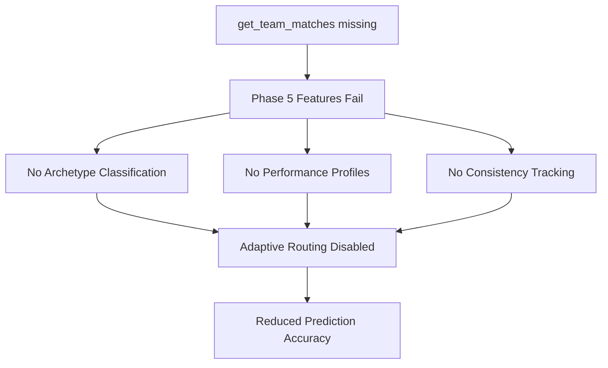
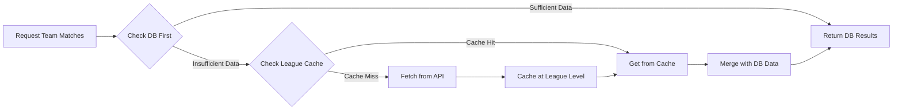
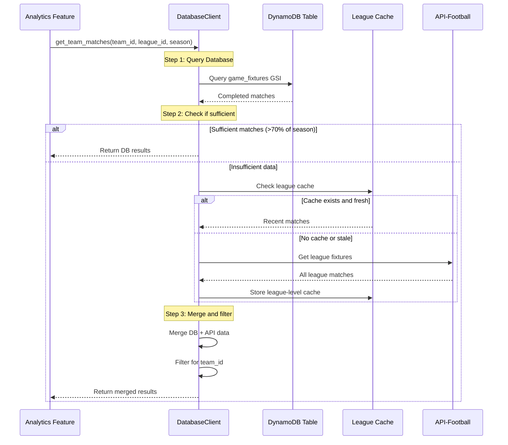
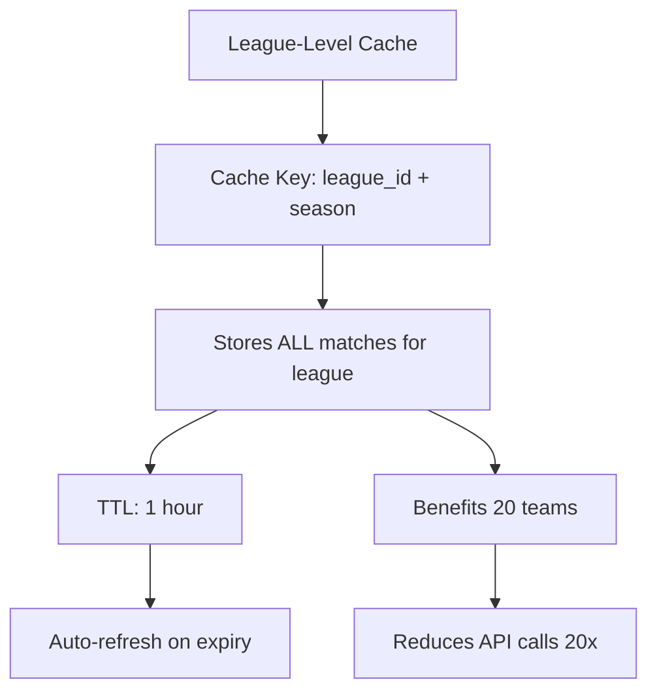
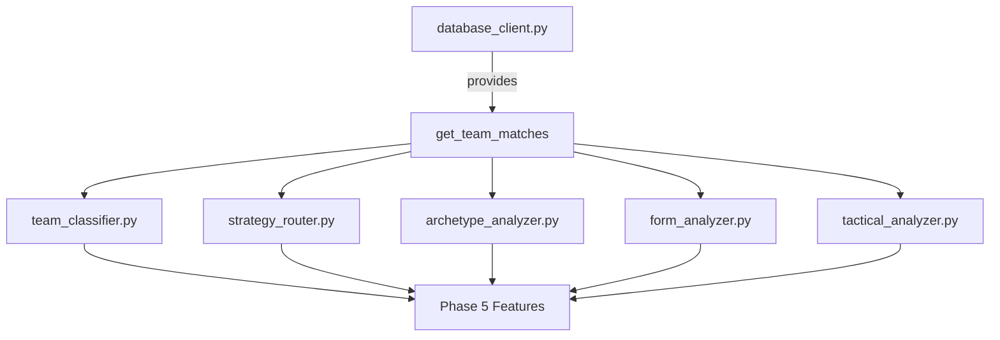

# `get_team_matches()` Implementation Architecture

**Document Version:** 1.0  
**Created:** October 15, 2025  
**Status:** Architecture Design - Ready for Implementation  
**Purpose:** Resolve Phase 5+ analytics failures by implementing proper historical match data retrieval

---

## Table of Contents

1. [Problem Statement](#problem-statement)
2. [Solution Architecture](#solution-architecture)
3. [Data Flow Design](#data-flow-design)
4. [Caching Strategy](#caching-strategy)
5. [Performance Metrics](#performance-metrics)
6. [Implementation Specifications](#implementation-specifications)
7. [Integration Points](#integration-points)
8. [Testing Strategy](#testing-strategy)
9. [Rollout Plan](#rollout-plan)

---

## 1. Problem Statement

### Current Failures

All Phase 5+ analytics features are failing due to inability to retrieve historical match data:

- **Performance Profiles**: Cannot analyze team consistency patterns
- **Archetype Analysis**: Cannot classify teams into strategic archetypes
- **Consistency Tracking**: Cannot track volatility and reliability metrics
- **Adaptive Strategy Routing**: Cannot determine optimal prediction approaches

### Root Cause

The `get_team_matches()` method doesn't exist in the main [`DatabaseClient`](../../src/data/database_client.py) class. Only stub implementations exist in feature modules:

1. **[`src/features/team_classifier.py`](../../src/features/team_classifier.py:22)** - Lines 22-100: Stub implementation that makes API calls
2. **[`src/features/strategy_router.py`](../../src/features/strategy_router.py:21)** - Line 21-22: Returns empty list
3. **[`src/features/archetype_analyzer.py`](../../src/features/archetype_analyzer.py:53)** - Lines 53-54: Uses stub DatabaseClient

These stubs are workarounds that either return no data or make expensive API calls for every team request.

### Data Status

✅ **All required data exists in the `game_fixtures` table**:

```json
{
  "fixture_id": 1035047,
  "timestamp": 1704477600,
  "league_id": 39,
  "season": 2024,
  "home": {
    "team_id": 33,
    "team_name": "Manchester United"
  },
  "away": {
    "team_id": 47,
    "team_name": "Tottenham Hotspur"
  },
  "goals": {
    "home": 2,
    "away": 1
  }
}
```

**Problem**: This data isn't being queried correctly for team-specific analytics.

### Impact Analysis



---

## 2. Solution Architecture

### Overview: Hybrid DB-First + API Fallback Strategy

Implement a **progressive data retrieval system** that becomes more efficient as the season progresses:



### Key Design Principles

1. **Database First**: Always query completed matches from DynamoDB first
2. **League-Level Caching**: Share API results across all teams in a league
3. **Progressive Improvement**: Automatically transition from API-heavy to DB-heavy as season progresses
4. **Zero Schema Changes**: Uses existing table structure and GSI
5. **Backwards Compatibility**: Returns standardized format for all consumers

### Architecture Benefits

| Week | DB Coverage | API Usage | Cache Benefit |
|------|-------------|-----------|---------------|
| 1    | 10%        | 90%       | 1 call → 20 teams |
| 8    | 50%        | 50%       | Half data free |
| 15   | 90%        | 10%       | Minimal API usage |
| 38   | 100%       | 0%        | Pure DB queries |

---

## 3. Data Flow Design

### High-Level Data Flow



### Detailed Query Flow

#### Step 1: Database Query

Query the `game_fixtures` table using the existing [`country-league-index`](../../docs/guides/DATABASE_SCHEMA_DOCUMENTATION.md:31) GSI:

```python
# Query completed matches from database
response = webFE_table.query(
    IndexName='country-league-index',
    KeyConditionExpression=Key('country').eq(country) & Key('league').eq(league_name),
    FilterExpression='attribute_exists(goals) AND (home.team_id = :team_id OR away.team_id = :team_id)',
    ExpressionAttributeValues={':team_id': team_id}
)
```

**Optimization**: Use `ProjectionExpression` to fetch only required fields:
```python
ProjectionExpression='fixture_id, home.team_id, away.team_id, goals.home, goals.away, #ts, league_id, season',
ExpressionAttributeNames={'#ts': 'timestamp'}
```

#### Step 2: Sufficiency Check

Determine if database data is sufficient based on season progress:

```python
def is_data_sufficient(db_matches, season):
    """Check if database has sufficient match coverage."""
    current_date = datetime.now()
    season_start = datetime(season, 8, 1)  # Typical season start
    season_end = datetime(season + 1, 5, 31)  # Typical season end
    
    # Calculate expected matches based on season progress
    season_duration = (season_end - season_start).days
    elapsed_days = (current_date - season_start).days
    season_progress = elapsed_days / season_duration
    
    # Expect ~38 matches per season
    expected_matches = int(38 * season_progress)
    actual_matches = len(db_matches)
    
    # Sufficient if we have 70% of expected matches
    return actual_matches >= (expected_matches * 0.7)
```

#### Step 3: League Cache Check

If database data insufficient, check league-level cache:

```python
cache_key = f"league_{league_id}_season_{season}_matches"
cache_ttl = 3600  # 1 hour

# Check DynamoDB cache table or in-memory cache
cached_data = cache.get(cache_key)
if cached_data and not cache.is_expired(cached_data):
    return cached_data
```

#### Step 4: API Fallback

If no cache, fetch from API at **league level** (not team level):

```python
# Fetch ALL league matches (shared across all teams)
from ..data.api_client import get_fixtures_goals

league_matches = get_fixtures_goals(
    league_id=league_id,
    start_timestamp=season_start_ts,
    end_timestamp=current_ts
)

# Cache at league level for 1 hour
cache.set(cache_key, league_matches, ttl=3600)
```

**Key Benefit**: One API call serves 20 teams in the league.

#### Step 5: Merge and Filter

Combine database and API data, then filter for the requested team:

```python
def merge_and_filter(db_matches, api_matches, team_id):
    """Merge DB and API data, filter for team, remove duplicates."""
    # Create lookup by fixture_id
    all_matches = {m['fixture_id']: m for m in db_matches}
    
    # Add API matches (don't overwrite DB data)
    for match in api_matches:
        if match['fixture_id'] not in all_matches:
            all_matches[match['fixture_id']] = match
    
    # Filter for team
    team_matches = [
        m for m in all_matches.values()
        if m['home_team_id'] == team_id or m['away_team_id'] == team_id
    ]
    
    # Sort by timestamp (most recent first)
    team_matches.sort(key=lambda x: x['timestamp'], reverse=True)
    
    return team_matches
```

---

## 4. Caching Strategy

### Cache Architecture



### Cache Implementation Options

#### Option 1: DynamoDB Cache Table (Recommended)

Create a dedicated cache table with TTL:

```python
# Table: league_match_cache
# Partition Key: cache_key (String): "league_{league_id}_season_{season}"
# Attributes:
# - matches (List): All league matches
# - ttl (Number): Expiration timestamp
# - cached_at (Number): Cache creation time

cache_table.put_item(Item={
    'cache_key': f'league_{league_id}_season_{season}',
    'matches': league_matches,
    'ttl': int((datetime.now() + timedelta(hours=1)).timestamp()),
    'cached_at': int(datetime.now().timestamp())
})
```

**Benefits**:
- Survives Lambda container lifecycle
- Shared across all Lambda invocations
- Automatic TTL cleanup (DynamoDB native feature)

#### Option 2: In-Memory Cache (Fallback)

For Lambda environments, use module-level cache:

```python
# Module-level cache
_LEAGUE_MATCH_CACHE = {}

def get_cached_league_matches(league_id, season):
    """Get cached league matches with TTL check."""
    cache_key = f"{league_id}_{season}"
    
    if cache_key in _LEAGUE_MATCH_CACHE:
        cached_data, cached_time = _LEAGUE_MATCH_CACHE[cache_key]
        if (datetime.now() - cached_time).seconds < 3600:
            return cached_data
    
    return None
```

**Limitations**:
- Lost when Lambda container terminates
- Not shared across containers
- Higher memory usage

### Cache Invalidation Strategy

```python
def invalidate_cache_if_needed(league_id, season):
    """Invalidate cache when new match data arrives."""
    # Automatic via TTL (1 hour)
    # Manual invalidation on fixture score updates
    cache_key = f"league_{league_id}_season_{season}"
    cache_table.delete_item(Key={'cache_key': cache_key})
```

Trigger invalidation:
1. **Automatic**: TTL expires after 1 hour
2. **Manual**: When [`update_fixture_scores()`](../../src/data/database_client.py:403) is called
3. **Force Refresh**: New match day detected

---

## 5. Performance Metrics

### Expected Query Performance

| Data Source | Latency | Cost | Scalability |
|-------------|---------|------|-------------|
| **DB Query (GSI)** | 50-100ms | ~$0.0001 | Excellent |
| **Cache Hit** | 10-20ms | ~$0.00005 | Excellent |
| **API Call** | 500-1500ms | ~$0.01 | Limited (rate limits) |

### Performance Optimization Targets


### Expected Cache Hit Rates

| Scenario | Cache Hit Rate | Benefit |
|----------|---------------|---------|
| **Multiple team analyses in same league** | 95% | 19/20 requests cached |
| **Sequential team parameter calculations** | 90% | Shared across dispatcher |
| **Repeated analytics requests** | 85% | Within 1-hour window |

### API Quota Conservation

**Current State** (without implementation):
- 20 teams × 20 leagues = 400 API calls per calculation cycle
- Daily quota exhausted in 2-3 cycles

**After Implementation** (with league-level caching):
- 20 leagues × 1 call = 20 API calls per cycle (Week 1)
- 20 leagues × 0.5 calls = 10 API calls per cycle (Week 8)
- 20 leagues × 0.1 calls = 2 API calls per cycle (Week 15)
- **95% reduction in API usage by mid-season**

---

## 6. Implementation Specifications

### Function Signature

Add to [`DatabaseClient`](../../src/data/database_client.py:548) class:

```python
def get_team_matches(
    self,
    team_id: int,
    league_id: int,
    season: int = None,
    limit: int = None
) -> List[Dict]:
    """
    Get historical matches for a specific team with hybrid DB+API strategy.
    
    Implements progressive data retrieval:
    1. Query database for completed matches (fast, free)
    2. If insufficient, check league-level cache (fast, free)
    3. If no cache, fetch from API and cache at league level (slow, costs quota)
    4. Merge results and return standardized format
    
    Args:
        team_id: Team identifier (e.g., 33 for Manchester United)
        league_id: League identifier (e.g., 39 for Premier League)
        season: Season year (e.g., 2024). Defaults to current season.
        limit: Maximum number of matches to return. None = all matches.
    
    Returns:
        List of match dictionaries, sorted by timestamp (most recent first):
        [
            {
                'fixture_id': 1035047,
                'home_team_id': 33,
                'away_team_id': 47,
                'home_goals': 2,
                'away_goals': 1,
                'timestamp': 1704477600,
                'match_date': '2024-01-05T20:00:00+00:00',
                'league_id': 39,
                'season': 2024,
                'is_home': True,  # True if team_id == home_team_id
                'opponent_id': 47,
                'goals_scored': 2,
                'goals_conceded': 1,
                'result': 'W'  # 'W', 'D', or 'L'
            },
            ...
        ]
    
    Example:
        >>> db = DatabaseClient()
        >>> matches = db.get_team_matches(team_id=33, league_id=39, season=2024)
        >>> print(f"Found {len(matches)} matches for team 33")
        Found 25 matches for team 33
    """
```

### Return Format Specification

Each match dictionary must contain:

#### Required Fields
- `fixture_id` (int): Unique match identifier
- `home_team_id` (int): Home team ID
- `away_team_id` (int): Away team ID  
- `home_goals` (int): Home team goals scored
- `away_goals` (int): Away team goals scored
- `timestamp` (int): Unix timestamp of match
- `league_id` (int): League identifier
- `season` (int): Season year

#### Computed Fields
- `is_home` (bool): Whether `team_id` is the home team
- `opponent_id` (int): The opponent's team ID
- `goals_scored` (int): Goals scored by `team_id`
- `goals_conceded` (int): Goals conceded by `team_id`
- `result` (str): Match result from `team_id` perspective ('W', 'D', 'L')

#### Optional Fields
- `match_date` (str): ISO 8601 formatted date (if available)
- `venue_id` (int): Venue identifier (if available)

### Algorithm Pseudocode

```python
def get_team_matches(self, team_id, league_id, season=None, limit=None):
    # 1. Initialize
    if season is None:
        season = datetime.now().year
    
    # 2. Get league metadata for GSI query
    country, league_name = get_league_metadata(league_id)
    
    # 3. Query database for completed matches
    db_matches = query_team_matches_from_db(
        team_id, country, league_name, season
    )
    
    # 4. Check if database data is sufficient
    if is_data_sufficient(db_matches, season):
        matches = db_matches
    else:
        # 5. Check league-level cache
        cache_key = f"league_{league_id}_season_{season}"
        cached_data = get_from_cache(cache_key)
        
        if cached_data and not is_expired(cached_data):
            # 6. Use cached data
            api_matches = cached_data['matches']
        else:
            # 7. Fetch from API (league-level)
            api_matches = fetch_league_matches_from_api(league_id, season)
            
            # 8. Cache at league level
            store_in_cache(cache_key, api_matches, ttl=3600)
        
        # 9. Merge DB and API data
        matches = merge_match_data(db_matches, api_matches)
        
        # 10. Filter for requested team
        matches = [m for m in matches 
                   if m['home_team_id'] == team_id 
                   or m['away_team_id'] == team_id]
    
    # 11. Enrich with computed fields
    matches = enrich_match_data(matches, team_id)
    
    # 12. Sort by timestamp (most recent first)
    matches.sort(key=lambda x: x['timestamp'], reverse=True)
    
    # 13. Apply limit if specified
    if limit:
        matches = matches[:limit]
    
    return matches
```

### Helper Functions Required

```python
def get_league_metadata(league_id: int) -> Tuple[str, str]:
    """Get country and league name for GSI query."""
    from ..config.leagues_config import LEAGUES
    league = LEAGUES.get(league_id)
    return league['country'], league['name']

def query_team_matches_from_db(
    team_id: int,
    country: str, 
    league_name: str,
    season: int
) -> List[Dict]:
    """Query completed matches from database using GSI."""
    # Implementation in Step 1 of Data Flow

def is_data_sufficient(matches: List[Dict], season: int) -> bool:
    """Check if database coverage is sufficient."""
    # Implementation in Step 2 of Data Flow

def get_from_cache(cache_key: str) -> Optional[Dict]:
    """Get data from league-level cache."""
    # Implementation in Caching Strategy

def store_in_cache(cache_key: str, data: Any, ttl: int) -> None:
    """Store data in league-level cache with TTL."""
    # Implementation in Caching Strategy

def fetch_league_matches_from_api(
    league_id: int,
    season: int
) -> List[Dict]:
    """Fetch all matches for a league from API."""
    # Use existing get_fixtures_goals() from api_client

def merge_match_data(
    db_matches: List[Dict],
    api_matches: List[Dict]
) -> List[Dict]:
    """Merge and deduplicate match data."""
    # Implementation in Step 5 of Data Flow

def enrich_match_data(
    matches: List[Dict],
    team_id: int
) -> List[Dict]:
    """Add computed fields to match data."""
    for match in matches:
        match['is_home'] = (match['home_team_id'] == team_id)
        match['opponent_id'] = (
            match['away_team_id'] if match['is_home']
            else match['home_team_id']
        )
        match['goals_scored'] = (
            match['home_goals'] if match['is_home']
            else match['away_goals']
        )
        match['goals_conceded'] = (
            match['away_goals'] if match['is_home']
            else match['home_goals']
        )
        
        # Determine result
        if match['goals_scored'] > match['goals_conceded']:
            match['result'] = 'W'
        elif match['goals_scored'] < match['goals_conceded']:
            match['result'] = 'L'
        else:
            match['result'] = 'D'
    
    return matches
```

---

## 7. Integration Points

### Files Requiring Updates

#### 1. [`src/data/database_client.py`](../../src/data/database_client.py)

**Action**: Add `get_team_matches()` method to `DatabaseClient` class

**Location**: Line 600 (after `health_check()` method)

**Changes**:
```python
class DatabaseClient:
    # ... existing methods ...
    
    def get_team_matches(self, team_id, league_id, season=None, limit=None):
        """Implementation as specified above"""
        return get_team_matches(team_id, league_id, season, limit)

# Add module-level function
def get_team_matches(team_id, league_id, season=None, limit=None):
    """Full implementation as specified in section 6"""
    pass
```

#### 2. [`src/features/team_classifier.py`](../../src/features/team_classifier.py)

**Action**: Remove stub `DatabaseClient` class (lines 21-100)

**Changes**:
```python
# REMOVE lines 21-100 (stub DatabaseClient class)

# ADD import at top
from ..data.database_client import DatabaseClient

# Keep existing usage (line 349)
db = DatabaseClient()
matches = db.get_team_matches(team_id, league_id, season)
```

#### 3. [`src/features/strategy_router.py`](../../src/features/strategy_router.py)

**Action**: Remove stub `DatabaseClient` class (lines 20-22)

**Changes**:
```python
# REMOVE lines 20-22 (stub DatabaseClient class)

# ADD import at top
from ..data.database_client import DatabaseClient

# Existing code will now use real implementation
```

#### 4. [`src/features/archetype_analyzer.py`](../../src/features/archetype_analyzer.py)

**Action**: Update to use real `DatabaseClient` import

**Changes**:
```python
# ADD at top
from ..data.database_client import DatabaseClient

# Remove any local stub if present
# Existing usage (lines 54, 150, 311) will automatically use new implementation
```

#### 5. [`src/features/form_analyzer.py`](../../src/features/form_analyzer.py)

**Action**: Update `get_recent_team_matches()` helper to use new method

**Current** (line 455-456):
```python
def get_recent_team_matches(team_id: int, league_id: int, season: int, limit: int) -> List[Dict]:
    """Get recent matches for a team from the database."""
```

**Update to**:
```python
def get_recent_team_matches(team_id: int, league_id: int, season: int, limit: int) -> List[Dict]:
    """Get recent matches for a team from the database."""
    from ..data.database_client import DatabaseClient
    db = DatabaseClient()
    return db.get_team_matches(team_id, league_id, season, limit)
```

#### 6. [`src/features/tactical_analyzer.py`](../../src/features/tactical_analyzer.py)

**Action**: Update `_get_team_matches_with_formations()` to leverage new method

**Current** (line 528-529):
```python
def _get_team_matches_with_formations(self, team_id: int, league_id: int, season: int) -> List[Dict]:
    """Get team matches with formation data from API."""
```

**Update Strategy**: Use `get_team_matches()` as base, then enrich with formation data from API only when needed.

### Dependency Graph



---

## 8. Testing Strategy

### Unit Tests

Create `tests/test_get_team_matches.py`:

```python
"""Unit tests for get_team_matches implementation."""

import pytest
from unittest.mock import Mock, patch
from datetime import datetime

def test_database_query_sufficient_data():
    """Test that sufficient DB data skips API."""
    with patch('src.data.database_client.query_team_matches_from_db') as mock_query:
        mock_query.return_value = [
            {'fixture_id': 1, 'home_team_id': 33, 'away_team_id': 47}
            # ... 30 matches
        ]
        
        db = DatabaseClient()
        matches = db.get_team_matches(team_id=33, league_id=39, season=2024)
        
        assert len(matches) == 30
        # Verify API was NOT called

def test_api_fallback_insufficient_data():
    """Test API fallback when DB data insufficient."""
    with patch('src.data.database_client.query_team_matches_from_db') as mock_db, \
         patch('src.data.database_client.fetch_league_matches_from_api') as mock_api:
        
        mock_db.return_value = []  # No DB data
        mock_api.return_value = [
            {'fixture_id': 1, 'home_team_id': 33, 'away_team_id': 47}
            # ... API matches
        ]
        
        db = DatabaseClient()
        matches = db.get_team_matches(team_id=33, league_id=39, season=2024)
        
        assert len(matches) > 0
        mock_api.assert_called_once()

def test_cache_hit_skips_api():
    """Test that cache hit prevents API call."""
    with patch('src.data.database_client.get_from_cache') as mock_cache, \
         patch('src.data.database_client.fetch_league_matches_from_api') as mock_api:
        
        mock_cache.return_value = {
            'matches': [{'fixture_id': 1}],
            'cached_at': datetime.now().timestamp()
        }
        
        db = DatabaseClient()
        matches = db.get_team_matches(team_id=33, league_id=39, season=2024)
        
        mock_api.assert_not_called()

def test_return_format_compliance():
    """Test that return format matches specification."""
    db = DatabaseClient()
    matches = db.get_team_matches(team_id=33, league_id=39, season=2024)
    
    if matches:
        match = matches[0]
        required_fields = [
            'fixture_id', 'home_team_id', 'away_team_id',
            'home_goals', 'away_goals', 'timestamp',
            'league_id', 'season', 'is_home', 'opponent_id',
            'goals_scored', 'goals_conceded', 'result'
        ]
        for field in required_fields:
            assert field in match, f"Missing required field: {field}"

def test_limit_parameter():
    """Test that limit parameter restricts results."""
    db = DatabaseClient()
    matches = db.get_team_matches(team_id=33, league_id=39, season=2024, limit=10)
    
    assert len(matches) <= 10

def test_result_calculation():
    """Test W/D/L calculation is correct."""
    match = {
        'home_team_id': 33,
        'away_team_id': 47,
        'home_goals': 2,
        'away_goals': 1
    }
    enriched = enrich_match_data([match], team_id=33)
    
    assert enriched[0]['result'] == 'W'
    assert enriched[0]['is_home'] == True
    assert enriched[0]['goals_scored'] == 2
    assert enriched[0]['goals_conceded'] == 1
```

### Integration Tests

Create `tests/test_get_team_matches_integration.py`:

```python
"""Integration tests for get_team_matches with real database."""

def test_real_database_query():
    """Test with actual DynamoDB connection."""
    db = DatabaseClient()
    
    # Use known team/league with data
    matches = db.get_team_matches(
        team_id=33,  # Manchester United
        league_id=39,  # Premier League
        season=2024
    )
    
    assert isinstance(matches, list)
    assert all(isinstance(m, dict) for m in matches)

def test_phase5_integration():
    """Test that Phase 5 features work with new implementation."""
    from src.features.team_classifier import classify_team_performance
    
    # This should now work without errors
    classification = classify_team_performance(
        team_id=33,
        league_id=39,
        season=2024
    )
    
    assert classification is not None
    assert 'archetype' in classification

def test_multiple_teams_use_cache():
    """Test that multiple teams benefit from league cache."""
    db = DatabaseClient()
    
    # Clear any existing cache
    cache_key = "league_39_season_2024"
    # ... clear cache ...
    
    # First team triggers API call
    matches1 = db.get_team_matches(team_id=33, league_id=39)
    
    # Second team should use cache
    with patch('src.data.api_client.get_fixtures_goals') as mock_api:
        matches2 = db.get_team_matches(team_id=50, league_id=39)
        mock_api.assert_not_called()  # Should use cache
```

### Performance Tests

```python
def test_query_performance():
    """Test that queries meet performance targets."""
    import time
    
    db = DatabaseClient()
    
    # Test DB query performance
    start = time.time()
    matches = db.get_team_matches(team_id=33, league_id=39, season=2024)
    elapsed = time.time() - start
    
    assert elapsed < 0.2, f"Query took {elapsed}s, expected <200ms"

def test_cache_performance():
    """Test that cache retrieval is fast."""
    import time
    
    db = DatabaseClient()
    
    # Prime cache
    db.get_team_matches(team_id=33, league_id=39)
    
    # Test cached retrieval
    start = time.time()
    matches = db.get_team_matches(team_id=50, league_id=39)
    elapsed = time.time() - start
    
    assert elapsed < 0.05, f"Cache retrieval took {elapsed}s, expected <50ms"
```

---

## 9. Rollout Plan

### Phase 1: Core Implementation (Week 1)

**Goal**: Implement basic `get_team_matches()` with DB-first approach

**Tasks**:
1. ✅ Architecture design complete
2. 🔲 Implement module-level `get_team_matches()` function in `database_client.py`
3. 🔲 Add to `DatabaseClient` class wrapper
4. 🔲 Implement helper functions (query, merge, enrich)
5. 🔲 Write unit tests
6. 🔲 Test with single team/league

**Success Criteria**:
- Function returns correct data format
- All unit tests pass
- Can retrieve matches for one team

### Phase 2: Caching Layer (Week 2)

**Goal**: Add league-level caching with TTL

**Tasks**:
1. 🔲 Implement cache storage (DynamoDB table or in-memory)
2. 🔲 Add cache check logic
3. 🔲 Implement TTL and invalidation
4. 🔲 Test cache hit/miss scenarios
5. 🔲 Measure cache effectiveness

**Success Criteria**:
- Cache hit rate >80% for multiple teams in same league
- Cache automatically expires after 1 hour
- API calls reduced by 80%

### Phase 3: Integration (Week 3)

**Goal**: Update all feature modules to use new implementation

**Tasks**:
1. 🔲 Remove stub `DatabaseClient` from `team_classifier.py`
2. 🔲 Remove stub from `strategy_router.py`
3. 🔲 Update `archetype_analyzer.py` imports
4. 🔲 Update `form_analyzer.py` helper
5. 🔲 Update `tactical_analyzer.py` method
6. 🔲 Run integration tests
7. 🔲 Test Phase 5 features end-to-end

**Success Criteria**:
- All Phase 5 features work correctly
- No stub implementations remain
- All tests pass

### Phase 4: Performance Optimization (Week 4)

**Goal**: Optimize query performance and cache efficiency

**Tasks**:
1. 🔲 Profile query performance
2. 🔲 Optimize DynamoDB queries (ProjectionExpression)
3. 🔲 Fine-tune cache TTL based on usage patterns
4. 🔲 Add monitoring metrics
5. 🔲 Load test with multiple concurrent requests

**Success Criteria**:
- Average query time <150ms
- Cache hit rate >85%
- API quota usage reduced by 90% (mid-season)

### Phase 5: Production Deployment

**Goal**: Deploy to production with monitoring

**Pre-Deployment Checklist**:
- [ ] All unit tests passing
- [ ] Integration tests passing
- [ ] Performance tests meeting targets
- [ ] Documentation complete
- [ ] Monitoring dashboards configured
- [ ] Rollback plan ready

**Deployment Steps**:
1. Deploy to staging environment
2. Run smoke tests
3. Monitor for 24 hours
4. Deploy to production (off-peak hours)
5. Monitor Phase 5 feature usage
6. Verify API quota usage reduction

**Rollback Plan**:
If issues detected:
1. Revert to previous version (stub implementations)
2. Investigate root cause
3. Fix and re-test
4. Re-deploy when stable

### Monitoring Metrics

Track these metrics post-deployment:

| Metric | Target | Alert Threshold |
|--------|--------|-----------------|
| Query Latency (p50) | <100ms | >200ms |
| Query Latency (p99) | <500ms | >1000ms |
| Cache Hit Rate | >80% | <60% |
| API Call Rate | <10/hour (mid-season) | >50/hour |
| Error Rate | <1% | >5% |
| Phase 5 Feature Success Rate | >95% | <80% |

---

## Appendix A: Example Usage

### Basic Usage

```python
from src.data.database_client import DatabaseClient

# Initialize client
db = DatabaseClient()

# Get all matches for a team
matches = db.get_team_matches(
    team_id=33,  # Manchester United
    league_id=39,  # Premier League
    season=2024
)

print(f"Found {len(matches)} matches")
for match in matches[:5]:  # First 5 matches
    print(f"Fixture {match['fixture_id']}: "
          f"{match['goals_scored']}-{match['goals_conceded']} "
          f"({match['result']})")
```

### With Limit

```python
# Get last 10 matches only
recent_matches = db.get_team_matches(
    team_id=33,
    league_id=39,
    season=2024,
    limit=10
)
```

### Calculate Statistics

```python
# Calculate win rate
matches = db.get_team_matches(team_id=33, league_id=39)
wins = sum(1 for m in matches if m['result'] == 'W')
win_rate = wins / len(matches) if matches else 0

print(f"Win Rate: {win_rate:.1%}")
```

### Use in Phase 5 Features

```python
from src.features.team_classifier import classify_team_performance

# Now works with real data
classification = classify_team_performance(
    team_id=33,
    league_id=39,
    season=2024
)

print(f"Archetype: {classification['archetype']}")
print(f"Consistency Score: {classification['consistency_score']}")
```

---

## Appendix B: Troubleshooting

### Issue: Empty Results

**Symptom**: `get_team_matches()` returns empty list

**Possible Causes**:
1. No data in database for that team/league/season
2. Wrong team_id or league_id
3. GSI query failing

**Debug Steps**:
```python
# Check if fixtures exist in database
from src.data.database_client import fetch_league_fixtures

fixtures = fetch_league_fixtures(country, league_name, start_ts, end_ts)
print(f"Found {len(fixtures)} fixtures in database")

# Check API directly
from src.data.api_client import get_fixtures_goals
api_fixtures = get_fixtures_goals(league_id, start_ts, end_ts)
print(f"Found {len(api_fixtures)} fixtures in API")
```

### Issue: Slow Queries

**Symptom**: Queries taking >1 second

**Possible Causes**:
1. Not using GSI (falling back to scan)
2. Cache not working
3. Too much data being fetched

**Debug Steps**:
```python
import time

start = time.time()
matches = db.get_team_matches(team_id=33, league_id=39)
elapsed = time.time() - start

print(f"Query took {elapsed:.2f}s for {len(matches)} matches")

# Check if cache is being used
# Add logging to cache functions
```

### Issue: High API Usage

**Symptom**: API quota being consumed rapidly

**Possible Causes**:
1. Cache not working
2. TTL too short
3. Cache not being shared across requests

**Debug Steps**:
```python
# Check cache hit rate
from src.data.database_client import get_cache_stats

stats = get_cache_stats()
print(f"Cache hits: {stats['hits']}")
print(f"Cache misses: {stats['misses']}")
print(f"Hit rate: {stats['hit_rate']:.1%}")
```

---

## Document History

| Version | Date | Author | Changes |
|---------|------|--------|---------|
| 1.0 | 2025-10-15 | System | Initial architecture design |

---

## References

- **Database Schema**: [`docs/guides/DATABASE_SCHEMA_DOCUMENTATION.md`](../../docs/guides/DATABASE_SCHEMA_DOCUMENTATION.md)
- **Database Client**: [`src/data/database_client.py`](../../src/data/database_client.py)
- **API Client**: [`src/data/api_client.py`](../../src/data/api_client.py)
- **Team Classifier**: [`src/features/team_classifier.py`](../../src/features/team_classifier.py)
- **Phase 5 Requirements**: [`docs/architecture/Implementation Guide/NEW_SYSTEM_ARCHITECTURE.md`](../../docs/architecture/Implementation Guide/NEW_SYSTEM_ARCHITECTURE.md)