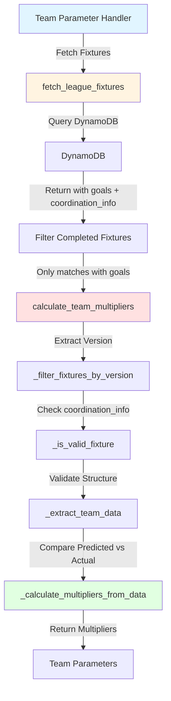

# Multiplier Calculation Fix Plan

## Problem Summary

Team multipliers are returning `sample_size: 0` and default values of `1.0` even when teams have completed predictions in the database. For example, a team with 3 completed predictions should have calculated multipliers but instead shows:

```json
{
  "home_multiplier": 1,
  "away_multiplier": 1,
  "total_multiplier": 1,
  "sample_size": 0,
  "confidence": 0.1
}
```

## Root Cause Analysis

### 1. Missing Fields in Database Query

**Location**: [`src/data/database_client.py:313`](../../src/data/database_client.py#L313)

**Current Code**:
```python
ProjectionExpression='fixture_id, home, away, predictions, alternate_predictions, #date, #timestamp'
```

**Problem**: The query does not project the `goals` field, which contains actual match results required for multiplier calculation.

**Required Fields Missing**:
- `goals` - Contains actual match scores (`goals.home` and `goals.away`)
- `coordination_info` - Contains architecture version for version filtering

### 2. Validation Failure

**Location**: [`src/parameters/multiplier_calculator.py:263-282`](../../src/parameters/multiplier_calculator.py#L263-282)

The `_is_valid_fixture()` method validates that fixtures have all required data:

```python
def _is_valid_fixture(self, fixture: Dict) -> bool:
    required_keys = ['home', 'away', 'goals']  # Line 265
    
    if not all(key in fixture for key in required_keys):
        return False  # Fails here because 'goals' not in fixture
    
    # ... more validation
```

Since `goals` is not projected in the query, ALL fixtures fail validation and are skipped.

### 3. Version Extraction Issue

**Location**: [`src/parameters/multiplier_calculator.py:148-168`](../../src/parameters/multiplier_calculator.py#L148-168)

**Current Code**:
```python
prediction_metadata = fixture.get('prediction_metadata', {})
fixture_version = prediction_metadata.get('architecture_version')

if not fixture_version:
    fixture_version = fixture.get('architecture_version')
```

**Problem**: Architecture version is stored in `coordination_info.league_coordination.architecture_version`, not in `prediction_metadata`.

**Actual Data Structure**:
```json
{
  "coordination_info": {
    "league_coordination": {
      "architecture_version": "6.0"
    }
  }
}
```

## Impact

- Multiplier calculations fail for ALL teams
- System falls back to neutral multipliers (1.0)
- Predictions lose accuracy enhancement from historical performance data
- Weight tuning parameters may also use incorrect thresholds (separately fixed)

## Solution Architecture



## Proposed Changes

### Change 1: Update `fetch_league_fixtures()` Projection

**File**: `src/data/database_client.py`  
**Line**: 313

**Before**:
```python
ProjectionExpression='fixture_id, home, away, predictions, alternate_predictions, #date, #timestamp'
```

**After**:
```python
ProjectionExpression='fixture_id, home, away, goals, predictions, coordination_info, #date, #timestamp'
```

**Rationale**:
- `goals`: Required for validation and actual vs predicted comparison
- `coordination_info`: Contains architecture version for version filtering

### Change 2: Add Python Filtering for Completed Fixtures

**File**: `src/data/database_client.py`  
**Line**: ~331 (after items collection)

**Add**:
```python
# Filter to only include completed fixtures (those with goals recorded)
# This prevents processing fixtures that haven't been played yet
completed_items = [
    item for item in items 
    if 'goals' in item and 
       item['goals'].get('home') is not None and 
       item['goals'].get('away') is not None
]

print(f"Filtered {len(items)} fixtures to {len(completed_items)} completed matches")
return completed_items
```

**Rationale**:
- DynamoDB query returns both upcoming and completed fixtures
- Only completed fixtures have `goals` populated with actual scores
- Multipliers can only be calculated from completed matches
- User preference: Filter in Python rather than in DynamoDB FilterExpression

### Change 3: Update Version Extraction Logic

**File**: `src/parameters/multiplier_calculator.py`  
**Lines**: 148-168

**Before**:
```python
# Check for prediction metadata with version info
prediction_metadata = fixture.get('prediction_metadata', {})
fixture_version = prediction_metadata.get('architecture_version')

# If no version info, try legacy fields (for backward compatibility)
if not fixture_version:
    # Look for version in other possible locations
    fixture_version = fixture.get('architecture_version')
```

**After**:
```python
# Try multiple locations for architecture version
prediction_metadata = fixture.get('prediction_metadata', {})
fixture_version = prediction_metadata.get('architecture_version')

# If no version in prediction_metadata, check coordination_info
# This is where current system stores version information
if not fixture_version:
    coordination_info = fixture.get('coordination_info', {})
    
    # Try league coordination first (primary prediction)
    league_coord = coordination_info.get('league_coordination', {})
    fixture_version = league_coord.get('architecture_version')
    
    # Fallback to team coordination if league not available
    if not fixture_version:
        team_coord = coordination_info.get('team_coordination', {})
        fixture_version = team_coord.get('architecture_version')

# Final fallback: try legacy top-level field (backward compatibility)
if not fixture_version:
    fixture_version = fixture.get('architecture_version')
```

**Rationale**:
- Matches actual data structure where version is in `coordination_info`
- Maintains backward compatibility with legacy data structures
- Tries both `league_coordination` and `team_coordination` for robustness
- Critical for version filtering to prevent multiplier contamination

### Change 4: Verification Only (No Changes Needed)

**File**: `src/parameters/multiplier_calculator.py`  
**Lines**: 263-282

The `_is_valid_fixture()` method is already correctly implemented:
- ✅ Checks for `goals` field existence
- ✅ Validates nested structure (`goals.home`, `goals.away`)
- ✅ Validates `predicted_goals` in home and away teams

No changes needed - will work correctly once `goals` field is projected.

## Implementation Steps

### Step 1: Update Database Query
1. Modify `fetch_league_fixtures()` projection expression
2. Add filtering logic for completed fixtures
3. Add debug logging for filtered counts

### Step 2: Update Version Extraction
1. Modify `_filter_fixtures_by_version()` method
2. Add fallback hierarchy for version extraction
3. Add logging for version extraction path used

### Step 3: Testing
1. **Unit Test**: Version extraction from `coordination_info`
2. **Integration Test**: Verify `goals` field is present in fetched fixtures
3. **End-to-End Test**: Calculate multipliers for team with 3+ predictions
4. **Validation**: Confirm `sample_size > 0` and multipliers ≠ 1.0

### Step 4: Verification
1. Run team parameter calculation for test team
2. Verify multipliers are calculated (not 1.0)
3. Check `sample_size` matches number of completed predictions
4. Validate `architecture_version` is correctly identified

## Expected Results After Fix

### Before Fix
```json
{
  "home_multiplier": 1,
  "away_multiplier": 1,
  "total_multiplier": 1,
  "sample_size": 0,
  "confidence": 0.1,
  "default_reason": "insufficient_sample_size"
}
```

### After Fix (Example with 3 Predictions)
```json
{
  "home_multiplier": 1.05,
  "away_multiplier": 0.98,
  "total_multiplier": 1.02,
  "home_ratio_raw": 1.12,
  "away_ratio_raw": 0.95,
  "home_std": 0.45,
  "away_std": 0.38,
  "sample_size": 3,
  "confidence": 0.42,
  "architecture_version": "6.0",
  "contamination_prevented": true
}
```

## Success Criteria

1. ✅ `fetch_league_fixtures()` projects `goals` and `coordination_info` fields
2. ✅ Only completed fixtures (with goals) are processed
3. ✅ Architecture version is extracted from `coordination_info`
4. ✅ `_is_valid_fixture()` passes for completed fixtures
5. ✅ Multipliers are calculated for teams with prediction history
6. ✅ `sample_size` reflects actual number of completed predictions
7. ✅ Confidence scores are calculated based on sample size and variance

## Risk Assessment

### Low Risk
- Adding fields to projection has no impact on existing functionality
- Python filtering is additive, doesn't modify existing data
- Backward compatibility maintained with fallback hierarchy

### Medium Risk
- If `coordination_info` structure changes, version extraction may fail
  - **Mitigation**: Multiple fallback paths ensure robustness
  
### Testing Recommendations
- Test with fixtures from different time periods
- Verify both league_coordination and team_coordination paths
- Test with edge cases (1 prediction, 100+ predictions)
- Validate memory usage with large result sets

## Related Issues

- ✅ Weight tuning threshold fixed (separate change)
- ✅ MINIMUM_GAMES_THRESHOLD now used consistently
- 🔄 Home advantage calculation edge case (separate investigation needed)
- 🔄 Formation effectiveness neutral values (separate investigation needed)

## Timeline

- **Analysis**: Complete
- **Plan Documentation**: In Progress
- **Implementation**: Pending approval
- **Testing**: TBD
- **Deployment**: TBD

## Approval Required

This plan requires approval before implementation. Once approved, switch to Code mode for implementation.

---

**Created**: 2025-10-24  
**Author**: Roo (Architect Mode)  
**Status**: Awaiting Review