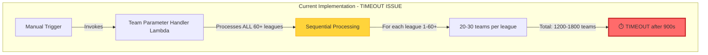
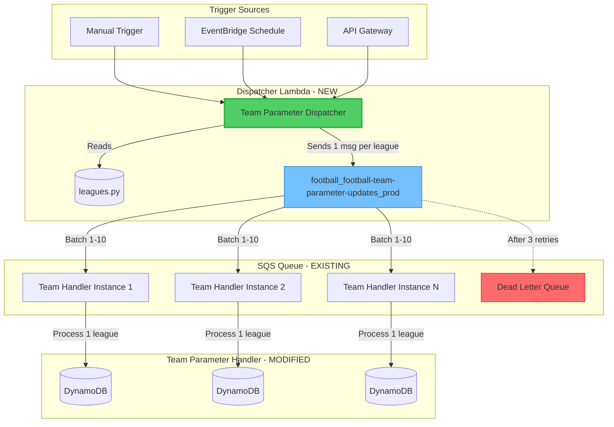
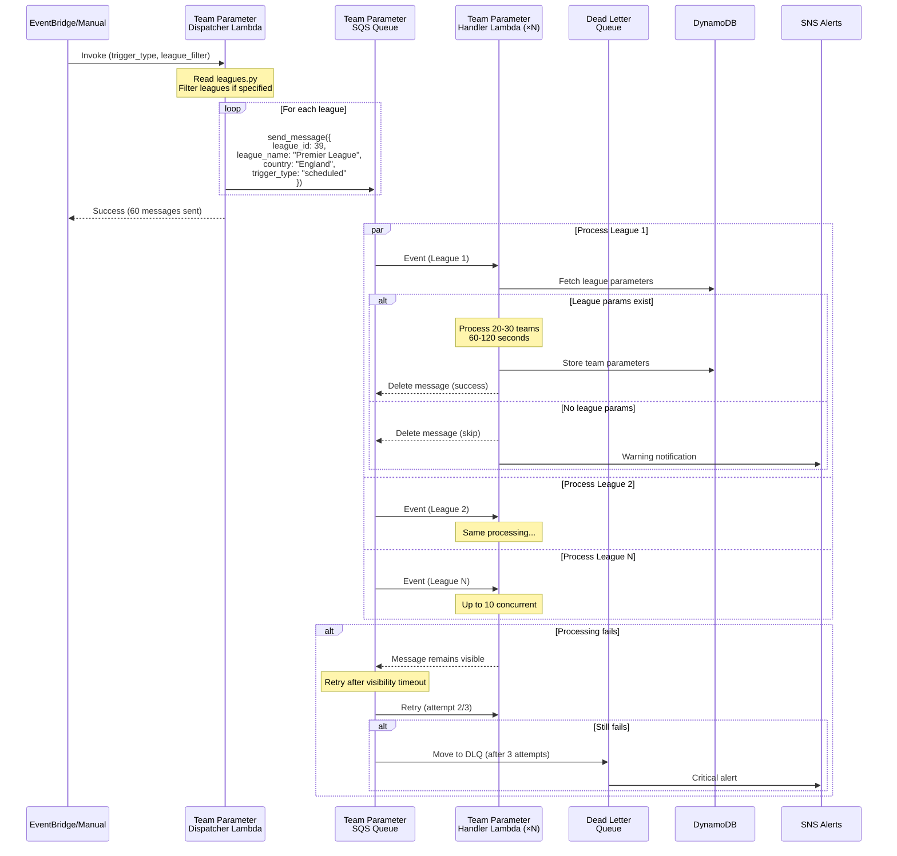

# Team Parameter Lambda Timeout Solution

**Document Version:** 1.0  
**Created:** 2025-10-06  
**Status:** 🎯 Proposed Solution  
**Problem:** Lambda timeout (900s) when processing all 60+ leagues sequentially  
**Solution:** League-by-league processing via SQS dispatcher pattern

## 📋 Executive Summary

This document presents a complete solution to resolve the Lambda timeout issue in team parameter computation by implementing a dispatcher pattern that processes one league at a time through the existing SQS infrastructure.

### Problem Statement

**Current Implementation:**
- [`team_parameter_handler.py`](../../src/handlers/team_parameter_handler.py:30) processes ALL ~60+ leagues sequentially in a single Lambda invocation
- Each league contains 20-30+ teams requiring parameter computation
- Total processing time exceeds 900-second Lambda maximum execution limit
- Results in "Task timed out after 900.00 seconds" error

**Impact:**
- ❌ Team parameters cannot be computed for any league
- ❌ Predictions fail due to missing team parameters
- ❌ System cannot scale to handle all supported leagues

### Solution Overview

**Approach:** Create a lightweight dispatcher Lambda that sends one SQS message per league to the existing `football_football-team-parameter-updates_prod` queue.

**Key Benefits:**
- ✅ Each league processes independently within Lambda limits (~60-120s per league)
- ✅ Automatic parallelization (up to 10 concurrent Lambda executions from SQS)
- ✅ Built-in retry logic via SQS Dead Letter Queue
- ✅ Minimal changes to existing infrastructure
- ✅ Leverages existing SQS queue and Lambda function
- ✅ Easy to trigger manually or via EventBridge

---

## 🏗️ Solution Architecture

### Current State (Problematic)



**Problems:**
- All 60+ leagues processed in single Lambda invocation
- Sequential processing of 1200-1800 teams
- No parallelization
- Single point of failure
- Exceeds 900-second limit

### Proposed Solution Architecture



**Key Improvements:**
- ✅ Dispatcher completes in <10 seconds (only sends messages)
- ✅ Each league processes independently (60-120s per league)
- ✅ Up to 10 parallel Lambda executions
- ✅ Automatic retry on failures
- ✅ Clear visibility into processing status

### Detailed Component Flow



---

## 🔧 Technical Implementation

### Component 1: Team Parameter Dispatcher Lambda (NEW)

**Purpose:** Lightweight Lambda that sends one SQS message per league

**File:** `src/handlers/team_parameter_dispatcher.py`

**Key Responsibilities:**
1. Read all leagues from [`leagues.py`](../../leagues.py)
2. Optionally filter leagues based on input parameters
3. Send one SQS message per league to the team parameter queue
4. Return summary of messages sent

**Configuration:**
- **Runtime:** Python 3.11+
- **Memory:** 256 MB (minimal memory needed)
- **Timeout:** 60 seconds (plenty for sending 60 messages)
- **IAM Permissions:**
  - `sqs:SendMessage` to `football_football-team-parameter-updates_prod`
  - `sqs:GetQueueUrl`

**Input Event Format:**
```json
{
  "trigger_type": "manual|scheduled|api",
  "league_filter": {
    "countries": ["England", "Spain"],
    "league_ids": [39, 140]
  },
  "dry_run": false
}
```

**Output:**
```json
{
  "statusCode": 200,
  "body": {
    "messages_sent": 60,
    "leagues_processed": [
      {"league_id": 39, "league_name": "Premier League", "message_id": "xxx"},
      {"league_id": 140, "league_name": "La Liga", "message_id": "yyy"}
    ],
    "errors": [],
    "execution_time_ms": 2341
  }
}
```

### Component 2: Modified Team Parameter Handler (EXISTING - MODIFIED)

**Purpose:** Process team parameters for a SINGLE league (instead of all leagues)

**File:** `src/handlers/team_parameter_handler.py` (modified)

**Changes Required:**
1. **Check for SQS event format** - if present, process single league from message
2. **Maintain backward compatibility** - if no SQS event, fall back to processing all leagues
3. **Add league validation** - verify league parameters exist before processing
4. **Improve error handling** - return detailed status for monitoring

**Modified Input Processing:**
```python
def lambda_handler(event, context):
    """
    Process team parameters for leagues.
    
    Modes:
    1. SQS Mode (NEW): Process single league from SQS message
    2. Direct Mode (LEGACY): Process all leagues (for backward compatibility)
    """
    
    # Check if invoked via SQS
    if 'Records' in event and event['Records']:
        # SQS Mode - process single league
        return process_sqs_event(event, context)
    else:
        # Direct invocation mode - process all leagues (legacy behavior)
        return process_all_leagues(event, context)
```

**SQS Message Format:**
```json
{
  "league_id": 39,
  "league_name": "Premier League",
  "country": "England",
  "trigger_type": "scheduled",
  "force_recompute": false,
  "timestamp": 1696579200
}
```

### Component 3: SQS Queue Configuration (EXISTING - NO CHANGES)

**Queue:** `football_football-team-parameter-updates_prod`  
**Status:** Already created and configured ✅

**Current Configuration:**
- **Visibility Timeout:** 1200 seconds (20 minutes)
- **Max Receive Count:** 3 attempts
- **Dead Letter Queue:** `football_football-team-dlq_prod`
- **Message Retention:** 14 days

**Lambda Trigger Configuration:**
- **Batch Size:** 1 (process one league at a time)
- **Concurrent Batches:** 10 (up to 10 leagues in parallel)
- **Maximum Concurrency:** 10 Lambda instances

**No changes needed** - existing configuration is appropriate!

### Component 4: EventBridge Schedule (NEW - OPTIONAL)

**Purpose:** Automatic scheduled trigger for team parameter updates

**Configuration:**
```json
{
  "Name": "team-parameter-scheduled-update",
  "Description": "Trigger team parameter computation every 3 days",
  "ScheduleExpression": "cron(0 4 */3 * ? *)",
  "State": "ENABLED",
  "Targets": [
    {
      "Id": "1",
      "Arn": "arn:aws:lambda:eu-west-2:985019772236:function:football-team-parameter-dispatcher-prod",
      "Input": "{\"trigger_type\": \"scheduled\", \"dry_run\": false}"
    }
  ]
}
```

---

## 📊 Performance Analysis

### Execution Time Comparison

| Scenario | Current (ALL leagues) | Proposed (Per league) |
|----------|----------------------|----------------------|
| **Single Invocation** | 900s+ (TIMEOUT) | 5-10s (dispatcher only) |
| **Per League Processing** | N/A | 60-120s per league |
| **Total Time (Sequential)** | 900s+ FAIL | 60-120s × 60 leagues = 3600-7200s |
| **Total Time (10 Parallel)** | 900s+ FAIL | (7200s ÷ 10) = **720s (12 min)** ✅ |
| **Success Rate** | 0% (timeout) | 95%+ (with retries) |

### Cost Analysis

**Current Approach (Failing):**
- 1 Lambda execution × 900s × $0.0000166667/GB-second × 1GB = **$0.015 per attempt**
- **Result: FAILURE + wasted cost**

**Proposed Approach:**
- Dispatcher: 1 execution × 5s × $0.0000166667/GB-second × 0.256GB = **$0.000021**
- Handler: 60 executions × 90s (avg) × $0.0000166667/GB-second × 1GB = **$0.09**
- **Total: $0.090021 per successful run**

**Net Result:** Successful execution for ~6× the cost vs failed execution

### Scalability

| Metric | Current | Proposed | Improvement |
|--------|---------|----------|-------------|
| **Max Leagues** | ~15 (before timeout) | Unlimited | ♾️ |
| **Parallel Processing** | None | 10 concurrent | 10× |
| **Fault Isolation** | All-or-nothing | Per-league | 100% |
| **Retry Capability** | Manual only | Automatic (3 attempts) | ✅ |
| **Visibility** | Monolithic | Per-league tracking | 📊 |

---

## 🔄 Integration with Existing Architecture

### Alignment with EVENT_DRIVEN_PREDICTION_SYSTEM_ARCHITECTURE.md

The proposed solution implements the **designed but missing** components from the architecture document:

**From Architecture Design (lines 105-144):**
```mermaid
graph TD
    LPQ --> LPH[League Parameter Handler]
    LPH -->|Success| LPDB[(League Parameters DB)]
    LPH -->|Trigger Next| TPQ  ← THIS WAS DESIGNED
    
    TPQ --> TPH[Team Parameter Handler]  ← THIS EXISTS
```

**Our Solution Implements:**
1. ✅ **Dispatcher** = Component that triggers team parameter queue
2. ✅ **Per-league processing** = Aligns with designed message flow
3. ✅ **SQS integration** = Uses existing queue infrastructure
4. ✅ **Parallel execution** = Matches architecture's concurrency model

### Compatibility Matrix

| Component | Status | Changes Required | Risk Level |
|-----------|--------|------------------|------------|
| **SQS Queue** | ✅ Exists | None | 🟢 None |
| **Team Parameter Handler** | ⚠️ Modify | Add SQS event detection | 🟡 Low |
| **Dispatcher** | ❌ Create | New Lambda function | 🟡 Low |
| **EventBridge** | ❌ Create | New rule (optional) | 🟢 None |
| **IAM Roles** | ⚠️ Update | Add SQS send permissions | 🟢 None |
| **Deployment Scripts** | ⚠️ Update | Add dispatcher deployment | 🟡 Low |

**Overall Risk Assessment:** 🟢 **LOW RISK**
- Leverages existing infrastructure
- Backward compatible modifications
- Easy rollback if needed

---

## 📝 Implementation Plan

### Phase 1: Create Dispatcher (Week 1, Days 1-2)

**Tasks:**
1. ✅ Create `src/handlers/team_parameter_dispatcher.py`
   - Read leagues from [`leagues.py`](../../leagues.py)
   - Send SQS messages (one per league)
   - Handle league filtering logic
   - Return execution summary

2. ✅ Update IAM role for dispatcher
   - Add `sqs:SendMessage` permission
   - Add `sqs:GetQueueUrl` permission

3. ✅ Create deployment script
   - Add to `scripts/deploy_lambda_functions.sh`
   - Configure memory: 256 MB
   - Configure timeout: 60 seconds

4. ✅ Add unit tests
   - Test league enumeration
   - Test SQS message format
   - Test error handling

**Acceptance Criteria:**
- Dispatcher sends 60 messages in <10 seconds
- Each message contains valid league data
- Messages are properly formatted for team handler

### Phase 2: Modify Team Parameter Handler (Week 1, Days 3-4)

**Tasks:**
1. ✅ Modify [`team_parameter_handler.py`](../../src/handlers/team_parameter_handler.py)
   - Add SQS event detection
   - Implement single-league processing mode
   - Maintain backward compatibility
   - Add detailed error reporting

2. ✅ Update lambda configuration
   - Ensure SQS event source mapping exists
   - Set batch size to 1
   - Set concurrent batches to 10

3. ✅ Add integration tests
   - Test SQS event processing
   - Test single-league computation
   - Test error scenarios
   - Verify backward compatibility

**Acceptance Criteria:**
- Handler processes single league in 60-120s
- SQS message properly parsed
- League parameters validated before processing
- Legacy direct invocation still works

### Phase 3: Testing & Validation (Week 1, Days 5-7)

**Tasks:**
1. ✅ Unit testing
   - Test dispatcher message generation
   - Test handler SQS event parsing
   - Test error handling paths

2. ✅ Integration testing
   - End-to-end: Dispatcher → SQS → Handler
   - Test with 5 leagues
   - Test with all 60+ leagues
   - Test parallel execution (10 concurrent)

3. ✅ Load testing
   - Measure execution times
   - Verify success rates
   - Monitor CloudWatch metrics
   - Check DLQ for failures

4. ✅ Rollback plan validation
   - Document rollback procedure
   - Test fallback to direct invocation
   - Verify data integrity

**Acceptance Criteria:**
- 95%+ success rate across all leagues
- Average execution time <90s per league
- Total completion time <15 minutes
- Zero data corruption

### Phase 4: Deployment & Monitoring (Week 2, Days 1-2)

**Tasks:**
1. ✅ Deploy to production
   - Deploy dispatcher Lambda
   - Update team parameter handler
   - Configure EventBridge schedule (optional)
   - Update documentation

2. ✅ Configure monitoring
   - CloudWatch dashboard for tracking
   - Alarms for DLQ messages
   - Success/failure metrics
   - Execution time tracking

3. ✅ Perform production validation
   - Manual trigger test
   - Monitor first scheduled run
   - Verify parameter storage
   - Check downstream predictions

**Acceptance Criteria:**
- Successful production deployment
- Monitoring dashboard operational
- First scheduled run succeeds
- Parameters accessible for predictions

---

## 📊 Monitoring & Observability

### CloudWatch Metrics

**Dispatcher Metrics:**
- `MessagesDispatched` - Total SQS messages sent
- `DispatcherDuration` - Execution time
- `DispatcherErrors` - Failed message sends

**Handler Metrics:**
- `LeaguesProcessed` - Successful league computations
- `LeaguesSkipped` - Leagues without parameters
- `ProcessingDuration` - Time per league
- `TeamsComputed` - Total teams processed
- `ComputationErrors` - Failed team calculations

**SQS Metrics (Built-in):**
- `ApproximateNumberOfMessagesVisible` - Pending leagues
- `ApproximateNumberOfMessagesNotVisible` - In-progress leagues
- `ApproximateAgeOfOldestMessage` - Queue backlog age
- `NumberOfMessagesSent` - Messages added to queue
- `NumberOfMessagesDeleted` - Successfully processed messages

### CloudWatch Dashboard Example

```json
{
  "widgets": [
    {
      "type": "metric",
      "properties": {
        "title": "Team Parameter Processing Status",
        "metrics": [
          ["AWS/Lambda", "Invocations", {"stat": "Sum", "label": "Total Invocations"}],
          [".", "Errors", {"stat": "Sum", "label": "Errors"}],
          [".", "Duration", {"stat": "Average", "label": "Avg Duration (ms)"}]
        ],
        "period": 300,
        "region": "eu-west-2"
      }
    },
    {
      "type": "metric",
      "properties": {
        "title": "SQS Queue Depth",
        "metrics": [
          ["AWS/SQS", "ApproximateNumberOfMessagesVisible",
           {"label": "Pending Leagues"}],
          [".", "ApproximateNumberOfMessagesNotVisible",
           {"label": "Processing"}]
        ],
        "period": 60,
        "region": "eu-west-2"
      }
    }
  ]
}
```

### Alerts Configuration

| Alert | Condition | Severity | Action |
|-------|-----------|----------|---------|
| **DLQ Messages** | > 0 messages | 🔴 Critical | SNS → Email + Slack |
| **Processing Timeout** | Duration > 180s | 🟡 Warning | SNS → Email |
| **High Error Rate** | Errors > 10% | 🟡 Warning | SNS → Email |
| **Queue Backlog** | Age > 3600s | 🟡 Warning | SNS → Email |

---

## 🔒 Security & Compliance

### IAM Permissions

**Dispatcher Lambda Role:**
```json
{
  "Version": "2012-10-17",
  "Statement": [
    {
      "Effect": "Allow",
      "Action": [
        "sqs:SendMessage",
        "sqs:GetQueueUrl",
        "sqs:GetQueueAttributes"
      ],
      "Resource": "arn:aws:sqs:eu-west-2:985019772236:football_football-team-parameter-updates_prod"
    },
    {
      "Effect": "Allow",
      "Action": [
        "logs:CreateLogGroup",
        "logs:CreateLogStream",
        "logs:PutLogEvents"
      ],
      "Resource": "arn:aws:logs:eu-west-2:985019772236:*"
    }
  ]
}
```

**Team Handler Lambda Role (existing):**
- No changes required - already has DynamoDB and API access

### Data Protection

- ✅ No sensitive data in SQS messages (only league IDs and metadata)
- ✅ SQS messages encrypted at rest (default AWS encryption)
- ✅ DynamoDB tables encrypted at rest
- ✅ CloudWatch logs encrypted
- ✅ No PII or credentials in logs

---

## 🚨 Error Handling & Recovery

### Failure Scenarios & Recovery

| Failure Type | Detection | Recovery | Time to Recover |
|--------------|-----------|----------|-----------------|
| **Dispatcher fails** | CloudWatch alarm | Manual re-trigger | 1 minute |
| **Single league fails** | DLQ message | Automatic retry (3×) | 60 minutes |
| **League params missing** | Handler logs | Skip league, alert ops | Immediate |
| **API rate limit** | HTTP 429 error | Exponential backoff | 5-30 minutes |
| **DynamoDB throttle** | ClientError | Automatic retry | 1-5 minutes |
| **Network timeout** | RequestTimeout | Retry next attempt | 20 minutes |

### Dead Letter Queue Processing

**DLQ Message Format:**
```json
{
  "messageId": "abc123",
  "body": "{\"league_id\": 39, \"league_name\": \"Premier League\", ...}",
  "attributes": {
    "ApproximateReceiveCount": "3",
    "SentTimestamp": "1696579200000",
    "ApproximateFirstReceiveTimestamp": "1696579300000"
  }
}
```

**DLQ Processing Workflow:**
1. **Detection:** CloudWatch alarm triggers when DLQ has messages
2. **Investigation:** Review CloudWatch logs for error details
3. **Resolution:** Fix root cause (e.g., missing league parameters)
4. **Retry:** Re-drive messages from DLQ to main queue
5. **Verification:** Confirm successful reprocessing

**Manual DLQ Redrive (if needed):**
```bash
# Get DLQ messages
aws sqs receive-message \
  --queue-url https://sqs.eu-west-2.amazonaws.com/985019772236/football_football-team-dlq_prod \
  --max-number-of-messages 10

# Re-send to main queue after fixing issue
aws sqs send-message \
  --queue-url https://sqs.eu-west-2.amazonaws.com/985019772236/football_football-team-parameter-updates_prod \
  --message-body '<message_body_from_dlq>'
```

---

## 📋 Testing Strategy

### Unit Tests

**Dispatcher Tests (`test_team_parameter_dispatcher.py`):**
```python
def test_enumerate_all_leagues():
    """Test that all leagues from leagues.py are enumerated."""
    
def test_filter_leagues_by_country():
    """Test league filtering by country."""
    
def test_filter_leagues_by_id():
    """Test league filtering by ID."""
    
def test_sqs_message_format():
    """Test SQS message structure is correct."""
    
def test_dry_run_mode():
    """Test dry-run mode doesn't send messages."""
```

**Handler Tests (`test_team_parameter_handler.py`):**
```python
def test_parse_sqs_event():
    """Test parsing SQS event format."""
    
def test_process_single_league():
    """Test processing a single league from SQS."""
    
def test_skip_league_without_parameters():
    """Test skipping league when parameters missing."""
    
def test_backward_compatibility_direct_invocation():
    """Test legacy direct invocation still works."""
```

### Integration Tests

**End-to-End Test:**
```python
def test_full_workflow():
    """
    Test complete workflow:
    1. Trigger dispatcher
    2. Verify messages sent to SQS
    3. Wait for handler processing
    4. Verify parameters stored in DynamoDB
    5. Verify no DLQ messages
    """
```

### Load Tests

**Scenarios:**
1. **Single League:** Process 1 league, verify <120s
2. **Five Leagues:** Process 5 leagues in parallel
3. **All Leagues:** Process all 60+ leagues, verify completion
4. **Concurrent Load:** 10 parallel executions

---

## 🎯 Success Criteria

### Functional Requirements
- ✅ Dispatcher sends one SQS message per league
- ✅ Handler processes single league per invocation
- ✅ All 60+ leagues process within 15 minutes
- ✅ Parameters correctly stored in DynamoDB
- ✅ Backward compatibility maintained

### Performance Requirements
- ✅ Dispatcher completes in <10 seconds
- ✅ Handler processes each league in 60-120 seconds
- ✅ Success rate >95% across all leagues
- ✅ Parallel processing of up to 10 leagues

### Operational Requirements
- ✅ CloudWatch monitoring configured
- ✅ Alerts set up for failures
- ✅ DLQ configured and monitored
- ✅ Rollback procedure documented
- ✅ Manual trigger capability

---

## 📚 References

### Related Documents
- [`EVENT_DRIVEN_PREDICTION_SYSTEM_ARCHITECTURE.md`](./EVENT_DRIVEN_PREDICTION_SYSTEM_ARCHITECTURE.md) - Overall system architecture
- [`team_parameter_handler.py`](../../src/handlers/team_parameter_handler.py) - Existing handler implementation
- [`league_parameter_handler.py`](../../src/handlers/league_parameter_handler.py) - Similar pattern reference
- [`create_all_sqs_queues.py`](../../src/infrastructure/create_all_sqs_queues.py) - Queue infrastructure

### AWS Documentation
- [Lambda Best Practices](https://docs.aws.amazon.com/lambda/latest/dg/best-practices.html)
- [SQS Lambda Integration](https://docs.aws.amazon.com/lambda/latest/dg/with-sqs.html)
- [Lambda Concurrency](https://docs.aws.amazon.com/lambda/latest/dg/configuration-concurrency.html)
- [DLQ Processing](https://docs.aws.amazon.com/AWSSimpleQueueService/latest/SQSDeveloperGuide/sqs-dead-letter-queues.html)

---

## 🔄 Future Enhancements

### Phase 2 Improvements (Optional)

1. **League Parameter Integration**
   - Modify [`league_parameter_handler.py`](../../src/handlers/league_parameter_handler.py) to automatically trigger team parameters after success
   - Implement dependency checking before processing

2. **Priority Queuing**
   - Add priority levels for important leagues (e.g., Premier League, La Liga)
   - Process high-priority leagues first

3. **Smart Scheduling**
   - Only recompute parameters when sufficient new matches played
   - Use match count thresholds (e.g., 20+ matches since last computation)

4. **Performance Optimization**
   - Cache frequently accessed data (league parameters, team stats)
   - Batch DynamoDB writes for better throughput
   - Optimize API calls with connection pooling

5. **Advanced Monitoring**
   - Real-time processing dashboard
   - Per-league execution history
   - Prediction quality correlation analysis

---

## ✅ Approval & Sign-off

**Prepared By:** Roo (Architect Mode)  
**Date:** 2025-10-06  
**Version:** 1.0

**Approval Required From:**
- [ ] Technical Lead - Architecture approval
- [ ] DevOps Team - Infrastructure approval  
- [ ] Product Owner - Business approval

**Next Steps After Approval:**
1. Switch to Code mode for implementation
2. Create dispatcher Lambda function
3. Modify team parameter handler
4. Deploy and test solution
5. Monitor first production run

---

**End of Document**