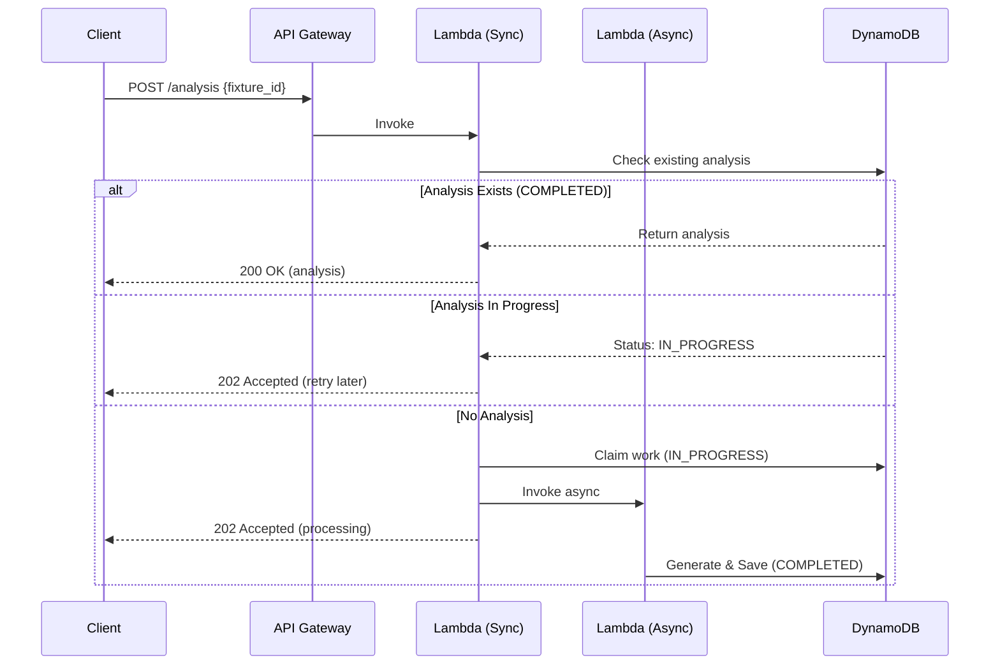

# GenAI Pundit v2.0 Implementation Guide

**Status:** Design Document | **Version:** 2.0 | **Date:** October 11, 2025  
**System Integration:** Phase 0-6 Architecture | **AI Providers:** Google Gemini (Primary), Claude (Secondary)

---

## 📋 Table of Contents

1. [Overview](#overview)
2. [Architecture](#architecture)
3. [Database Integration](#database-integration)
4. [Data Extraction Strategy](#data-extraction-strategy)
5. [AI Provider Integration](#ai-provider-integration)
6. [Implementation Steps](#implementation-steps)
7. [API Gateway Configuration](#api-gateway-configuration)
8. [Request Management](#request-management)
9. [Testing & Validation](#testing--validation)
10. [Deployment](#deployment)

---

## Overview

### Purpose

GenAI Pundit v2.0 is an AI-powered match analysis service that generates natural language betting advice by consuming predictions from the Phase 0-6 statistical prediction system. It enhances the statistical predictions with narrative insights, contextual analysis, and betting recommendations.

### Key Changes from Legacy Version

| Aspect | Legacy Version | v2.0 |
|--------|---------------|------|
| **AI Providers** | 5 providers (Gemini, OpenAI, Claude, DeepSeek, Groq) | 2 providers (Gemini or Claude - manually selected) |
| **Data Source** | Basic team parameters | Enhanced Phase 0-6 parameters |
| **Integration** | Standalone Lambda | Integrated with modern architecture |
| **Team Parameters** | Limited metrics | Comprehensive 6-phase intelligence |
| **Module Structure** | Monolithic | Modular with `src/` integration |
| **Provider Selection** | Automatic failover | Manual configuration only |
| **Secrets Management** | N/A | **Environment variables (project standard)** |

### Important: API Key Management

**📌 This project uses environment variables for all API keys** (RAPIDAPI_KEY, OPENWEATHER_KEY, GEMINI_API_KEY, ANTHROPIC_API_KEY, etc.). GenAI Pundit v2.0 follows the same proven pattern used throughout the codebase. See the [Secrets Management](#secrets-management) section for details.

### Design Principles

1. **Non-Invasive**: Does not modify core prediction system
2. **Modular**: Clean separation from statistical engine
3. **Manual Control**: Provider selection via configuration (no automatic failover)
4. **Scalable**: Asynchronous processing for large workloads
5. **Comprehensive**: Leverages all Phase 0-6 parameters

---

## Architecture

### System Context

```
┌─────────────────────────────────────────────────────────────────┐
│                     Core Prediction System                       │
│  (Phase 0-6: Statistical Analysis & Feature Engineering)        │
└───────────────────────────┬─────────────────────────────────────┘
                            │
                            │ Fixture Data + Predictions
                            │ Stored in DynamoDB
                            ↓
┌─────────────────────────────────────────────────────────────────┐
│                    GenAI Pundit v2.0 Service                     │
│                                                                   │
│  ┌─────────────┐    ┌──────────────┐    ┌─────────────────┐   │
│  │  Data       │ -> │  AI Analysis │ -> │  Natural        │   │
│  │  Extraction │    │  Generation  │    │  Language       │   │
│  │             │    │              │    │  Insights       │   │
│  └─────────────┘    └──────────────┘    └─────────────────┘   │
│                                                                   │
│  Data Sources:           AI Providers:         Output:          │
│  • game_fixtures         • Google Gemini       • game_analysis  │
│  • team_parameters       • Claude AI           • Rich betting   │
│  • league_parameters                            insights        │
└─────────────────────────────────────────────────────────────────┘
```

### Component Structure

```
src/
└── handlers/
    └── genai_pundit_handler.py          # Main Lambda handler
└── services/
    └── genai_analysis_service.py        # AI interaction service
    └── parameter_extraction_service.py   # Data extraction logic
└── config/
    └── genai_config.py                   # AI provider configuration
```

---

## Database Integration

### Required Tables

#### 1. **game_fixtures** (Input)
**Purpose**: Source of fixture data and predictions  
**Key Schema**: `fixture_id` (partition key), `timestamp` (sort key)

**Critical Fields**:
```python
{
    'fixture_id': int,
    'timestamp': int,
    'league_id': int,
    'season': int,
    'date': str,
    'venue': int,
    'home': {
        'team_id': int,
        'team_name': str,
        'predicted_goals': float,
        'probability_to_score': float,
        # ... predictions data
    },
    'away': {
        'team_id': int,
        'team_name': str,
        'predicted_goals': float,
        'probability_to_score': float,
        # ... predictions data
    },
    'predictions': {
        'home_win_prob': float,
        'draw_prob': float,
        'away_win_prob': float,
        'over_under': {...},
        'btts': {...}
    }
}
```

#### 2. **team_parameters** (Input)
**Purpose**: Enhanced team intelligence from Phase 0-6  
**Key Schema**: `id` (partition key) = `"{league_id}-{team_id}"`

**Critical Nested Parameters** (to extract for AI):

```python
{
    'id': str,  # "{league_id}-{team_id}"
    'team_id': int,
    'league_id': int,
    'season': int,
    
    # PHASE 5: Classification Parameters
    'classification_params': {
        'archetype': str,              # "ELITE_CONSISTENT", "BALANCED_CONSISTENT", etc.
        'evolution_trend': str,         # "improving", "stable", "declining"
        'archetype_stability': float,   # 0.5-0.9 (higher = more consistent)
        'secondary_traits': [str],      # ["set_piece_specialist", "counter_attacking"]
        'archetype_confidence': float,  # How confident in classification
        
        'performance_profile': {
            'attacking_profile': {
                'goal_scoring_consistency': float
            },
            'defensive_profile': {
                'defensive_stability': float
            },
            'mentality_profile': {
                'away_resilience': float
            },
            'tactical_profile': {
                'tactical_flexibility': float
            }
        }
    },
    
    # PHASE 3: Temporal Parameters
    'temporal_params': {
        'form_trend': str,              # "improving", "stable", "declining"
        'recent_form': float,           # Current form rating (0.8-1.2 range)
        'momentum_factor': float,       # Momentum direction and strength
        'form_confidence': float        # Reliability of form assessment
    },
    
    # PHASE 4: Tactical Parameters
    'tactical_params': {
        'defensive_solidity': float,    # KEY metric (0.0-1.0)
        'attacking_intensity': float,   # Offensive pressure
        'preferred_formation': str,     # "4-3-3", "4-4-2", etc.
        'formation_confidence': float,  # Tactical consistency
        'tactical_consistency': float,  # How consistently they execute
        'possession_style': str         # "possession_based", "direct", etc.
    },
    
    # PHASE 2: Venue Parameters
    'venue_params': {
        'home_advantage': float,        # Home strength multiplier (1.0-1.5)
        'away_resilience': float,       # Away performance (0.5-1.3)
        'confidence_level': float       # Sample size reliability
    },
    
    # PHASE 1: Segmented Parameters by Opponent Strength
    'segmented_params': {
        'vs_bottom': {
            'mu_home': float,           # Goals scored at home vs weak opponents
            'mu_away': float,           # Goals scored away vs weak opponents
            'p_score_home': float,      # Scoring probability home
            'p_score_away': float,      # Scoring probability away
            'segment_sample_size': int, # Data backing this segment
            'using_segment_home': bool, # Whether segment is actively used
            'using_segment_away': bool,
            'variance_home': float,     # Consistency at home
            'variance_away': float      # Consistency away
        },
        'vs_middle': {
            # Same structure as vs_bottom
        },
        'vs_top': {
            # Same structure as vs_bottom
        }
    }
}
```

#### 3. **league_parameters** (Input)
**Purpose**: League-level context and conformance data  
**Key Schema**: `league_id` (partition key), `season` (sort key)

**Critical Fields**:
```python
{
    'league_id': int,
    'season': int,
    'league_conformance': {
        'match_outcome_accuracy': float,
        'over_15_accuracy': float,
        'over_25_accuracy': float,
        'btts_accuracy': float,
        'double_chance_accuracy': float
    }
}
```

#### 4. **game_analysis** (Output)
**Purpose**: Store AI-generated analysis  
**Key Schema**: `fixture_id` (partition key), `timestamp` (sort key)

**Output Structure**:
```python
{
    'fixture_id': int,
    'timestamp': int,
    'text': str,                    # AI-generated analysis
    'status': str,                  # "IN_PROGRESS" | "COMPLETED"
    'completed_at': int,            # Unix timestamp
    'ai_provider': str,             # "gemini" | "claude"
    'fixture_data': dict,           # Complete context used
    'generation_time_ms': int       # Performance metric
}
```

---

## Data Extraction Strategy

### Parameter Extraction Service

Create `src/services/parameter_extraction_service.py`:

```python
"""
Parameter extraction service for GenAI Pundit v2.0.
Extracts Phase 0-6 parameters from team_parameters table.
"""

from decimal import Decimal
from typing import Dict, Any, Optional


def extract_ai_relevant_parameters(team_params: dict) -> dict:
    """
    Extract only AI-relevant parameters from full team parameters.
    
    Args:
        team_params: Complete team parameters from DynamoDB
        
    Returns:
        Filtered dictionary with AI-relevant parameters
    """
    if not team_params:
        return {}
    
    extracted = {
        'team_id': team_params.get('team_id'),
        'league_id': team_params.get('league_id'),
        'season': team_params.get('season'),
    }
    
    # PHASE 5: Classification Parameters
    if 'classification_params' in team_params:
        classification = team_params['classification_params']
        extracted['classification_params'] = {
            'archetype': classification.get('archetype'),
            'evolution_trend': classification.get('evolution_trend'),
            'archetype_stability': _to_float(classification.get('archetype_stability')),
            'secondary_traits': classification.get('secondary_traits', []),
            'archetype_confidence': _to_float(classification.get('archetype_confidence')),
        }
        
        # Performance profile (nested within classification_params)
        if 'performance_profile' in classification:
            profile = classification['performance_profile']
            extracted['classification_params']['performance_profile'] = {
                'attacking_profile': {
                    'goal_scoring_consistency': _to_float(
                        profile.get('attacking_profile', {}).get('goal_scoring_consistency')
                    )
                },
                'defensive_profile': {
                    'defensive_stability': _to_float(
                        profile.get('defensive_profile', {}).get('defensive_stability')
                    )
                },
                'mentality_profile': {
                    'away_resilience': _to_float(
                        profile.get('mentality_profile', {}).get('away_resilience')
                    )
                },
                'tactical_profile': {
                    'tactical_flexibility': _to_float(
                        profile.get('tactical_profile', {}).get('tactical_flexibility')
                    )
                }
            }
    
    # PHASE 3: Temporal Parameters
    if 'temporal_params' in team_params:
        temporal = team_params['temporal_params']
        extracted['temporal_params'] = {
            'form_trend': temporal.get('form_trend'),
            'recent_form': _to_float(temporal.get('recent_form')),
            'momentum_factor': _to_float(temporal.get('momentum_factor')),
            'form_confidence': _to_float(temporal.get('form_confidence'))
        }
    
    # PHASE 4: Tactical Parameters
    if 'tactical_params' in team_params:
        tactical = team_params['tactical_params']
        extracted['tactical_params'] = {
            'defensive_solidity': _to_float(tactical.get('defensive_solidity')),
            'attacking_intensity': _to_float(tactical.get('attacking_intensity')),
            'preferred_formation': tactical.get('preferred_formation'),
            'formation_confidence': _to_float(tactical.get('formation_confidence')),
            'tactical_consistency': _to_float(tactical.get('tactical_consistency')),
            'possession_style': tactical.get('possession_style')
        }
    
    # PHASE 2: Venue Parameters
    if 'venue_params' in team_params:
        venue = team_params['venue_params']
        extracted['venue_params'] = {
            'home_advantage': _to_float(venue.get('home_advantage')),
            'away_resilience': _to_float(venue.get('away_resilience')),
            'confidence_level': _to_float(venue.get('confidence_level'))
        }
    
    # PHASE 1: Segmented Parameters
    if 'segmented_params' in team_params:
        segmented = team_params['segmented_params']
        extracted['segmented_params'] = {}
        
        for tier in ['vs_bottom', 'vs_middle', 'vs_top']:
            if tier in segmented:
                tier_data = segmented[tier]
                extracted['segmented_params'][tier] = {
                    'mu_home': _to_float(tier_data.get('mu_home')),
                    'mu_away': _to_float(tier_data.get('mu_away')),
                    'p_score_home': _to_float(tier_data.get('p_score_home')),
                    'p_score_away': _to_float(tier_data.get('p_score_away')),
                    'segment_sample_size': tier_data.get('segment_sample_size'),
                    'using_segment_home': tier_data.get('using_segment_home'),
                    'using_segment_away': tier_data.get('using_segment_away'),
                    'variance_home': _to_float(tier_data.get('variance_home')),
                    'variance_away': _to_float(tier_data.get('variance_away'))
                }
    
    return extracted


def _to_float(value: Any) -> Optional[float]:
    """Convert Decimal or numeric value to float."""
    if value is None:
        return None
    if isinstance(value, Decimal):
        return float(value)
    if isinstance(value, (int, float)):
        return float(value)
    return None


def build_ai_context(fixture_data: dict, home_params: dict, away_params: dict, 
                     league_params: dict) -> dict:
    """
    Build complete context for AI analysis.
    
    Args:
        fixture_data: Fixture data from game_fixtures table
        home_params: Extracted home team parameters
        away_params: Extracted away team parameters
        league_params: League parameters and conformance data
        
    Returns:
        Complete context dictionary for AI provider
    """
    context = {
        'fixture_info': {
            'fixture_id': fixture_data.get('fixture_id'),
            'date': fixture_data.get('date'),
            'league': fixture_data.get('league'),
            'venue': fixture_data.get('venue'),
            'timestamp': fixture_data.get('timestamp')
        },
        'home_team': {
            'team_name': fixture_data.get('home', {}).get('team_name'),
            'team_id': fixture_data.get('home', {}).get('team_id'),
            'predictions': fixture_data.get('home'),
            'parameters': home_params
        },
        'away_team': {
            'team_name': fixture_data.get('away', {}).get('team_name'),
            'team_id': fixture_data.get('away', {}).get('team_id'),
            'predictions': fixture_data.get('away'),
            'parameters': away_params
        },
        'match_predictions': fixture_data.get('predictions', {}),
        'league_conformance': league_params.get('league_conformance', {}),
        'weather': fixture_data.get('weather')  # If available
    }
    
    return context
```

---

## AI Provider Integration

### Configuration

Create `src/config/genai_config.py`:

```python
"""
GenAI Pundit configuration for AI providers.
"""

import os

# AI Provider Configuration
GENAI_CONFIG = {
    'active_provider': os.getenv('ACTIVE_AI_PROVIDER', 'gemini'),  # Read from environment variable
    
    'gemini': {
        'enabled': True,
        'api_key_env': 'GEMINI_API_KEY',
        'model': 'gemini-2.5-pro',
        'temperature': 0.9,
        'max_output_tokens': 32768,
        'timeout': 60
    },
    
    'claude': {
        'enabled': True,
        'api_key_env': 'ANTHROPIC_API_KEY',
        'model': 'claude-4.5-sonnet',
        'temperature': 0.9,
        'max_tokens': 16384,
        'timeout': 60
    }
}

# System Instruction (shared across providers)
SYSTEM_INSTRUCTION = """
You are an AI sports data analyst specializing in predictive analytics for football matches. 
Your expertise lies in advanced statistics, tactical football strategies, and contextual analysis.

Using the provided data, assess teams' strengths, weaknesses, and tendencies to predict match 
outcomes. The data is accurate and represents the current form and capabilities of the teams.

CRITICAL ANALYSIS FRAMEWORK:

1. **Team Identity Analysis** (classification_params)
   - Evaluate archetype (ELITE_CONSISTENT, BALANCED_CONSISTENT, etc.)
   - Consider evolution_trend (improving/stable/declining)
   - Assess archetype_stability (higher = more predictable)
   - Note secondary_traits for special capabilities
   - Weight archetype_confidence in your assessment

2. **Current Form Assessment** (temporal_params)
   - Analyze form_trend for trajectory
   - Evaluate recent_form rating (0.8-1.2 scale)
   - Consider momentum_factor for current direction
   - Weight form_confidence in predictions

3. **Tactical Style Evaluation** (tactical_params)
   - CRITICAL: defensive_solidity is a key differentiator (0.0-1.0)
   - Assess attacking_intensity for offensive threat
   - Consider preferred_formation and formation_confidence
   - Evaluate tactical_consistency for reliability
   - Note possession_style for match approach

4. **Venue Impact** (venue_params)
   - Apply home_advantage multiplier (typically 1.0-1.5)
   - Consider away_resilience for away team performance
   - Weight confidence_level for data reliability

5. **Opponent-Specific Performance** (segmented_params)
   - Analyze vs_bottom, vs_middle, vs_top separately
   - Compare mu_home and mu_away for goals by opponent tier
   - Evaluate p_score_home and p_score_away for scoring probability
   - Check segment_sample_size for data reliability
   - Note using_segment_home/away for active segments
   - Consider variance_home/away for consistency

6. **Performance Profiles** (within classification_params)
   - goal_scoring_consistency for attack reliability
   - defensive_stability for defensive reliability
   - away_resilience for away performance
   - tactical_flexibility for adaptability

BETTING ADVISORY FRAMEWORK:

Focus on key markets:
- Match outcome (1X2)
- Double chance (1X, X2, 12)
- Over/Under goals (0.5, 1.5, 2.5, 3.5)
- Both teams to score (BTTS)

Use league_conformance data to validate predictions:
- Only recommend markets with strong conformance (>70%)
- Cross-check statistical predictions with historical league performance
- Flag uncertainty when conformance is low

Confidence Scoring (1-10):
- 8-10: Strong indicators, low variance, high stability
- 5-7: Moderate confidence, some uncertainty
- 1-4: High uncertainty, conflicting signals

CRITICAL RULES:
1. Never recommend based solely on league conformance - must align with statistical predictions
2. Always consider defensive_solidity as key differentiator
3. Weight archetype_stability in confidence levels
4. Flag high variance as uncertainty warning
5. Be conservative - hedge with double chance when appropriate
6. Provide specific parameter-based justifications for recommendations

Present analysis in clear sections:
1. Team Identity & Form Analysis
2. Tactical Matchup Assessment
3. Venue & Historical Performance
4. Betting Recommendations with Confidence Scores
5. Risk Factors & Warnings
"""
```

### AI Service Implementation

Create `src/services/genai_analysis_service.py`:

```python
"""
GenAI Analysis Service - AI provider integration.
"""

import os
import json
import time
from typing import Dict, Any, Tuple, Optional

# AI Provider imports
import google.generativeai as genai
import anthropic

from ..config.genai_config import GENAI_CONFIG, SYSTEM_INSTRUCTION


class GenAIAnalysisService:
    """Service for generating AI-powered match analysis."""
    
    def __init__(self):
        """Initialize AI providers."""
        self._init_gemini()
        self._init_claude()
    
    def _init_gemini(self):
        """Initialize Google Gemini."""
        if not GENAI_CONFIG['gemini']['enabled']:
            self.gemini_model = None
            return
        
        api_key = os.getenv(GENAI_CONFIG['gemini']['api_key_env'])
        if not api_key:
            print("Warning: Gemini API key not found")
            self.gemini_model = None
            return
        
        genai.configure(api_key=api_key)
        
        generation_config = {
            "temperature": GENAI_CONFIG['gemini']['temperature'],
            "max_output_tokens": GENAI_CONFIG['gemini']['max_output_tokens'],
            "response_mime_type": "text/plain",
        }
        
        self.gemini_model = genai.GenerativeModel(
            model_name=GENAI_CONFIG['gemini']['model'],
            generation_config=generation_config,
            system_instruction=SYSTEM_INSTRUCTION
        )
        print("Gemini initialized successfully")
    
    def _init_claude(self):
        """Initialize Claude AI."""
        if not GENAI_CONFIG['claude']['enabled']:
            self.claude_client = None
            return
        
        api_key = os.getenv(GENAI_CONFIG['claude']['api_key_env'])
        if not api_key:
            print("Warning: Claude API key not found")
            self.claude_client = None
            return
        
        self.claude_client = anthropic.Anthropic(api_key=api_key)
        print("Claude initialized successfully")
    
    def generate_analysis(self, context: dict) -> Tuple[str, str, int]:
        """
        Generate match analysis using the manually configured AI provider.
        
        Args:
            context: Complete fixture and parameter context
            
        Returns:
            Tuple of (analysis_text, provider_used, generation_time_ms)
        """
        active_provider = GENAI_CONFIG['active_provider']
        
        if active_provider == 'gemini':
            if not self.gemini_model:
                raise Exception("Gemini provider not initialized")
            return self._generate_with_gemini(context)
        
        elif active_provider == 'claude':
            if not self.claude_client:
                raise Exception("Claude provider not initialized")
            return self._generate_with_claude(context)
        
        else:
            raise Exception(f"Invalid active_provider: {active_provider}. Must be 'gemini' or 'claude'")
    
    def _generate_with_gemini(self, context: dict) -> Tuple[str, str, int]:
        """Generate analysis using Gemini."""
        start_time = time.time()
        
        # Convert context to JSON string for prompt
        prompt = json.dumps(context, default=self._decimal_default, indent=2)
        
        # Generate content
        response = self.gemini_model.generate_content(prompt)
        analysis_text = response.candidates[0].content.parts[0].text
        
        generation_time_ms = int((time.time() - start_time) * 1000)
        
        return analysis_text, 'gemini', generation_time_ms
    
    def _generate_with_claude(self, context: dict) -> Tuple[str, str, int]:
        """Generate analysis using Claude."""
        start_time = time.time()
        
        # Convert context to JSON string
        prompt = json.dumps(context, default=self._decimal_default, indent=2)
        
        # Generate content
        response = self.claude_client.messages.create(
            model=GENAI_CONFIG['claude']['model'],
            max_tokens=GENAI_CONFIG['claude']['max_tokens'],
            temperature=GENAI_CONFIG['claude']['temperature'],
            system=SYSTEM_INSTRUCTION,
            messages=[
                {
                    "role": "user",
                    "content": prompt
                }
            ]
        )
        
        analysis_text = response.content[0].text
        
        generation_time_ms = int((time.time() - start_time) * 1000)
        
        return analysis_text, 'claude', generation_time_ms
    
    @staticmethod
    def _decimal_default(obj):
        """Handle Decimal serialization for JSON."""
        from decimal import Decimal
        if isinstance(obj, Decimal):
            return float(obj)
        raise TypeError(f"Object of type {type(obj)} is not JSON serializable")
```

---

## Implementation Steps

### Step 1: Create Module Structure

```bash
# Create new directories
mkdir -p src/services
mkdir -p src/config

# Create files
touch src/services/parameter_extraction_service.py
touch src/services/genai_analysis_service.py
touch src/config/genai_config.py
touch src/handlers/genai_pundit_handler.py
```

### Step 2: Implement Lambda Handler

Create `src/handlers/genai_pundit_handler.py`:

```python
"""
GenAI Pundit v2.0 Lambda Handler.
Generates AI-powered match analysis using Phase 0-6 parameters.
"""

import json
import time
import os
import boto3
from boto3.dynamodb.conditions import Key
from decimal import Decimal
from typing import Dict, Any, Optional

from ..services.parameter_extraction_service import (
    extract_ai_relevant_parameters,
    build_ai_context
)
from ..services.genai_analysis_service import GenAIAnalysisService
from ..data.database_client import (
    dynamodb,
    convert_for_dynamodb
)

# Initialize DynamoDB tables
games_table = dynamodb.Table(os.getenv('GAME_FIXTURES_TABLE', 'game_fixtures'))
teams_table = dynamodb.Table(os.getenv('TEAM_PARAMETERS_TABLE', 'team_parameters'))
league_table = dynamodb.Table(os.getenv('LEAGUE_PARAMETERS_TABLE', 'league_parameters'))
analysis_table = dynamodb.Table(os.getenv('GAME_ANALYSIS_TABLE', 'game_analysis'))

# Initialize AI service
ai_service = GenAIAnalysisService()

# CORS Configuration
ALLOWED_ORIGINS = [
    "https://footystats.abv.ng",
    "https://chacha-online.abv.ng",
    "http://10.197.182.36:3000"
]
MOBILE_API_KEY = os.getenv('VALID_MOBILE_API_KEY')


def lambda_handler(event, context):
    """
    Main Lambda handler for GenAI Pundit v2.0.
    
    Handles both:
    1. API Gateway requests (with CORS and authentication)
    2. Direct Lambda invocations (for async processing)
    """
    print(f"Event: {json.dumps(event)}")
    
    # Check if this is a direct Lambda invocation (background processing)
    if 'httpMethod' not in event:
        return handle_direct_invocation(event, context)
    
    # Handle API Gateway request
    return handle_api_gateway_request(event, context)


def handle_direct_invocation(event: dict, context: Any) -> dict:
    """
    Handle direct Lambda invocation for background processing.
    
    Args:
        event: Event containing fixture_id
        context: Lambda context
        
    Returns:
        Success/error response
    """
    fixture_id = event.get('fixture_id')
    if not fixture_id:
        print("Error: Missing fixture_id in direct invocation")
        return {'error': 'Missing fixture_id'}
    
    print(f"Direct invocation for fixture_id: {fixture_id}")
    
    # Generate and store analysis
    try:
        analysis = generate_fixture_analysis(fixture_id)
        if analysis:
            return {
                'success': True,
                'fixture_id': fixture_id,
                'provider': analysis.get('provider')
            }
        else:
            return {'error': 'Failed to generate analysis'}
    except Exception as e:
        print(f"Error in direct invocation: {e}")
        return {'error': str(e)}


def handle_api_gateway_request(event: dict, context: Any) -> dict:
    """
    Handle API Gateway HTTP request with CORS and authentication.
    
    Args:
        event: API Gateway event
        context: Lambda context
        
    Returns:
        API Gateway response with CORS headers
    """
    # Get origin and API key
    origin = event['headers'].get('origin', '')
    request_context = event.get('requestContext', {})
    identity = request_context.get('identity', {})
    api_key = identity.get('apiKey', '')
    
    # Determine allowed origin
    if origin in ALLOWED_ORIGINS:
        allowed_origin = origin
    elif api_key == MOBILE_API_KEY:
        allowed_origin = "Mobile App"
    else:
        allowed_origin = None
    
    # CORS headers
    cors_headers = {
        'Access-Control-Allow-Origin': allowed_origin if allowed_origin else "null",
        'Access-Control-Allow-Headers': 'content-type,X-Amz-Date,Authorization,X-Api-Key,X-Amz-Security-Token,x-api-key',
        'Access-Control-Allow-Methods': 'OPTIONS,POST',
        'Content-Type': 'application/json; charset=utf-8'
    }
    
    # Handle OPTIONS (preflight)
    if event['httpMethod'] == 'OPTIONS':
        return {
            'statusCode': 200,
            'headers': cors_headers,
            'body': json.dumps('CORS preflight successful')
        }
    
    # Handle POST
    if event['httpMethod'] == 'POST':
        if not allowed_origin:
            return {
                'statusCode': 403,
                'headers': cors_headers,
                'body': json.dumps({'error': 'Forbidden: Origin not allowed'})
            }
        
        return handle_post_request(event, cors_headers, context)
    
    # Method not allowed
    return {
        'statusCode': 405,
        'headers': cors_headers,
        'body': json.dumps({'error': 'Method not allowed'})
    }


def handle_post_request(event: dict, cors_headers: dict, context: Any) -> dict:
    """
    Handle POST request to generate analysis.
    
    Args:
        event: API Gateway event
        cors_headers: CORS headers
        context: Lambda context
        
    Returns:
        API Gateway response
    """
    # Validate body
    if not event.get('body'):
        return {
            'statusCode': 400,
            'headers': cors_headers,
            'body': json.dumps({'error': 'Request body is missing'})
        }
    
    try:
        body = json.loads(event['body'])
        fixture_id = body.get('fixture_id')
        
        if not fixture_id:
            raise ValueError("Missing required field: 'fixture_id'")
        
        # Convert to integer
        try:
            fixture_id = int(fixture_id)
        except ValueError:
            return {
                'statusCode': 400,
                'headers': cors_headers,
                'body': json.dumps({'error': 'fixture_id must be an integer'})
            }
        
        print(f"Fixture ID: {fixture_id}")
        
        # Check if analysis already exists or claim work
        existing_analysis = get_analysis(fixture_id)
        
        if existing_analysis:
            status = existing_analysis.get('status', 'COMPLETED')
            
            if status == 'COMPLETED':
                print(f"Completed analysis found for fixture ID: {fixture_id}")
                return {
                    'statusCode': 200,
                    'headers': cors_headers,
                    'body': json.dumps({
                        'analysis': existing_analysis['text'],
                        'provider': existing_analysis.get('ai_provider', 'unknown')
                    }, ensure_ascii=False)
                }
            elif status == 'IN_PROGRESS':
                print(f"Analysis already in progress for fixture ID: {fixture_id}")
                return {
                    'statusCode': 202,
                    'headers': cors_headers,
                    'body': json.dumps({
                        'message': 'Analysis generation already in progress. Please retry in a few moments.',
                        'fixture_id': fixture_id
                    })
                }
        
        # Claim work
        if claim_analysis_work(fixture_id):
            print(f"Successfully claimed analysis work for fixture ID: {fixture_id}")
            
            # Invoke Lambda asynchronously
            lambda_client = boto3.client('lambda')
            lambda_client.invoke(
                FunctionName=context.function_name,
                InvocationType='Event',  # Asynchronous
                Payload=json.dumps({'fixture_id': fixture_id})
            )
            
            return {
                'statusCode': 202,
                'headers': cors_headers,
                'body': json.dumps({
                    'message': 'Analysis generation started. Please retry in a few moments.',
                    'fixture_id': fixture_id
                })
            }
        else:
            print(f"Another process already claimed work for fixture ID: {fixture_id}")
            return {
                'statusCode': 202,
                'headers': cors_headers,
                'body': json.dumps({
                    'message': 'Analysis generation already in progress. Please retry in a few moments.',
                    'fixture_id': fixture_id
                })
            }
    
    except json.JSONDecodeError:
        return {
            'statusCode': 400,
            'headers': cors_headers,
            'body': json.dumps({'error': 'Invalid JSON in request body'})
        }
    except ValueError as e:
        return {
            'statusCode': 400,
            'headers': cors_headers,
            'body': json.dumps({'error': str(e)})
        }
    except Exception as e:
        print(f"Unexpected error: {e}")
        return {
            'statusCode': 500,
            'headers': cors_headers,
            'body': json.dumps({'error': 'Internal server error'})
        }


def generate_fixture_analysis(fixture_id: int) -> Optional[dict]:
    """
    Generate AI-powered analysis for a fixture.
    
    Args:
        fixture_id: Fixture identifier
        
    Returns:
        Analysis result or None if failed
    """
    try:
        print(f"Generating analysis for fixture_id: {fixture_id}")
        
        # 1. Load fixture data
        fixture_data = get_fixture(fixture_id)
        if not fixture_data:
            print(f"No fixture data found for fixture_id: {fixture_id}")
            return None
        
        print("Fixture data loaded successfully")
        
        # 2. Extract team and league IDs
        home_team_id = fixture_data['home']['team_id']
        away_team_id = fixture_data['away']['team_id']
        league_id = fixture_data['league_id']
        season = fixture_data['season']
        
        # 3. Load team parameters
        home_params_raw = get_team_parameters(league_id, home_team_id)
        away_params_raw = get_team_parameters(league_id, away_team_id)
        
        if not home_params_raw or not away_params_raw:
            print("Warning: Team parameters not found")
            return None
        
        # 4. Extract AI-relevant parameters
        home_params = extract_ai_relevant_parameters(home_params_raw)
        away_params = extract_ai_relevant_parameters(away_params_raw)
        
        print("Team parameters extracted successfully")
        
        # 5. Load league parameters
        league_params = get_league_parameters(league_id, season)
        if not league_params:
            league_params = {}
        
        # 6. Build AI context
        context = build_ai_context(
            fixture_data, 
            home_params, 
            away_params, 
            league_params
        )
        
        print("AI context built successfully")
        
        # 7. Generate analysis with AI
        analysis_text, provider, generation_time_ms = ai_service.generate_analysis(context)
        
        print(f"Analysis generated with {provider} in {generation_time_ms}ms")
        
        # 8. Save to database
        current_time = int(time.time())
        analysis_output = {
            'fixture_id': fixture_id,
            'timestamp': fixture_data['timestamp'],
            'text': analysis_text,
            'status': 'COMPLETED',
            'completed_at': current_time,
            'ai_provider': provider,
            'generation_time_ms': generation_time_ms,
            'fixture_data': convert_for_dynamodb(context)
        }
        
        analysis_table.put_item(Item=analysis_output)
        print(f"Successfully saved analysis for fixture ID: {fixture_id}")
        
        return {
            'text': analysis_text,
            'provider': provider,
            'generation_time_ms': generation_time_ms
        }
    
    except Exception as e:
        print(f"Error generating analysis: {e}")
        # Clean up IN_PROGRESS status on failure
        try:
            analysis_table.delete_item(
                Key={
                    'fixture_id': fixture_id,
                    'timestamp': fixture_data.get('timestamp', 0)
                }
            )
        except:
            pass
        return None


def get_fixture(fixture_id: int) -> Optional[dict]:
    """Get fixture data from database."""
    try:
        response = games_table.query(
            KeyConditionExpression=Key('fixture_id').eq(fixture_id),
            Limit=1,
            ScanIndexForward=False
        )
        items = response.get('Items', [])
        return items[0] if items else None
    except Exception as e:
        print(f"Error fetching fixture {fixture_id}: {e}")
        return None


def get_team_parameters(league_id: int, team_id: int) -> Optional[dict]:
    """Get team parameters from database."""
    try:
        unique_id = f"{league_id}-{team_id}"
        response = teams_table.query(
            KeyConditionExpression=Key('id').eq(unique_id),
            Limit=1
        )
        items = response.get('Items', [])
        return items[0] if items else None
    except Exception as e:
        print(f"Error fetching team parameters for {league_id}-{team_id}: {e}")
        return None


def get_league_parameters(league_id: int, season: int) -> Optional[dict]:
    """Get league parameters from database."""
    try:
        response = league_table.get_item(
            Key={
                'league_id': league_id,
                'season': season
            }
        )
        return response.get('Item')
    except Exception as e:
        print(f"Error fetching league parameters for {league_id}: {e}")
        return None


def get_analysis(fixture_id: int) -> Optional[dict]:
    """Get existing analysis from database."""
    try:
        response = analysis_table.query(
            KeyConditionExpression=Key('fixture_id').eq(fixture_id),
            Limit=1,
            ScanIndexForward=False
        )
        items = response.get('Items', [])
        return items[0] if items else None
    except Exception as e:
        print(f"Error fetching analysis for {fixture_id}: {e}")
        return None


def claim_analysis_work(fixture_id: int) -> bool:
    """
    Atomically claim analysis work for a fixture.
    
    Args:
        fixture_id: Fixture identifier
        
    Returns:
        True if successfully claimed, False if already claimed
    """
    try:
        # Get fixture timestamp
        fixture = get_fixture(fixture_id)
        if not fixture:
            return False
        
        timestamp = fixture['timestamp']
        
        # Attempt to claim with conditional put
        analysis_table.put_item(
            Item={
                'fixture_id': fixture_id,
                'timestamp': timestamp,
                'status': 'IN_PROGRESS',
                'claimed_at': int(time.time())
            },
            ConditionExpression='attribute_not_exists(fixture_id)'
        )
        return True
    except analysis_table.meta.client.exceptions.ConditionalCheckFailedException:
        # Already exists (claimed by another process)
        return False
    except Exception as e:
        print(f"Error claiming work for fixture {fixture_id}: {e}")
        return False
```

---

## API Gateway Configuration

### Step 3: Configure API Gateway

#### Create REST API

```bash
# Using AWS CLI
aws apigateway create-rest-api \
    --name "GenAI-Pundit-v2-API" \
    --description "AI-powered match analysis API" \
    --endpoint-configuration types=REGIONAL
```

#### Create Resource and Method

```bash
# Get API ID from previous command
API_ID="your-api-id"

# Get root resource ID
ROOT_ID=$(aws apigateway get-resources --rest-api-id $API_ID \
    --query 'items[0].id' --output text)

# Create /analysis resource
RESOURCE_ID=$(aws apigateway create-resource \
    --rest-api-id $API_ID \
    --parent-id $ROOT_ID \
    --path-part "analysis" \
    --query 'id' --output text)

# Create POST method
aws apigateway put-method \
    --rest-api-id $API_ID \
    --resource-id $RESOURCE_ID \
    --http-method POST \
    --authorization-type AWS_IAM \
    --api-key-required
```

#### Create API Key and Usage Plan

```bash
# Create API key
API_KEY_ID=$(aws apigateway create-api-key \
    --name "genai-pundit-mobile-key" \
    --enabled \
    --query 'id' --output text)

# Create usage plan
USAGE_PLAN_ID=$(aws apigateway create-usage-plan \
    --name "genai-pundit-standard-plan" \
    --throttle rateLimit=10,burstLimit=20 \
    --quota limit=1000,period=DAY \
    --query 'id' --output text)

# Associate API key with usage plan
aws apigateway create-usage-plan-key \
    --usage-plan-id $USAGE_PLAN_ID \
    --key-id $API_KEY_ID \
    --key-type API_KEY
```

#### Enable CORS

```bash
# Create OPTIONS method for CORS preflight
aws apigateway put-method \
    --rest-api-id $API_ID \
    --resource-id $RESOURCE_ID \
    --http-method OPTIONS \
    --authorization-type NONE

# Configure OPTIONS method response
aws apigateway put-method-response \
    --rest-api-id $API_ID \
    --resource-id $RESOURCE_ID \
    --http-method OPTIONS \
    --status-code 200 \
    --response-parameters \
        method.response.header.Access-Control-Allow-Headers=true,\
        method.response.header.Access-Control-Allow-Methods=true,\
        method.response.header.Access-Control-Allow-Origin=true
```

---

## Request Management

### Async Processing Pattern

The service uses a claim-based system to prevent duplicate processing:



### Status Management

**Status Values**:
- `IN_PROGRESS`: Analysis generation in progress
- `COMPLETED`: Analysis ready
- `FAILED`: Generation failed (with error details)

**Timeout Handling**:
- Lambda timeout: 60 seconds
- Client should retry after 10-15 seconds
- Stale IN_PROGRESS records (>5 minutes) should be cleaned up

---

## Testing & Validation

### Step 4: Unit Tests

Create `tests/test_genai_pundit_v2.py`:

```python
"""
Unit tests for GenAI Pundit v2.0.
"""

import pytest
import json
from decimal import Decimal
from unittest.mock import Mock, patch

from src.services.parameter_extraction_service import (
    extract_ai_relevant_parameters,
    build_ai_context
)


class TestParameterExtraction:
    """Test parameter extraction service."""
    
    def test_extract_classification_params(self):
        """Test extraction of classification parameters."""
        team_params = {
            'team_id': 33,
            'league_id': 39,
            'classification_params': {
                'archetype': 'ELITE_CONSISTENT',
                'evolution_trend': 'improving',
                'archetype_stability': Decimal('0.85'),
                'secondary_traits': ['set_piece_specialist'],
                'archetype_confidence': Decimal('0.92')
            }
        }
        
        result = extract_ai_relevant_parameters(team_params)
        
        assert result['classification_params']['archetype'] == 'ELITE_CONSISTENT'
        assert result['classification_params']['archetype_stability'] == 0.85
        assert 'set_piece_specialist' in result['classification_params']['secondary_traits']
    
    def test_extract_temporal_params(self):
        """Test extraction of temporal parameters."""
        team_params = {
            'team_id': 33,
            'temporal_params': {
                'form_trend': 'improving',
                'recent_form': Decimal('1.105'),
                'momentum_factor': Decimal('0.15'),
                'form_confidence': Decimal('0.87')
            }
        }
        
        result = extract_ai_relevant_parameters(team_params)
        
        assert result['temporal_params']['form_trend'] == 'improving'
        assert result['temporal_params']['recent_form'] == 1.105
    
    def test_extract_segmented_params(self):
        """Test extraction of segmented parameters."""
        team_params = {
            'team_id': 33,
            'segmented_params': {
                'vs_bottom': {
                    'mu_home': Decimal('3.33'),
                    'mu_away': Decimal('2.1'),
                    'p_score_home': Decimal('1.0'),
                    'p_score_away': Decimal('0.95'),
                    'variance_home': Decimal('0.45'),
                    'variance_away': Decimal('0.67')
                }
            }
        }
        
        result = extract_ai_relevant_parameters(team_params)
        
        assert result['segmented_params']['vs_bottom']['mu_home'] == 3.33
        assert result['segmented_params']['vs_bottom']['p_score_home'] == 1.0
    
    def test_build_ai_context(self):
        """Test building complete AI context."""
        fixture_data = {
            'fixture_id': 12345,
            'date': '2025-10-15',
            'home': {'team_id': 33, 'team_name': 'Arsenal'},
            'away': {'team_id': 40, 'team_name': 'Liverpool'}
        }
        
        home_params = {'team_id': 33}
        away_params = {'team_id': 40}
        league_params = {'league_conformance': {'over_15_accuracy': 0.85}}
        
        context = build_ai_context(fixture_data, home_params, away_params, league_params)
        
        assert context['fixture_info']['fixture_id'] == 12345
        assert context['home_team']['team_name'] == 'Arsenal'
        assert context['league_conformance']['over_15_accuracy'] == 0.85


class TestAIService:
    """Test AI service."""
    
    @patch('google.generativeai.GenerativeModel')
    def test_gemini_generation(self, mock_model):
        """Test Gemini analysis generation."""
        from src.services.genai_analysis_service import GenAIAnalysisService
        
        # Mock Gemini response
        mock_response = Mock()
        mock_response.candidates = [
            Mock(content=Mock(parts=[Mock(text="Analysis text")]))
        ]
        mock_model.return_value.generate_content.return_value = mock_response
        
        service = GenAIAnalysisService()
        context = {'fixture_id': 12345}
        
        text, provider, time_ms = service.generate_analysis(context)
        
        assert text == "Analysis text"
        assert provider == 'gemini'
        assert time_ms > 0


class TestLambdaHandler:
    """Test Lambda handler."""
    
    def test_handle_options_request(self):
        """Test CORS preflight handling."""
        from src.handlers.genai_pundit_handler import lambda_handler
        
        event = {
            'httpMethod': 'OPTIONS',
            'headers': {'origin': 'https://footystats.abv.ng'}
        }
        
        response = lambda_handler(event, None)
        
        assert response['statusCode'] == 200
        assert 'Access-Control-Allow-Origin' in response['headers']
    
    def test_handle_post_missing_fixture_id(self):
        """Test POST with missing fixture_id."""
        from src.handlers.genai_pundit_handler import lambda_handler
        
        event = {
            'httpMethod': 'POST',
            'headers': {'origin': 'https://footystats.abv.ng'},
            'body': json.dumps({})
        }
        
        response = lambda_handler(event, None)
        
        assert response['statusCode'] == 400
        body = json.loads(response['body'])
        assert 'error' in body
```

### Step 5: Integration Tests

```python
"""
Integration tests for GenAI Pundit v2.0.
"""

import pytest
import boto3
from moto import mock_dynamodb

from src.handlers.genai_pundit_handler import (
    get_fixture,
    get_team_parameters,
    claim_analysis_work
)


@mock_dynamodb
class TestDatabaseIntegration:
    """Test database operations."""
    
    def setup_method(self):
        """Set up test DynamoDB tables."""
        self.dynamodb = boto3.resource('dynamodb', region_name='us-east-1')
        
        # Create game_fixtures table
        self.games_table = self.dynamodb.create_table(
            TableName='game_fixtures',
            KeySchema=[
                {'AttributeName': 'fixture_id', 'KeyType': 'HASH'},
                {'AttributeName': 'timestamp', 'KeyType': 'RANGE'}
            ],
            AttributeDefinitions=[
                {'AttributeName': 'fixture_id', 'AttributeType': 'N'},
                {'AttributeName': 'timestamp', 'AttributeType': 'N'}
            ],
            BillingMode='PAY_PER_REQUEST'
        )
        
        # Create team_parameters table
        self.teams_table = self.dynamodb.create_table(
            TableName='team_parameters',
            KeySchema=[
                {'AttributeName': 'id', 'KeyType': 'HASH'}
            ],
            AttributeDefinitions=[
                {'AttributeName': 'id', 'AttributeType': 'S'}
            ],
            BillingMode='PAY_PER_REQUEST'
        )
    
    def test_get_fixture(self):
        """Test fixture retrieval."""
        # Insert test fixture
        self.games_table.put_item(Item={
            'fixture_id': 12345,
            'timestamp': 1728000000,
            'home': {'team_id': 33},
            'away': {'team_id': 40}
        })
        
        fixture = get_fixture(12345)
        
        assert fixture is not None
        assert fixture['fixture_id'] == 12345
    
    def test_get_team_parameters(self):
        """Test team parameter retrieval."""
        # Insert test team parameters
        self.teams_table.put_item(Item={
            'id': '39-33',
            'team_id': 33,
            'league_id': 39,
            'classification_params': {
                'archetype': 'ELITE_CONSISTENT'
            }
        })
        
        params = get_team_parameters(39, 33)
        
        assert params is not None
        assert params['team_id'] == 33
        assert params['classification_params']['archetype'] == 'ELITE_CONSISTENT'
```

---

## Secrets Management

### Overview

API keys and sensitive credentials must **never** be committed to GitHub. This project follows a proven pattern for secure key management using environment variables.

**📌 PROJECT STANDARD**: This project uses **environment variables** for all API keys (RAPIDAPI_KEY, OPENWEATHER_KEY, GEMINI_API_KEY, etc.). GenAI Pundit v2.0 follows the same pattern for consistency.

### Method 1: Environment Variables (Project Standard - Recommended)

**This is the current working method used throughout the project.** All existing services use this approach successfully.

#### Local Development with .env File

Create a `.env` file in the project root (already protected by `.gitignore`):

```bash
# .env (local development only - never commit!)
# Add to your existing .env file

# GenAI Pundit v2.0 Configuration
ACTIVE_AI_PROVIDER=gemini

# API Keys (use your existing keys or create new ones)
GEMINI_API_KEY=your_gemini_api_key_here
ANTHROPIC_API_KEY=your_claude_api_key_here
VALID_MOBILE_API_KEY=your_mobile_api_key_here

# DynamoDB Tables
GAME_FIXTURES_TABLE=game_fixtures
TEAM_PARAMETERS_TABLE=team_parameters
LEAGUE_PARAMETERS_TABLE=league_parameters
GAME_ANALYSIS_TABLE=game_analysis
```

**Note**: Your `.gitignore` already protects `.env` files, so this follows your existing security practices.

#### AWS Lambda Deployment

Set environment variables when creating or updating the Lambda function:

```bash
# Create Lambda with environment variables
aws lambda create-function \
    --function-name genai-pundit-v2 \
    --runtime python3.11 \
    --role $ROLE_ARN \
    --handler src.handlers.genai_pundit_handler.lambda_handler \
    --timeout 60 \
    --memory-size 512 \
    --environment Variables={
        ACTIVE_AI_PROVIDER=gemini,
        GEMINI_API_KEY=your_gemini_key,
        ANTHROPIC_API_KEY=your_claude_key,
        OPENWEATHER_KEY=your_openweather_key,
        RAPIDAPI_KEY=your_rapidapi_key,
        VALID_MOBILE_API_KEY=your_mobile_key,
        GAME_FIXTURES_TABLE=game_fixtures,
        TEAM_PARAMETERS_TABLE=team_parameters,
        LEAGUE_PARAMETERS_TABLE=league_parameters,
        GAME_ANALYSIS_TABLE=game_analysis
    } \
    --zip-file fileb://build/genai-pundit-v2.zip

# Or update existing function
aws lambda update-function-configuration \
    --function-name genai-pundit-v2 \
    --environment Variables={
        ACTIVE_AI_PROVIDER=gemini,
        GEMINI_API_KEY=your_key,
        ANTHROPIC_API_KEY=your_key,
        OPENWEATHER_KEY=your_key,
        RAPIDAPI_KEY=your_key,
        VALID_MOBILE_API_KEY=your_key
    }
```

**Benefits of this approach**:
- ✅ Consistent with existing project pattern
- ✅ Simple and proven to work
- ✅ Lambda encrypts environment variables at rest
- ✅ No additional AWS services required
- ✅ Easy to update and manage

#### Code Implementation

The handler reads directly from environment variables (same as existing services):

```python
# src/config/genai_config.py
import os

# Read from environment variables (project standard)
GENAI_CONFIG = {
    'active_provider': os.getenv('ACTIVE_AI_PROVIDER', 'gemini'),
    
    'gemini': {
        'enabled': True,
        'api_key': os.getenv('GEMINI_API_KEY'),  # Same pattern as existing code
        'model': 'gemini-2.5-pro',
        'temperature': 0.9,
        'max_output_tokens': 32768,
        'timeout': 60
    },
    
    'claude': {
        'enabled': True,
        'api_key': os.getenv('ANTHROPIC_API_KEY'),  # Same pattern as existing code
        'model': 'claude-4.5-sonnet',
        'temperature': 0.9,
        'max_tokens': 16384,
        'timeout': 60
    }
}
```

### Method 2: AWS Systems Manager Parameter Store (Optional Enhancement)</search>
</search_and_replace>

AWS SSM Parameter Store provides secure, encrypted storage for secrets.

#### Store Secrets in SSM

```bash
# Store Gemini API key (encrypted)
aws ssm put-parameter \
    --name "/genai-pundit/gemini-api-key" \
    --value "YOUR_ACTUAL_GEMINI_KEY" \
    --type "SecureString" \
    --description "Gemini API key for GenAI Pundit v2.0"

# Store Claude API key (encrypted)
aws ssm put-parameter \
    --name "/genai-pundit/claude-api-key" \
    --value "YOUR_ACTUAL_CLAUDE_KEY" \
    --type "SecureString" \
    --description "Claude API key for GenAI Pundit v2.0"

# Store Mobile API key
aws ssm put-parameter \
    --name "/genai-pundit/mobile-api-key" \
    --value "YOUR_ACTUAL_MOBILE_KEY" \
    --type "SecureString" \
    --description "Mobile app API key"
```

#### Verify Storage

```bash
# List parameters
aws ssm describe-parameters \
    --parameter-filters "Key=Name,Option=BeginsWith,Values=/genai-pundit/"

# Retrieve encrypted value (for verification)
aws ssm get-parameter \
    --name "/genai-pundit/gemini-api-key" \
    --with-decryption
```

#### Grant Lambda Access to SSM

Update Lambda IAM role with SSM permissions:

```json
{
    "Version": "2012-10-17",
    "Statement": [
        {
            "Effect": "Allow",
            "Action": [
                "ssm:GetParameter",
                "ssm:GetParameters"
            ],
            "Resource": [
                "arn:aws:ssm:us-east-1:YOUR_ACCOUNT_ID:parameter/genai-pundit/*"
            ]
        },
        {
            "Effect": "Allow",
            "Action": [
                "kms:Decrypt"
            ],
            "Resource": [
                "arn:aws:kms:us-east-1:YOUR_ACCOUNT_ID:key/YOUR_KMS_KEY_ID"
            ]
        }
    ]
}
```

Apply the policy:

```bash
# Create policy
aws iam create-policy \
    --policy-name genai-pundit-ssm-access \
    --policy-document file://ssm-policy.json

# Attach to Lambda role
aws iam attach-role-policy \
    --role-name genai-pundit-v2-lambda-role \
    --policy-arn arn:aws:iam::YOUR_ACCOUNT_ID:policy/genai-pundit-ssm-access
```

#### Retrieve Secrets in Lambda

Modify the handler initialization to read from SSM:

```python
# src/handlers/genai_pundit_handler.py

import boto3
import os

# SSM client for retrieving secrets
ssm_client = boto3.client('ssm')

def get_secret_from_ssm(parameter_name):
    """
    Retrieve encrypted parameter from SSM Parameter Store.
    
    Args:
        parameter_name: Full parameter path (e.g., '/genai-pundit/gemini-api-key')
        
    Returns:
        Decrypted parameter value
    """
    try:
        response = ssm_client.get_parameter(
            Name=parameter_name,
            WithDecryption=True
        )
        return response['Parameter']['Value']
    except Exception as e:
        print(f"Error retrieving {parameter_name} from SSM: {e}")
        return None

# Initialize secrets at module level (outside handler for Lambda optimization)
GEMINI_API_KEY = None
CLAUDE_API_KEY = None
MOBILE_API_KEY = None

def init_secrets():
    """Initialize secrets from SSM (called once per Lambda container)."""
    global GEMINI_API_KEY, CLAUDE_API_KEY, MOBILE_API_KEY
    
    if GEMINI_API_KEY is None:
        GEMINI_API_KEY = get_secret_from_ssm('/genai-pundit/gemini-api-key')
    
    if CLAUDE_API_KEY is None:
        CLAUDE_API_KEY = get_secret_from_ssm('/genai-pundit/claude-api-key')
    
    if MOBILE_API_KEY is None:
        MOBILE_API_KEY = get_secret_from_ssm('/genai-pundit/mobile-api-key')

def lambda_handler(event, context):
    """Main Lambda handler."""
    # Initialize secrets on cold start
    init_secrets()
    
    # Rest of handler logic...
    # Use GEMINI_API_KEY, CLAUDE_API_KEY, MOBILE_API_KEY as needed
```

**Alternative: Pass via Environment Variables**

If you prefer environment variables (less secure but simpler):

```bash
# Lambda deployment
aws lambda update-function-configuration \
    --function-name genai-pundit-v2 \
    --environment Variables={
        GAME_FIXTURES_TABLE=game_fixtures,
        TEAM_PARAMETERS_TABLE=team_parameters,
        LEAGUE_PARAMETERS_TABLE=league_parameters,
        GAME_ANALYSIS_TABLE=game_analysis,
        ACTIVE_AI_PROVIDER=gemini,
        GEMINI_API_KEY=$(aws ssm get-parameter --name /genai-pundit/gemini-api-key --with-decryption --query 'Parameter.Value' --output text),
        ANTHROPIC_API_KEY=$(aws ssm get-parameter --name /genai-pundit/claude-api-key --with-decryption --query 'Parameter.Value' --output text),
        VALID_MOBILE_API_KEY=$(aws ssm get-parameter --name /genai-pundit/mobile-api-key --with-decryption --query 'Parameter.Value' --output text)
    }
```

### Method 2: Local Development with .env Files

For local testing and development, use environment files that are **never committed to Git**.

#### Create .env File

```bash
# Create .env file in project root
cat > .env << EOF
# GenAI Pundit v2.0 - Local Development Secrets
# NEVER commit this file to Git!

# AI Provider Configuration
ACTIVE_AI_PROVIDER=gemini

# API Keys (replace with your actual keys)
GEMINI_API_KEY=your_gemini_api_key_here
ANTHROPIC_API_KEY=your_claude_api_key_here
VALID_MOBILE_API_KEY=your_mobile_api_key_here

# DynamoDB Tables
GAME_FIXTURES_TABLE=game_fixtures
TEAM_PARAMETERS_TABLE=team_parameters
LEAGUE_PARAMETERS_TABLE=league_parameters
GAME_ANALYSIS_TABLE=game_analysis

# AWS Configuration
AWS_REGION=us-east-1
AWS_PROFILE=default
EOF

# Secure the file
chmod 600 .env
```

#### Load in Local Development

Install python-dotenv:

```bash
pip install python-dotenv
```

Use in your code:

```python
# src/config/genai_config.py

import os
from dotenv import load_dotenv

# Load .env file if it exists (for local development)
load_dotenv()

# AI Provider Configuration
GENAI_CONFIG = {
    'active_provider': os.getenv('ACTIVE_AI_PROVIDER', 'gemini'),
    
    'gemini': {
        'enabled': True,
        'api_key_env': 'GEMINI_API_KEY',
        'model': 'gemini-2.5-pro',
        'temperature': 0.9,
        'max_output_tokens': 32768,
        'timeout': 60
    },
    
    'claude': {
        'enabled': True,
        'api_key_env': 'ANTHROPIC_API_KEY',
        'model': 'claude-4.5-sonnet',
        'temperature': 0.9,
        'max_tokens': 16384,
        'timeout': 60
    }
}
```

### Method 3: .gitignore Configuration

Ensure sensitive files are **never** committed to GitHub.

#### Update .gitignore

```bash
# Add to .gitignore (or create if it doesn't exist)
cat >> .gitignore << EOF

# ===================================
# Secrets and Environment Variables
# ===================================

# Environment variables
.env
.env.local
.env.*.local
.env.development
.env.production
.env.test

# API Keys and Secrets
*_api_key.txt
*_secret.txt
secrets/
*.key
*.pem

# AWS Credentials
.aws/
aws-credentials.json

# Python environment
venv/
env/
.venv/

# IDE
.vscode/settings.json
.idea/

# Build artifacts
build/
dist/
*.zip

# Testing
.pytest_cache/
.coverage
htmlcov/

EOF
```

#### Verify .gitignore Works

```bash
# Check what would be committed
git status

# Verify .env is ignored
git check-ignore .env
# Should output: .env

# Test with dummy file
echo "TEST_KEY=123" > test_api_key.txt
git check-ignore test_api_key.txt
# Should output: test_api_key.txt

# Clean up test
rm test_api_key.txt
```

### Method 4: Create Template File

Provide a template file for developers without exposing actual secrets.

```bash
# Create .env.example (safe to commit)
cat > .env.example << EOF
# GenAI Pundit v2.0 - Environment Variables Template
# Copy this file to .env and fill in your actual values
# NEVER commit .env to Git!

# AI Provider Configuration
ACTIVE_AI_PROVIDER=gemini

# AI Provider API Keys
GEMINI_API_KEY=your_gemini_api_key_here
ANTHROPIC_API_KEY=your_claude_api_key_here

# Weather and Standings API Keys
OPENWEATHER_KEY=your_openweather_api_key_here
RAPIDAPI_KEY=your_rapidapi_key_here

# Mobile/Web Authentication
VALID_MOBILE_API_KEY=your_mobile_api_key_here

# DynamoDB Tables
GAME_FIXTURES_TABLE=game_fixtures
TEAM_PARAMETERS_TABLE=team_parameters
LEAGUE_PARAMETERS_TABLE=league_parameters
GAME_ANALYSIS_TABLE=game_analysis

# AWS Configuration
AWS_REGION=us-east-1
AWS_PROFILE=default
EOF

# Commit the template (safe)
git add .env.example
git commit -m "Add environment variables template"
```

### Security Best Practices Summary

**📌 This project uses environment variables for all API keys.** The following best practices ensure keys remain secure:

#### 1. **Never Hardcode Secrets**

❌ **WRONG**:
```python
# BAD - Never do this!
GEMINI_API_KEY = "AIzaSyD..."
CLAUDE_API_KEY = "sk-ant-api03..."
```

✅ **CORRECT** (Project Standard):
```python
# GOOD - Always use environment variables (project pattern)
GEMINI_API_KEY = os.getenv('GEMINI_API_KEY')
CLAUDE_API_KEY = os.getenv('ANTHROPIC_API_KEY')
```

This is the same pattern used throughout the project for RAPIDAPI_KEY, OPENWEATHER_KEY, and all other API keys.

#### Weather and Standings Integration

GenAI Pundit v2.0 now includes weather forecasts and team standings to achieve feature parity with the legacy version:

**Weather Data (via OpenWeather API)**:
- Fetches hourly weather forecast for match venue
- Uses OneCall API 3.0 for detailed forecasts
- Geocoding API to convert city names to coordinates
- Weather data included in AI context for better predictions

**Team Standings (via RapidAPI)**:
- Fetches current league standings for both teams
- Includes league position, points, and total teams
- Uses the same RAPIDAPI_KEY as other handlers
- Standings data included in AI context for better analysis

Both features are optional - if API keys are not configured, the system will log warnings but continue to generate analysis without this data.

#### 2. **Rotate Keys Regularly**

```bash
# Update Lambda environment variable with new key
aws lambda update-function-configuration \
    --function-name genai-pundit-v2 \
    --environment Variables={GEMINI_API_KEY=NEW_KEY_VALUE}

# Lambda picks up new value immediately on next invocation
```

#### 3. **Use Different Keys Per Environment**

```bash
# Development
/genai-pundit/dev/gemini-api-key

# Staging
/genai-pundit/staging/gemini-api-key

# Production
/genai-pundit/prod/gemini-api-key
```

#### 4. **Audit Access**

```bash
# Monitor who accessed parameters
aws cloudtrail lookup-events \
    --lookup-attributes AttributeKey=ResourceName,AttributeValue=/genai-pundit/gemini-api-key \
    --max-results 50
```

#### 5. **Check for Exposed Secrets**

Install git-secrets:

```bash
# Install git-secrets
git clone https://github.com/awslabs/git-secrets.git
cd git-secrets
sudo make install

# Configure in your repo
cd /path/to/football-fixture-predictions
git secrets --install
git secrets --register-aws

# Add custom patterns
git secrets --add 'GEMINI_API_KEY.*'
git secrets --add 'ANTHROPIC_API_KEY.*'
git secrets --add 'AIzaSy[0-9A-Za-z-_]{33}'  # Gemini pattern
git secrets --add 'sk-ant-api03-[0-9A-Za-z-_]{95}'  # Claude pattern

# Scan existing repo
git secrets --scan-history
```

### Quick Setup Guide

**📌 Note**: This project uses **environment variables** (via `.env` file locally and Lambda environment variables in production) for all API keys. This is the working standard across all services in this project.

#### For New Developers

```bash
# 1. Clone repository
git clone <repo-url>
cd football-fixture-predictions

# 2. Create .env file (add GenAI Pundit keys to existing .env or create new one)
cat >> .env << EOF
# GenAI Pundit v2.0
ACTIVE_AI_PROVIDER=gemini
GEMINI_API_KEY=your_gemini_key
ANTHROPIC_API_KEY=your_claude_key
OPENWEATHER_KEY=your_openweather_key
RAPIDAPI_KEY=your_rapidapi_key
VALID_MOBILE_API_KEY=your_mobile_key
EOF

# 3. Secure the file
chmod 600 .env

# 4. Verify .env is not tracked
git status  # Should not show .env

# 5. Install dependencies
pip install -r requirements.txt
pip install python-dotenv  # For loading .env files

# 6. Run tests
python -m pytest tests/
```

#### For AWS Deployment (Project Standard Method)

```bash
# 1. Set API keys as environment variables in Lambda
aws lambda update-function-configuration \
    --function-name genai-pundit-v2 \
    --environment Variables={
        ACTIVE_AI_PROVIDER=gemini,
        GEMINI_API_KEY=your_key,
        ANTHROPIC_API_KEY=your_key,
        OPENWEATHER_KEY=your_key,
        RAPIDAPI_KEY=your_key,
        VALID_MOBILE_API_KEY=your_key,
        GAME_FIXTURES_TABLE=game_fixtures,
        TEAM_PARAMETERS_TABLE=team_parameters,
        LEAGUE_PARAMETERS_TABLE=league_parameters,
        GAME_ANALYSIS_TABLE=game_analysis
    }

# 2. Deploy Lambda function
./scripts/deploy_genai_pundit_v2.sh

# 3. Test the deployment
aws lambda invoke \
    --function-name genai-pundit-v2 \
    --payload '{"fixture_id": 12345}' \
    response.json
```

**Note**: Lambda automatically encrypts environment variables at rest. This is the same method used by all other services in this project (RAPIDAPI_KEY, OPENWEATHER_KEY, etc.).

### Troubleshooting

**Issue**: Lambda cannot read SSM parameters  
**Solution**: Check IAM role has `ssm:GetParameter` permission

**Issue**: .env file not loading locally  
**Solution**: Ensure `python-dotenv` is installed and `load_dotenv()` is called

**Issue**: Accidentally committed secrets  
**Solution**: 
```bash
# Remove from history
git filter-branch --force --index-filter \
  "git rm --cached --ignore-unmatch .env" \
  --prune-empty --tag-name-filter cat -- --all

# Rotate compromised keys immediately!
```

---

## Deployment

### Overview

GenAI Pundit v2.0 is integrated into the existing deployment infrastructure and uses **pre-existing Lambda layers** for dependencies. This ensures consistency with project standards and keeps the deployment package lightweight.

### Key Deployment Details

- **Lambda Layers Used**:
  - `scipy-layer:4` - Contains numpy, pandas, scipy, scikit-learn (used by all functions)
  - `llm-layer:1` - Contains google-generativeai, anthropic (used by GenAI Pundit)
- **Dependencies**: AI libraries are in the llm-layer, NOT in requirements.txt
- **Integration**: Deployed as function #8 in `scripts/deploy_lambda_functions.sh`
- **Build Script**: Uses `build_lambda_package_lightweight.sh` (layer-aware)

### Step 6: Deploy Using Existing Scripts

GenAI Pundit is deployed alongside other Lambda functions using the existing lightweight build script:

```bash
# Build lightweight Lambda package (excludes dependencies in layers)
./scripts/build_lambda_package_lightweight.sh

# Deploy all Lambda functions including GenAI Pundit
./scripts/deploy_lambda_functions.sh prod
```

The deployment script automatically:
1. Creates the Lambda function with the existing LLM layer attached
2. Configures environment variables
3. Sets up proper timeout and memory settings
4. Handles both create and update operations

### Deployment Configuration

From `scripts/deploy_lambda_functions.sh` (function #8):

```bash
# Deploy GenAI Pundit Handler
echo -e "${YELLOW}[8/8] Deploying GenAI Pundit Handler...${NC}"
LLM_LAYER_ARN="arn:aws:lambda:eu-west-2:985019772236:layer:llm-layer:1"

aws lambda create-function \
    --function-name "football-genai-pundit-${ENVIRONMENT}" \
    --runtime python3.11 \
    --role "$IAM_ROLE_ARN" \
    --handler src.handlers.genai_pundit_handler.lambda_handler \
    --zip-file fileb://lambda_deployment/football_prediction_system.zip \
    --timeout 60 \
    --memory-size 512 \
    --layers "$LLM_LAYER_ARN" \
    --environment "Variables={ENVIRONMENT=${ENVIRONMENT},ACTIVE_AI_PROVIDER=gemini,...}" \
    --region "$AWS_REGION"
```

**Important**: The LLM layer (`llm-layer:1`) contains:
- `google-generativeai>=0.3.0`
- `anthropic>=0.18.0`

These dependencies are **NOT** in `requirements.txt` because they're provided by the layer.

### Step 7: Configure Environment Variables

```bash
# Update environment variables
# Note: Set ACTIVE_AI_PROVIDER to either 'gemini' or 'claude' to manually select provider
aws lambda update-function-configuration \
    --function-name genai-pundit-v2 \
    --environment Variables={
        GAME_FIXTURES_TABLE=game_fixtures,
        TEAM_PARAMETERS_TABLE=team_parameters,
        LEAGUE_PARAMETERS_TABLE=league_parameters,
        GAME_ANALYSIS_TABLE=game_analysis,
        ACTIVE_AI_PROVIDER=gemini,
        GEMINI_API_KEY=$(aws ssm get-parameter --name /genai/gemini-key --with-decryption --query 'Parameter.Value' --output text),
        ANTHROPIC_API_KEY=$(aws ssm get-parameter --name /genai/claude-key --with-decryption --query 'Parameter.Value' --output text),
        OPENWEATHER_KEY=$(aws ssm get-parameter --name /api/openweather-key --with-decryption --query 'Parameter.Value' --output text),
        RAPIDAPI_KEY=$(aws ssm get-parameter --name /api/rapidapi-key --with-decryption --query 'Parameter.Value' --output text),
        VALID_MOBILE_API_KEY=$(aws ssm get-parameter --name /api/mobile-key --with-decryption --query 'Parameter.Value' --output text)
    }

# To switch to Claude, update the ACTIVE_AI_PROVIDER:
aws lambda update-function-configuration \
    --function-name genai-pundit-v2 \
    --environment Variables={ACTIVE_AI_PROVIDER=claude}
```

---

## Testing & Validation

### Manual Testing

```bash
# Test API endpoint
curl -X POST https://your-api-id.execute-api.us-east-1.amazonaws.com/prod/analysis \
  -H "Content-Type: application/json" \
  -H "x-api-key: your-api-key" \
  -d '{"fixture_id": 12345}'

# Expected responses:

# 1. First request (202 Accepted):
{
  "message": "Analysis generation started. Please retry in a few moments.",
  "fixture_id": 12345
}

# 2. Retry after 10 seconds (200 OK):
{
  "analysis": "...(AI-generated analysis text)...",
  "provider": "gemini"
}
```

### Performance Monitoring

```bash
# Check Lambda metrics
aws cloudwatch get-metric-statistics \
    --namespace AWS/Lambda \
    --metric-name Duration \
    --dimensions Name=FunctionName,Value=genai-pundit-v2 \
    --start-time 2025-10-11T00:00:00Z \
    --end-time 2025-10-11T23:59:59Z \
    --period 3600 \
    --statistics Average,Maximum

# Check DynamoDB metrics
aws cloudwatch get-metric-statistics \
    --namespace AWS/DynamoDB \
    --metric-name ConsumedReadCapacityUnits \
    --dimensions Name=TableName,Value=game_analysis \
    --start-time 2025-10-11T00:00:00Z \
    --end-time 2025-10-11T23:59:59Z \
    --period 3600 \
    --statistics Sum
```

---

## Success Metrics

### Performance Targets

| Metric | Target | Measurement |
|--------|--------|-------------|
| **Analysis Generation Time** | < 30s | From claim to completion |
| **API Response Time** | < 200ms | For status checks |
| **Success Rate** | > 95% | Completed analyses |
| **AI Provider Uptime** | > 99% | Combined availability |

### Quality Metrics

| Metric | Target | Method |
|--------|--------|--------|
| **Parameter Coverage** | 100% | All Phase 0-6 params extracted |
| **Analysis Accuracy** | Qualitative | User feedback |
| **Betting Insight Quality** | Qualitative | Expert review |

---

## Maintenance & Operations

### Monitoring

1. **CloudWatch Alarms**:
   - Lambda errors > 5%
   - Duration > 45s (approaching timeout)
   - Throttling > 10 requests/hour

2. **Custom Metrics**:
   - AI provider distribution (Gemini vs Claude)
   - Parameter extraction failures
   - Stale IN_PROGRESS records

### Troubleshooting

**Issue**: Analysis not generating  
**Solution**: Check Lambda logs, verify AI API