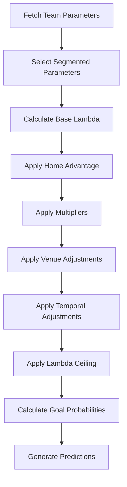

# Parameter Usage in Score Predictions and Goal Probabilities

## Overview

This document provides a detailed explanation of how league and team parameters—specifically the home and away goal averages computed separately—are used in calculating score predictions and goal probabilities in the football fixture prediction system.

## Table of Contents

1. [Parameter Hierarchy](#parameter-hierarchy)
2. [League Parameters](#league-parameters)
3. [Team Parameters](#team-parameters)
4. [Prediction Calculation Pipeline](#prediction-calculation-pipeline)
5. [Lambda Calculation Process](#lambda-calculation-process)
6. [Bayesian Smoothing](#bayesian-smoothing)
7. [Goal Probability Distribution](#goal-probability-distribution)
8. [Complete Prediction Workflow](#complete-prediction-workflow)
9. [Mathematical Formulas](#mathematical-formulas)

---

## Parameter Hierarchy

The system uses a hierarchical approach to parameters:

```
League Parameters (Baseline)
    ↓
Team Parameters (Team-specific)
    ↓
Segmented Parameters (Opponent-specific)
    ↓
Adjusted Parameters (Venue, Temporal, Tactical)
```

### Key Parameter Types

1. **League Parameters**: Baseline statistics calculated from all matches in a league
2. **Team Parameters**: Specific to each team's performance
3. **Segmented Parameters**: Team performance against different opponent tiers (top/middle/bottom)
4. **Enhanced Parameters**: Include venue, temporal, and tactical adjustments

---

## League Parameters

### Core League Parameters

League parameters are calculated in [`league_calculator.py:fit_league_params()`](../../src/parameters/league_calculator.py:25) and include:

| Parameter | Description | Role in Predictions |
|-----------|-------------|---------------------|
| `mu` | Overall average goals per game | Baseline expected goals |
| `mu_home` | Average goals scored by home teams | Prior for home team predictions |
| `mu_away` | Average goals scored by away teams | Prior for away team predictions |
| `p_score` | Overall probability of scoring | Baseline scoring likelihood |
| `p_score_home` | Probability home team scores | Prior for home scoring events |
| `p_score_away` | Probability away team scores | Prior for away scoring events |
| `alpha` | Dispersion parameter (overall) | Controls variance in goal distribution |
| `alpha_home` | Dispersion for home goals | Home team variance modeling |
| `alpha_away` | Dispersion for away goals | Away team variance modeling |
| `home_adv` | Home advantage ratio (mu_home/mu_away) | Multiplier for home advantage |
| `variance_home` | Variance in home goals | Statistical confidence measure |
| `variance_away` | Variance in away goals | Statistical confidence measure |

### How League Parameters Are Calculated

```python
# From league_calculator.py
g_home = df['home_goals']
g_away = df['away_goals']

# Separate means for home and away
mu_home = g_home.mean()
mu_away = g_away.mean()
mu = (mu_home + mu_away) / 2  # Overall mean

# Separate variances
var_home = g_home.var()
var_away = g_away.var()

# Dispersion parameters
alpha_home = max((var_home - mu_home) / mu_home**2, 0)
alpha_away = max((var_away - mu_away) / mu_away**2, 0)

# Home advantage
home_adv = mu_home / mu_away
```

---

## Team Parameters

### Core Team Parameters

Team parameters are calculated in [`team_calculator.py:fit_team_params()`](../../src/parameters/team_calculator.py:45) and include all the same metrics as league parameters, but specific to each team:

| Parameter | Description | Calculation |
|-----------|-------------|-------------|
| `mu_home` | Team's average goals when playing at home | Mean of home goals scored |
| `mu_away` | Team's average goals when playing away | Mean of away goals scored |
| `mu` | Team's overall average | Weighted average of home and away |
| `p_score_home` | Team's probability of scoring at home | (home_goals > 0).mean() |
| `p_score_away` | Team's probability of scoring away | (away_goals > 0).mean() |
| `alpha_home` | Team's home goal dispersion | (var_home - mu_home) / mu_home² |
| `alpha_away` | Team's away goal dispersion | (var_away - mu_away) / mu_away² |
| `home_adv` | Team's specific home advantage | mu_home / mu_away |

### Minimum Data Requirements

- **Minimum home matches**: 5
- **Minimum away matches**: 5
- **Overall minimum**: Set by `MINIMUM_GAMES_THRESHOLD`

If insufficient data exists, the system falls back to league parameters.

### Team Parameter Structure

```python
{
    # Overall parameters (backward compatibility)
    'mu': 1.45,
    'mu_home': 1.65,
    'mu_away': 1.25,
    'p_score_home': 0.78,
    'p_score_away': 0.68,
    'alpha_home': 0.12,
    'alpha_away': 0.10,
    'home_adv': 1.32,
    
    # Enhanced structures (Phase 1+)
    'segmented_params': {
        'vs_top': {...},      # Against top-tier opponents
        'vs_middle': {...},   # Against middle-tier opponents
        'vs_bottom': {...}    # Against bottom-tier opponents
    },
    'venue_params': {...},
    'temporal_params': {...},
    'tactical_params': {...}
}
```

---

## Prediction Calculation Pipeline

The prediction process follows these steps:



### Step-by-Step Process

1. **Parameter Selection**: Choose appropriate parameters based on opponent strength
2. **Lambda Calculation**: Compute expected goals (lambda) using team statistics
3. **Adjustments**: Apply various factors (home advantage, venue, form, etc.)
4. **Distribution**: Calculate probability distribution using Negative Binomial
5. **Predictions**: Generate most likely scores and probabilities

---

## Lambda Calculation Process

### What is Lambda (λ)?

Lambda represents the **expected number of goals** a team will score in a match. It's the core metric used in the Negative Binomial distribution to calculate goal probabilities.

### Base Lambda Calculation

The lambda calculation happens in [`prediction_engine.py:calculate_to_score()`](../../src/prediction/prediction_engine.py:92):

```python
# For home team:
lambda_home = (
    home_goals_scored *      # Team's attacking strength
    away_goals_conceded *    # Opponent's defensive weakness
    home_games_scored *      # Probability team scores
    (1 - away_cleanSheet)    # Probability opponent concedes
)

# For away team:
lambda_away = (
    away_goals_scored *      # Team's attacking strength
    home_goals_conceded *    # Opponent's defensive weakness
    away_games_scored *      # Probability team scores
    (1 - home_cleanSheet)    # Probability opponent concedes
)
```

### How Home/Away Averages (mu_home, mu_away) Are Used

The `mu_home` and `mu_away` parameters serve as **priors** in Bayesian smoothing:

1. **As Priors for Smoothing**:
   ```python
   # These parameters provide baseline expectations
   goal_prior = params['mu_home'] if is_home else params['mu_away']
   score_prior = params['p_score_home'] if is_home else params['p_score_away']
   ```

2. **In K-value Calculations**:
   ```python
   # Used to calculate parameter k_goals and k_score
   # which determine how much weight to give to priors vs. observed data
   k_goals = calculate_k_value(league_avg_goals=mu_home or mu_away)
   ```

3. **For Teams with Limited Data**:
   ```python
   # If team has < 5 home matches, use league's mu_home
   if len(home_matches) < MIN_HOME_MATCHES:
       mu_home = league_params['mu_home']
   ```

### Home Advantage Application

```python
# Apply home advantage using league-wide or team-specific ratio
if is_home:
    lambda_home *= home_adv      # Boost home team
else:
    lambda_away *= (1/home_adv)  # Reduce away team
```

### Lambda Adjustments

Multiple adjustments are applied to lambda:

1. **Multipliers** (from historical performance):
   ```python
   lambda *= multiplier_float  # Data-driven correction
   ```

2. **Venue Factors** (Phase 2):
   ```python
   lambda *= stadium_advantage  # Home stadium bonus
   lambda *= travel_impact      # Away travel penalty
   ```

3. **Temporal Factors** (Phase 3):
   ```python
   lambda *= recent_form        # Current form adjustment
   lambda *= momentum_factor    # Win/loss streak impact
   ```

4. **Tactical Factors** (Phase 4):
   ```python
   lambda *= tactical_matchup   # Formation compatibility
   ```

5. **Lambda Ceiling**:
   ```python
   # Prevent unrealistic predictions
   lambda = squash_lambda(lambda, ceiling=7.0)
   ```

---

## Bayesian Smoothing

### Why Smoothing is Needed

Raw statistics from small sample sizes can be unreliable. Bayesian smoothing combines:
- **Prior knowledge** (league averages)
- **Observed data** (team's actual performance)

### Smoothing Formula

```python
smoothed_value = (
    (prior_mean * prior_weight) + (observed_mean * sample_size)
) / (prior_weight + sample_size)
```

### How Home/Away Priors Are Used

```python
# From prediction_engine.py:calculate_to_score()

# Get appropriate prior based on home/away status
if is_home:
    goal_prior = params['mu_home']
    score_prior = params['p_score_home']
else:
    goal_prior = params['mu_away']
    score_prior = params['p_score_away']

# Calculate prior weights
goal_prior_weight = prior_weight_from_k(team_games, k_goals, ref_games)
score_prior_weight = prior_weight_from_k(team_games, k_score, ref_games)

# Apply smoothing to team statistics
team_goals_scored = apply_smoothing_to_team_data(
    raw_goals, 
    alpha_smooth, 
    goal_prior,          # Uses mu_home or mu_away
    goal_prior_weight, 
    use_bayesian=True
)

team_games_scored = apply_smoothing_to_binary_rate(
    scored_binary,
    total_games,
    alpha_smooth,
    score_prior,         # Uses p_score_home or p_score_away
    score_prior_weight,
    use_bayesian=True
)
```

### Prior Weight Calculation

```python
def prior_weight_from_k(games_played, k, ref_games=20, lo=2, hi=10):
    """
    Calculate how much weight to give to prior vs. observed data.
    More games played = less weight on prior, more on observed.
    """
    if games_played < lo:
        return ref_games * k
    elif games_played > hi:
        return ref_games * k * 0.5
    else:
        # Linear interpolation
        return ref_games * k * (1 - (games_played - lo) / (hi - lo) * 0.5)
```

---

## Goal Probability Distribution

### Negative Binomial Distribution

Once lambda is calculated, goal probabilities are computed using the Negative Binomial distribution in [`distributions.py:calculate_goal_probabilities()`](../../src/statistics/distributions.py:81):

```python
def calculate_goal_probabilities(lambda, alpha):
    """
    Calculate probability of scoring 0, 1, 2, 3, ... goals
    
    Args:
        lambda: Expected goals (from lambda calculation)
        alpha: Dispersion parameter (alpha_home or alpha_away)
    
    Returns:
        probabilities: {0: p0, 1: p1, 2: p2, ...}
    """
    probabilities = {}
    for goals in range(11):  # 0 to 10 goals
        probabilities[goals] = nb_pmf(goals, lambda, alpha)
    
    # Normalize to sum to 1.0
    total = sum(probabilities.values())
    probabilities = {k: v/total for k, v in probabilities.items()}
    
    return probabilities
```

### Negative Binomial PMF

```python
def nb_pmf(k, mu, alpha):
    """
    Probability mass function for k goals given expected mu and dispersion alpha.
    
    If alpha <= 0.01, uses Poisson (low variance)
    Otherwise uses Negative Binomial (higher variance)
    """
    if alpha <= 0.01:
        # Use Poisson for low dispersion
        return (mu**k) * exp(-mu) / factorial(k)
    else:
        # Use Negative Binomial
        r = 1 / alpha
        p = 1 / (1 + alpha * mu)
        return nbinom.pmf(k, r, p)
```

### Why Home/Away Alpha Matters

The `alpha_home` and `alpha_away` parameters control the **spread** of the probability distribution:

- **Low alpha (α < 0.1)**: Goals cluster tightly around lambda → narrower distribution
- **High alpha (α > 0.3)**: Goals more dispersed → wider distribution

Example:
```
Lambda = 2.0, Alpha = 0.05 (low variance):
  P(0) = 0.10, P(1) = 0.20, P(2) = 0.35, P(3) = 0.25, P(4+) = 0.10

Lambda = 2.0, Alpha = 0.30 (high variance):
  P(0) = 0.15, P(1) = 0.22, P(2) = 0.23, P(3) = 0.18, P(4+) = 0.22
```

---

## Complete Prediction Workflow

### Example Prediction

**Match**: Arsenal (Home) vs. Manchester City (Away)  
**League**: Premier League

#### Step 1: Fetch Parameters

```python
# League parameters (Premier League baseline)
league_params = {
    'mu_home': 1.65,
    'mu_away': 1.32,
    'p_score_home': 0.78,
    'p_score_away': 0.70,
    'alpha_home': 0.12,
    'alpha_away': 0.10,
    'home_adv': 1.25
}

# Arsenal parameters
arsenal_params = {
    'mu_home': 1.85,      # Arsenal scores 1.85 goals/game at home
    'mu_away': 1.45,      # Arsenal scores 1.45 goals/game away
    'p_score_home': 0.85,
    'alpha_home': 0.15,
    'home_adv': 1.28
}

# Man City parameters
city_params = {
    'mu_home': 2.10,
    'mu_away': 1.75,      # City scores 1.75 goals/game away
    'p_score_away': 0.80,
    'alpha_away': 0.11,
}
```

#### Step 2: Calculate Base Lambda

```python
# Arsenal (home) vs Man City (away)
# Using smoothed team statistics with league priors

arsenal_attack_home = smooth(1.85, prior=league_params['mu_home'])
city_defense_away = smooth(1.32, prior=league_params['mu_away'])
arsenal_score_rate = smooth(0.85, prior=league_params['p_score_home'])
city_cleansheet_rate = smooth(0.25, prior=1-league_params['p_score_away'])

lambda_arsenal = (
    arsenal_attack_home *     # 1.80 (smoothed)
    city_defense_away *       # 1.35 (smoothed)
    arsenal_score_rate *      # 0.82 (smoothed)
    (1 - city_cleansheet_rate) # 0.77 (smoothed)
) = 1.54
```

#### Step 3: Apply Home Advantage

```python
lambda_arsenal *= 1.25  # home_adv
lambda_arsenal = 1.93
```

#### Step 4: Apply Multipliers & Adjustments

```python
# Historical multiplier (from past predictions)
lambda_arsenal *= 1.05  # 2.03

# Temporal adjustment (Arsenal in good form)
lambda_arsenal *= 1.08  # 2.19

# Venue adjustment (Emirates Stadium advantage)
lambda_arsenal *= 1.02  # 2.23

# Lambda ceiling
lambda_arsenal = min(lambda_arsenal, 7.0)  # 2.23 (within bounds)
```

#### Step 5: Calculate Goal Probabilities

```python
alpha_arsenal = 0.15  # Arsenal's home alpha

goal_probs_arsenal = calculate_goal_probabilities(2.23, 0.15)
# Result:
# {
#     0: 0.11,  # 11% chance of 0 goals
#     1: 0.23,  # 23% chance of 1 goal
#     2: 0.27,  # 27% chance of 2 goals (most likely)
#     3: 0.20,  # 20% chance of 3 goals
#     4: 0.12,  # 12% chance of 4 goals
#     5+: 0.07  # 7% chance of 5+ goals
# }

most_likely_goals = 2
probability_to_score = 1 - 0.11 = 0.89  # 89%
```

#### Step 6: Repeat for Away Team

```python
# Similar process for Man City (away)
lambda_city = calculate_lambda(city_params, arsenal_params, is_home=False)
lambda_city = 1.45  # After all adjustments

goal_probs_city = calculate_goal_probabilities(1.45, 0.11)
# Most likely: 1 goal
# Probability to score: 76%
```

#### Step 7: Generate Match Predictions

```python
# Combine home and away probabilities
match_predictions = {
    'home_goals_expected': 2.23,
    'away_goals_expected': 1.45,
    'home_most_likely': 2,
    'away_most_likely': 1,
    'most_likely_score': '2-1',
    'home_win_prob': 0.52,
    'draw_prob': 0.24,
    'away_win_prob': 0.24,
    'btts_prob': 0.69,  # Both teams to score
    'over_2.5_prob': 0.58
}
```

---

## Mathematical Formulas

### Lambda Calculation

$$\lambda_{home} = G^{for}_{home} \times G^{against}_{away} \times P_{score,home} \times (1 - P_{cleansheet,away}) \times A_{home}$$

$$\lambda_{away} = G^{for}_{away} \times G^{against}_{home} \times P_{score,away} \times (1 - P_{cleansheet,home}) \times \frac{1}{A_{home}}$$

Where:
- $G^{for}$ = Goals scored (smoothed)
- $G^{against}$ = Goals conceded (smoothed)
- $P_{score}$ = Probability of scoring
- $P_{cleansheet}$ = Probability of clean sheet
- $A_{home}$ = Home advantage factor

### Bayesian Smoothing

$$\theta_{smoothed} = \frac{\mu_{prior} \times w_{prior} + \bar{x}_{observed} \times n}{w_{prior} + n}$$

Where:
- $\mu_{prior}$ = Prior mean (mu_home or mu_away)
- $w_{prior}$ = Prior weight (based on k and ref_games)
- $\bar{x}_{observed}$ = Observed sample mean
- $n$ = Sample size

### Negative Binomial PMF

$$P(X = k) = \binom{k + r - 1}{k} \times p^r \times (1-p)^k$$

Where:
- $r = \frac{1}{\alpha}$ (shape parameter)
- $p = \frac{1}{1 + \alpha \times \mu}$ (success probability)
- $\mu$ = $\lambda$ (expected goals)
- $\alpha$ = alpha_home or alpha_away

---

## Summary

### Key Takeaways

1. **League parameters** (mu_home, mu_away, etc.) serve as **baseline priors** for all predictions
2. **Team parameters** override league values when sufficient data exists (≥5 matches)
3. **Lambda** is calculated by combining team attack, opponent defense, and scoring probabilities
4. **Bayesian smoothing** uses home/away priors to stabilize predictions for teams with limited data
5. **Alpha parameters** control the variance in goal distribution
6. **Multiple adjustments** (home advantage, venue, form, tactics) refine lambda before final calculation
7. **Negative Binomial distribution** generates probability distribution for exact goal counts

### Parameter Flow

```
League mu_home (1.65) → Team mu_home (1.85) → Smoothed attack (1.80)
                                              ↓
League mu_away (1.32) → Opponent mu_away (1.35) → Smoothed defense (1.35)
                                                  ↓
                                          Base Lambda (2.43)
                                                  ↓
                                          Home Advantage × 1.25
                                                  ↓
                                          Multipliers & Adjustments
                                                  ↓
                                          Final Lambda (2.23)
                                                  ↓
                                          Goal Probabilities
                                                  ↓
                                          Match Predictions
```

---

## References

- [`league_calculator.py`](../../src/parameters/league_calculator.py) - League parameter calculation
- [`team_calculator.py`](../../src/parameters/team_calculator.py) - Team parameter calculation
- [`prediction_engine.py`](../../src/prediction/prediction_engine.py) - Prediction computation
- [`distributions.py`](../../src/statistics/distributions.py) - Probability distributions
- [`bayesian.py`](../../src/statistics/bayesian.py) - Bayesian smoothing functions

---

*Last Updated: 2025-11-02*