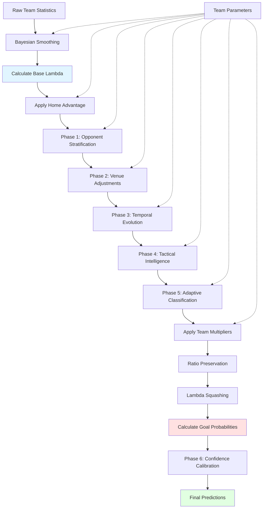

# Prediction Computation Guide

## Overview

This guide explains how the football fixture prediction system computes match predictions using a sophisticated multi-phase Poisson-based model. The system calculates expected goals (lambda λ) for each team and converts these into detailed match outcome probabilities.

## Table of Contents

1. [Core Lambda Calculation](#core-lambda-calculation)
2. [Team Parameters and Their Application](#team-parameters-and-their-application)
3. [Prediction Flow](#prediction-flow)
4. [Parameter Sources](#parameter-sources)
5. [Code References](#code-references)

---

## Core Lambda Calculation

### Base Formula

The fundamental formula for computing lambda (expected goals) is:

```
λ = (team_goals_scored × opponent_goals_conceded × team_games_scored × (1 - opponent_games_cleanSheet))
```

### Implementation

**For Home Team:**
```python
lmbda = (team1_goals_scored * team2_goals_conceded * 
         team1_games_scored * 
         (1 - team2_games_cleanSheet))
```

**For Away Team:**
```python
lmbda = (team2_goals_scored * team1_goals_conceded * 
         team2_games_scored * 
         (1 - team1_games_cleanSheet))
```

This formula combines four key factors:
1. **Team's attacking strength** (goals scored per game)
2. **Opponent's defensive weakness** (goals conceded per game)
3. **Team's scoring frequency** (probability of scoring)
4. **Opponent's defensive vulnerability** (1 - clean sheet rate)

Reference: [`prediction_engine.py:213-219`](../../src/prediction/prediction_engine.py)

---

## Team Parameters and Their Application

The system applies team parameters to lambda through six major phases, each enhancing the prediction accuracy.

### Phase 0: Bayesian Smoothing Parameters

Raw statistics are smoothed using league-wide priors to prevent overfitting and handle small sample sizes.

**Key Parameters:**
- **`mu_home`** / **`mu_away`**: Prior expected goals (e.g., 1.5 home, 1.2 away)
- **`p_score_home`** / **`p_score_away`**: Prior probability of scoring (e.g., 0.75 home, 0.65 away)
- **`k_goals`** / **`k_score`**: Smoothing strength parameters
- **`alpha_smooth`**: Smoothing factor (default 0.5)

**Application:**
```python
team1_goals_scored = apply_smoothing_to_team_data(
    team1_goals_scored_raw, 
    alpha_smooth, 
    goal_prior, 
    goal_prior_weight, 
    use_bayesian=True
)
```

Reference: [`prediction_engine.py:193-210`](../../src/prediction/prediction_engine.py)

### Home Advantage Adjustment

**Parameter:**
- **`home_adv`**: League-specific home advantage multiplier (typically 1.25-1.31)

**Application:**
```python
if is_home:
    lmbda *= league_home_adv
else:
    lmbda *= 1/league_home_adv
```

Reference: [`prediction_engine.py:232-235`](../../src/prediction/prediction_engine.py)

### Phase 1: Opponent Stratification

Teams perform differently against top, middle, and bottom-tier opponents. The system uses segmented parameters for more accurate predictions.

**Parameters:**
- **`segmented_params['vs_top']`**: Parameters when facing top-tier teams
- **`segmented_params['vs_middle']`**: Parameters when facing middle-tier teams
- **`segmented_params['vs_bottom']`**: Parameters when facing bottom-tier teams

**Application:**
```python
effective_home_params = get_segmented_params(
    home_params, away_team_id, league_id, season
)
```

Reference: [`prediction_engine.py:375-391`](../../src/prediction/prediction_engine.py)

### Phase 2: Venue Analysis

Stadium-specific advantages and travel distance impacts are incorporated.

**Parameters:**
- **`home_stadium_advantage`**: Venue-specific boost (0.95-1.15)
- **`away_travel_impact`**: Travel fatigue penalty (0.90-1.05)
- **`surface_compatibility`**: Playing surface match rating
- **`altitude_factor`**: High-altitude venue adjustment

**Application:**
```python
venue_factors = apply_venue_adjustments(
    home_lambda_base, away_lambda_base,
    home_team_id, away_team_id, venue_id, season,
    effective_home_params, effective_away_params
)
```

Reference: [`prediction_engine.py:411-425`](../../src/prediction/prediction_engine.py)

### Phase 3: Temporal Evolution

Time-aware adjustments based on recent form, momentum, and seasonal patterns.

**Parameters:**
- **`home_temporal_multiplier`** / **`away_temporal_multiplier`**: Form-based adjustments
- **`h2h_multiplier`**: Head-to-head history impact
- **`recent_form`**: Last 5-10 games performance
- **`momentum_factor`**: Win/loss streak impact
- **`injury_impact`**: Current injury situation
- **`fixture_congestion`**: Fatigue from match density

**Application:**
```python
home_temporal_multiplier = get_temporal_multiplier_for_prediction(
    home_team_id, league_id, season, prediction_date
)
home_lambda_base *= float(home_temporal_multiplier)
```

Reference: [`prediction_engine.py:432-469`](../../src/prediction/prediction_engine.py)

### Phase 4: Tactical Intelligence

Formation and playing style matchup analysis.

**Parameters:**
- **`home_tactical_multiplier`** / **`away_tactical_multiplier`**: Style compatibility
- **`home_formation_bonus`** / **`away_formation_bonus`**: Formation advantages
- **`tactical_style_scores`**: Possession, pressing, counter-attacking ratings
- **`formation_preferences`**: Primary and alternative formations

**Application:**
```python
tactical_analysis = matchup_analyzer.analyze_tactical_compatibility(
    home_team_id, away_team_id, league_id, season
)
home_tactical_mult = float(tactical_multipliers.get('home_tactical_multiplier', 1.0))
home_lambda_base *= home_tactical_mult
```

Reference: [`prediction_engine.py:477-534`](../../src/prediction/prediction_engine.py)

### Phase 5: Adaptive Classification

Team archetype-based strategy routing for intelligent prediction selection.

**Parameters:**
- **`home_classification_multiplier`** / **`away_classification_multiplier`**: Archetype adjustments
- **`adaptive_weights`**: Dynamic phase contribution weights
- **`archetype`**: Team classification (e.g., "possession_masters", "counter_attackers")
- **`volatility_level`**: Matchup unpredictability assessment
- **`confidence_adjustment`**: Strategy-specific confidence modifier

**Application:**
```python
home_classification = classify_team_archetype(home_team_id, league_id, season)
adaptive_weights = calculate_adaptive_weights(home_archetype, away_archetype, match_context)

# Apply adaptive weighting to previous phase contributions
weighted_venue_adjustment = 1.0 + (venue_adjustment - 1.0) * phase_weights['venue_weight']
```

Reference: [`prediction_engine.py:542-649`](../../src/prediction/prediction_engine.py)

### Team Multipliers with Ratio Preservation

Team-specific performance adjustments are applied while maintaining competitive balance between home and away lambdas.

**Parameters:**
- **`home_multiplier`** / **`away_multiplier`**: Optimization-derived adjustments (typically 0.8-1.2)

**Application:**
```python
# Apply multipliers
home_lambda_adjusted = home_lambda_base * home_multiplier
away_lambda_adjusted = away_lambda_base * away_multiplier

# Preserve original ratio
original_ratio = home_lambda_base / away_lambda_base
new_ratio = home_lambda_adjusted / away_lambda_adjusted
ratio_correction = original_ratio / new_ratio

# Apply geometric mean correction
adjustment_factor = np.sqrt(ratio_correction)
home_lambda_final = home_lambda_adjusted * adjustment_factor
away_lambda_final = away_lambda_adjusted / adjustment_factor
```

Reference: [`prediction_engine.py:747-767`](../../src/prediction/prediction_engine.py)

### Distribution Parameters

Lambda is converted to goal probabilities using a negative binomial distribution.

**Parameters:**
- **`alpha_home`** / **`alpha_away`**: Negative binomial dispersion parameters (typically 0.1-0.5)

**Application:**
```python
home_goals, home_likelihood, home_probs = calculate_goal_probabilities(
    home_lambda_final, home_alpha
)
```

Reference: [`prediction_engine.py:777-778`](../../src/prediction/prediction_engine.py)

### Phase 6: Confidence Calibration

The final phase calibrates prediction confidence based on historical accuracy and context.

**Parameters:**
- **`base_confidence`**: Initial confidence from strategy routing
- **`calibrated_confidence`**: Adjusted based on historical performance
- **`final_confidence`**: Context-aware final confidence score
- **`reliability_score`**: Model reliability assessment
- **`uncertainty_sources`**: Identified sources of prediction uncertainty

**Application:**
```python
calibrated_confidence = calibrate_prediction_confidence(
    {'base_confidence': base_confidence}, 
    historical_performance
)

adaptive_confidence = calculate_adaptive_confidence(
    calibrated_confidence['calibrated_confidence'], 
    context_factors
)
```

Reference: [`prediction_engine.py:657-737`](../../src/prediction/prediction_engine.py)

---

## Prediction Flow

The following diagram illustrates the complete prediction computation flow:



### Flow Description

1. **Raw Team Statistics**: Historical match data (goals, clean sheets, etc.)
2. **Bayesian Smoothing**: Apply league priors to prevent overfitting
3. **Calculate Base Lambda**: Compute expected goals using core formula
4. **Apply Home Advantage**: League-specific home boost
5. **Phase 1**: Select opponent-stratified parameters
6. **Phase 2**: Adjust for venue and travel effects
7. **Phase 3**: Apply temporal factors (form, momentum)
8. **Phase 4**: Incorporate tactical matchup analysis
9. **Phase 5**: Route strategy based on team archetypes
10. **Apply Team Multipliers**: Optimization-derived adjustments
11. **Ratio Preservation**: Maintain competitive balance
12. **Lambda Squashing**: Cap at reasonable maximum (~5.0 goals)
13. **Calculate Goal Probabilities**: Use negative binomial distribution
14. **Phase 6**: Calibrate confidence based on context
15. **Final Predictions**: Complete match outcome probabilities

---

## Lambda Squashing

To prevent unrealistic predictions, lambda is bounded using a squashing function:

```python
lmbda = squash_lambda(lmbda)  # Caps at reasonable maximum (~5.0 goals)
```

This ensures predictions remain within realistic bounds while preserving relative differences.

Reference: [`statistics/distributions.py`](../../src/statistics/distributions.py)

---

## Parameter Sources

Parameters originate from multiple calculation modules:

### 1. League Parameters
Calculated from aggregate league data to establish baseline expectations.

**Source:** [`league_calculator.py`](../../src/parameters/league_calculator.py)

**Key Parameters:**
- Average goals per game (mu)
- Home/away split expectations
- Scoring probabilities
- Home advantage factor

### 2. Team Parameters
Derived from team-specific match history with Bayesian smoothing.

**Source:** [`team_calculator.py`](../../src/parameters/team_calculator.py)

**Key Parameters:**
- Team-specific goal averages
- Opponent-stratified performance
- Venue-specific statistics
- Temporal evolution metrics
- Tactical style profiles
- Archetype classifications

### 3. Multipliers
Optimization-derived adjustments to improve prediction accuracy.

**Source:** [`multiplier_calculator.py`](../../src/parameters/multiplier_calculator.py)

**Calculation Method:**
- Grid search optimization
- Historical performance evaluation
- Ratio preservation constraints

### 4. Version Tracking
Ensures parameter compatibility across system versions.

**Source:** [`version_manager.py`](../../src/infrastructure/version_manager.py)

**Purpose:**
- Prevent contamination from incompatible multipliers
- Track architecture evolution
- Enable hierarchical fallback

---

## Final Probability Calculation

The final lambda values are used in a **negative binomial distribution** to calculate:

### Goal Distribution
```
P(goals = n) = NB(n | λ, α)
```

Where:
- **λ (lambda)**: Expected goals
- **α (alpha)**: Dispersion parameter (controls variance)

### Output Metrics

1. **Goal Probabilities**: P(0 goals), P(1 goal), P(2 goals), etc.
2. **Most Likely Scoreline**: Goal count with highest probability
3. **Match Outcome Probabilities**:
   - Home Win: P(home_goals > away_goals)
   - Draw: P(home_goals = away_goals)
   - Away Win: P(home_goals < away_goals)

4. **Scoring Probability**: P(goals > 0) = 1 - P(0 goals)

5. **Confidence Metrics**:
   - Calibrated confidence score
   - Reliability assessment
   - Uncertainty quantification
   - Expected accuracy

---

## Example Calculation

Here's a simplified example of the prediction computation:

### Input Data
- Home Team: Liverpool (vs Brighton)
- League: Premier League
- Venue: Anfield
- Date: October 2024

### Step-by-Step Calculation

1. **Base Lambda Calculation**
   ```
   Liverpool attack: 2.1 goals/game
   Brighton defense: 1.3 goals/game conceded
   Liverpool scoring rate: 0.85
   Brighton clean sheet rate: 0.30
   
   λ_home_base = 2.1 × 1.3 × 0.85 × (1 - 0.30) = 1.62
   ```

2. **Home Advantage** (1.31x)
   ```
   λ_home = 1.62 × 1.31 = 2.12
   ```

3. **Opponent Stratification** (vs middle-tier team)
   ```
   λ_home = 2.12 × 0.95 = 2.01
   ```

4. **Venue Advantage** (Anfield boost: 1.08x)
   ```
   λ_home = 2.01 × 1.08 = 2.17
   ```

5. **Temporal Adjustment** (good form: 1.05x)
   ```
   λ_home = 2.17 × 1.05 = 2.28
   ```

6. **Tactical Matchup** (favorable: 1.02x)
   ```
   λ_home = 2.28 × 1.02 = 2.33
   ```

7. **Classification Adjustment** (possession master vs balanced: 1.01x)
   ```
   λ_home = 2.33 × 1.01 = 2.35
   ```

8. **Team Multiplier** (1.08x with ratio preservation)
   ```
   λ_home_final = 2.35 × 1.08 × correction_factor = 2.41
   ```

9. **Goal Probabilities** (α = 0.3)
   ```
   P(0 goals) = 0.09
   P(1 goal) = 0.22
   P(2 goals) = 0.26  ← Most likely
   P(3 goals) = 0.21
   P(4+ goals) = 0.22
   ```

10. **Final Confidence** (0.78)
    ```
    Base confidence: 0.75
    Calibrated: 0.77
    Context-adjusted: 0.78
    ```

---

## Code References

### Primary Files

1. **[`prediction_engine.py`](../../src/prediction/prediction_engine.py)**
   - Main prediction computation logic
   - Phase orchestration
   - Lambda calculation and adjustment

2. **[`team_calculator.py`](../../src/parameters/team_calculator.py)**
   - Team parameter calculation
   - Segmented parameter generation
   - Temporal and tactical analysis

3. **[`league_calculator.py`](../../src/parameters/league_calculator.py)**
   - League-wide parameter computation
   - Baseline expectations

4. **[`multiplier_calculator.py`](../../src/parameters/multiplier_calculator.py)**
   - Optimization-based multiplier derivation
   - Grid search implementation

5. **[`distributions.py`](../../src/statistics/distributions.py)**
   - Negative binomial probability calculations
   - Lambda squashing
   - Goal probability distributions

6. **[`bayesian.py`](../../src/statistics/bayesian.py)**
   - Bayesian smoothing functions
   - Prior weight calculations

### Supporting Modules

- **[`opponent_classifier.py`](../../src/features/opponent_classifier.py)**: Opponent tier classification
- **[`venue_analyzer.py`](../../src/features/venue_analyzer.py)**: Stadium advantage calculation
- **[`form_analyzer.py`](../../src/features/form_analyzer.py)**: Recent form assessment
- **[`tactical_matchups.py`](../../src/features/tactical_matchups.py)**: Tactical compatibility
- **[`team_classifier.py`](../../src/features/team_classifier.py)**: Archetype classification
- **[`confidence_calibrator.py`](../../src/analytics/confidence_calibrator.py)**: Confidence calibration
- **[`version_manager.py`](../../src/infrastructure/version_manager.py)**: Version tracking
- **[`transition_manager.py`](../../src/infrastructure/transition_manager.py)**: Multiplier coordination

---

## Summary

The prediction system uses a sophisticated multi-phase approach that:

1. **Combines statistical rigor** with domain knowledge
2. **Accounts for multiple factors** affecting match outcomes
3. **Prevents overfitting** through Bayesian smoothing
4. **Maintains balance** via ratio preservation
5. **Adapts strategy** based on team characteristics
6. **Calibrates confidence** using historical performance

This comprehensive approach ensures accurate, reliable, and contextually-aware predictions for football fixtures.

---

## Related Documentation

- [API Documentation](API_DOCUMENTATION.md)
- [Database Schema](DATABASE_SCHEMA_DOCUMENTATION.md)
- [System Architecture](../architecture/NEW_SYSTEM_ARCHITECTURE.md)
- [Developer Guide](DEVELOPER_GUIDE.md)