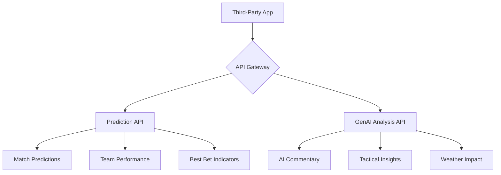

# Third-Party Integration Guide
**Football Fixture Prediction API - Developer Integration Manual**

Version: 1.0 | Last Updated: October 16, 2025 | Status: Production

---

## 📋 Table of Contents

1. [Introduction](#introduction)
2. [Quick Start](#quick-start)
3. [Authentication](#authentication)
4. [API Endpoints](#api-endpoints)
5. [Response Formats](#response-formats)
6. [Code Examples](#code-examples)
7. [Integration Patterns](#integration-patterns)
8. [Rate Limits & Quotas](#rate-limits--quotas)
9. [Error Handling](#error-handling)
10. [Best Practices](#best-practices)
11. [Use Cases](#use-cases)
12. [Data Interpretation](#data-interpretation)
13. [FAQs & Troubleshooting](#faqs--troubleshooting)
14. [Support & Resources](#support--resources)

---

## Introduction

### What is the Football Fixture Prediction API?

The Football Fixture Prediction API is a production-ready REST API that provides:

- **Advanced Match Predictions** - 6-phase prediction model with Poisson distribution analysis
- **AI-Powered Analysis** - Expert commentary using Gemini/Claude AI
- **Comprehensive Data** - Team stats, tactical insights, venue analysis, weather forecasts
- **Real-time Updates** - Daily fixture ingestion and prediction updates

### Key Capabilities



### System Architecture

| Component | Technology | Purpose |
|-----------|------------|---------|
| **API Gateway** | AWS API Gateway | Regional endpoint with authentication |
| **Prediction Engine** | AWS Lambda (Python 3.13) | 6-phase prediction model |
| **GenAI Analysis** | AWS Lambda + Gemini/Claude | AI-powered match analysis |
| **Data Store** | DynamoDB | Predictions, parameters, analysis |
| **Authentication** | API Key | x-api-key header validation |

### Available Endpoints

| Endpoint | Method | Purpose | Response Time |
|----------|--------|---------|---------------|
| [`/predictions`](#predictions-endpoint) | GET | Query match predictions | ~200-500ms |
| [`/analysis`](#genai-analysis-endpoint) | POST | Request AI analysis | ~10-30s |

---

## Quick Start

Get started with the API in 5 minutes!

### Step 1: Obtain Your API Key

Contact your system administrator or use the AWS Console to obtain your API key.

```bash
# Your API key will look like this (example):
API_KEY="AbCdEf123456789XyZ"
```

### Step 2: Test Your First Request

```bash
# Get predictions for a specific fixture
curl -X GET \
  'https://esqyjhhc4e.execute-api.eu-west-2.amazonaws.com/prod/predictions?fixture_id=1035046' \
  -H 'x-api-key: YOUR_API_KEY'
```

### Step 3: Parse the Response

```json
{
  "items": [
    {
      "fixture_id": 1035046,
      "timestamp": 1704117600,
      "date": "2024-01-01T15:00:00+00:00",
      "has_best_bet": true,
      "home": {
        "team_id": 33,
        "team_name": "Manchester United",
        "predicted_goals": 1.8,
        "home_performance": 0.68
      },
      "away": {
        "team_id": 40,
        "team_name": "Liverpool",
        "predicted_goals": 1.2,
        "away_performance": 0.55
      }
    }
  ],
  "last_evaluated_key": null,
  "query_type": "single_fixture",
  "total_items": 1
}
```

### Step 4: Request AI Analysis (Optional)

```bash
# Get AI-powered analysis for the same match
curl -X POST \
  'https://esqyjhhc4e.execute-api.eu-west-2.amazonaws.com/prod/analysis' \
  -H 'x-api-key: YOUR_API_KEY' \
  -H 'Content-Type: application/json' \
  -d '{"fixture_id": 1035046}'
```

🎉 **Congratulations!** You've made your first API calls.

---

## Authentication

### API Key Authentication

All API requests require authentication using an API key passed in the `x-api-key` header.

```http
GET /predictions?fixture_id=12345 HTTP/1.1
Host: esqyjhhc4e.execute-api.eu-west-2.amazonaws.com
x-api-key: YOUR_API_KEY_HERE
```

### Obtaining API Keys

API keys are managed through AWS API Gateway. Contact your administrator to:

1. Create a new API key
2. Associate it with the appropriate usage plan
3. Receive your key value (keep it secure!)

### Security Best Practices

✅ **DO:**
- Store API keys in environment variables or secure vaults
- Use HTTPS for all API requests (enforced)
- Rotate API keys periodically
- Use different keys for dev/staging/production
- Monitor key usage through CloudWatch

❌ **DON'T:**
- Hard-code API keys in your source code
- Commit API keys to version control
- Share API keys publicly
- Use the same key across multiple applications

### Testing Authentication

```bash
# Test if your API key is valid
curl -X GET \
  'https://esqyjhhc4e.execute-api.eu-west-2.amazonaws.com/prod/predictions?country=England&league=Premier%20League' \
  -H 'x-api-key: YOUR_API_KEY' \
  -w "\nHTTP Status: %{http_code}\n"
```

**Expected Response:**
- `200 OK` - Authentication successful
- `401 Unauthorized` - Invalid or missing API key
- `403 Forbidden` - Valid key but no access permission

---

## API Endpoints

### Overview

```mermaid
graph LR
    A[Client] --> B{API Gateway}
    B --> C[/predictions]
    B --> D[/analysis]
    C --> E[Prediction Data]
    D --> F[AI Analysis]
    E --> G[Quick Response]
    F --> H[Comprehensive Analysis]
```

---

### Predictions Endpoint

#### Base URL
```
GET https://esqyjhhc4e.execute-api.eu-west-2.amazonaws.com/prod/predictions
```

#### Query Types

##### 1. Single Fixture Query

Get prediction for a specific match by fixture ID.

**Parameters:**

| Parameter | Type | Required | Description | Example |
|-----------|------|----------|-------------|---------|
| `fixture_id` | integer | Yes | API-Football fixture ID | `1035046` |

**Example Request:**
```bash
curl -X GET \
  'https://esqyjhhc4e.execute-api.eu-west-2.amazonaws.com/prod/predictions?fixture_id=1035046' \
  -H 'x-api-key: YOUR_API_KEY'
```

##### 2. League Fixtures Query

Get all predictions for a league within a date range.

**Parameters:**

| Parameter | Type | Required | Description | Example |
|-----------|------|----------|-------------|---------|
| `country` | string | Yes | Country name | `England` |
| `league` | string | Yes | League name | `Premier League` |
| `startDate` | string | No | Start date (YYYY-MM-DD) | `2024-01-01` |
| `endDate` | string | No | End date (YYYY-MM-DD) | `2024-01-07` |
| `limit` | integer | No | Max results (default: 100) | `50` |
| `last_key` | string | No | Pagination token | (from previous response) |

**Example Request:**
```bash
curl -X GET \
  'https://esqyjhhc4e.execute-api.eu-west-2.amazonaws.com/prod/predictions?country=England&league=Premier%20League&startDate=2024-01-01&endDate=2024-01-07' \
  -H 'x-api-key: YOUR_API_KEY'
```

**Default Behavior:**
If `startDate` and `endDate` are not provided, the API returns fixtures from today to 4 days in the future.

#### Response Format

```json
{
  "items": [
    {
      "fixture_id": 1035046,
      "timestamp": 1704117600,
      "date": "2024-01-01T15:00:00+00:00",
      "has_best_bet": true,
      "country": "England",
      "league": "Premier League",
      "home": {
        "team_id": 33,
        "team_name": "Manchester United",
        "team_logo": "https://media.api-sports.io/football/teams/33.png",
        "predicted_goals": 1.8,
        "predicted_goals_alt": 1.6,
        "home_performance": 0.68
      },
      "away": {
        "team_id": 40,
        "team_name": "Liverpool",
        "team_logo": "https://media.api-sports.io/football/teams/40.png",
        "predicted_goals": 1.2,
        "predicted_goals_alt": 1.3,
        "away_performance": 0.55
      }
    }
  ],
  "last_evaluated_key": null,
  "query_type": "league_fixtures",
  "total_items": 1,
  "date_range": {
    "start": "2024-01-01",
    "end": "2024-01-07"
  },
  "filters": {
    "country": "England",
    "league": "Premier League"
  }
}
```

#### Pagination

For large result sets, use the `last_evaluated_key` for pagination:

```bash
# First request
curl -X GET \
  'https://esqyjhhc4e.execute-api.eu-west-2.amazonaws.com/prod/predictions?country=England&league=Premier%20League&limit=50' \
  -H 'x-api-key: YOUR_API_KEY'

# Subsequent request (use last_evaluated_key from previous response)
curl -X GET \
  'https://esqyjhhc4e.execute-api.eu-west-2.amazonaws.com/prod/predictions?country=England&league=Premier%20League&limit=50&last_key=PAGINATION_TOKEN' \
  -H 'x-api-key: YOUR_API_KEY'
```

---

### GenAI Analysis Endpoint

#### Base URL
```
POST https://esqyjhhc4e.execute-api.eu-west-2.amazonaws.com/prod/analysis
```

#### Request Format

**Headers:**
```http
Content-Type: application/json
x-api-key: YOUR_API_KEY
```

**Body:**
```json
{
  "fixture_id": 1035046
}
```

#### Example Request

```bash
curl -X POST \
  'https://esqyjhhc4e.execute-api.eu-west-2.amazonaws.com/prod/analysis' \
  -H 'x-api-key: YOUR_API_KEY' \
  -H 'Content-Type: application/json' \
  -d '{
    "fixture_id": 1035046
  }'
```

#### Response Format

```json
{
  "fixture_id": 1035046,
  "analysis": {
    "summary": "Manchester United hosts Liverpool in a crucial Premier League encounter...",
    "key_factors": [
      "Home advantage gives United a 12% performance boost",
      "Liverpool's away form has been inconsistent (0.55 performance)",
      "Weather conditions favor possession-based play",
      "Historical H2H suggests tight match"
    ],
    "tactical_insights": {
      "home_approach": "Expected 4-3-3 formation with high press",
      "away_approach": "Likely 4-2-3-1 with counter-attacking focus",
      "key_matchup": "Midfield battle will be decisive"
    },
    "prediction_analysis": {
      "most_likely_outcome": "1-1 or 2-1 home win",
      "confidence_level": "medium",
      "best_bet_rationale": "Over 2.5 goals based on both teams' attacking strength"
    },
    "weather_impact": {
      "condition": "Partly cloudy",
      "temperature": "12°C",
      "impact": "Ideal playing conditions"
    },
    "league_context": {
      "home_position": 4,
      "away_position": 2,
      "significance": "Top 4 implications"
    }
  },
  "metadata": {
    "ai_provider": "gemini",
    "generated_at": "2024-01-01T10:30:00Z",
    "processing_time_ms": 12500,
    "confidence": 0.82
  }
}
```

#### Response Time

⏱️ **Expected Processing Time:** 10-30 seconds

The GenAI endpoint performs comprehensive analysis including:
- Weather data retrieval
- League standings lookup
- AI model inference (Gemini/Claude)
- Tactical parameter extraction

**Recommendation:** Use asynchronous patterns for GenAI requests in production applications.

---

## Response Formats

### Standard Success Response

```json
{
  "statusCode": 200,
  "headers": {
    "Content-Type": "application/json",
    "Access-Control-Allow-Origin": "*"
  },
  "body": {
    // Response data here
  }
}
```

### Error Response

```json
{
  "statusCode": 400,
  "headers": {
    "Content-Type": "application/json",
    "Access-Control-Allow-Origin": "*"
  },
  "body": {
    "error": "Bad Request",
    "message": "Both 'country' and 'league' parameters are required",
    "timestamp": "2024-01-01T12:00:00Z"
  }
}
```

### HTTP Status Codes

| Code | Meaning | Description |
|------|---------|-------------|
| `200` | OK | Request successful |
| `400` | Bad Request | Invalid parameters |
| `401` | Unauthorized | Missing or invalid API key |
| `403` | Forbidden | Valid key but insufficient permissions |
| `404` | Not Found | Resource not found |
| `429` | Too Many Requests | Rate limit exceeded |
| `500` | Internal Server Error | Server error |
| `503` | Service Unavailable | Temporary service disruption |

---

## Code Examples

### cURL

#### Get Single Fixture Prediction
```bash
#!/bin/bash

API_KEY="YOUR_API_KEY"
BASE_URL="https://esqyjhhc4e.execute-api.eu-west-2.amazonaws.com/prod"
FIXTURE_ID="1035046"

curl -X GET \
  "${BASE_URL}/predictions?fixture_id=${FIXTURE_ID}" \
  -H "x-api-key: ${API_KEY}" \
  -H "Accept: application/json"
```

#### Get League Fixtures
```bash
#!/bin/bash

API_KEY="YOUR_API_KEY"
BASE_URL="https://esqyjhhc4e.execute-api.eu-west-2.amazonaws.com/prod"

curl -X GET \
  "${BASE_URL}/predictions?country=England&league=Premier%20League&startDate=2024-01-01&endDate=2024-01-07" \
  -H "x-api-key: ${API_KEY}" \
  -H "Accept: application/json"
```

#### Request AI Analysis
```bash
#!/bin/bash

API_KEY="YOUR_API_KEY"
BASE_URL="https://esqyjhhc4e.execute-api.eu-west-2.amazonaws.com/prod"
FIXTURE_ID="1035046"

curl -X POST \
  "${BASE_URL}/analysis" \
  -H "x-api-key: ${API_KEY}" \
  -H "Content-Type: application/json" \
  -d "{\"fixture_id\": ${FIXTURE_ID}}"
```

---

### Python

#### Installation
```bash
pip install requests
```

#### Complete Integration Class

```python
import requests
from typing import Dict, List, Optional
from datetime import datetime, timedelta


class FootballPredictionAPI:
    """
    Client for Football Fixture Prediction API.
    
    Usage:
        api = FootballPredictionAPI(api_key="YOUR_API_KEY")
        prediction = api.get_fixture_prediction(1035046)
        analysis = api.get_ai_analysis(1035046)
    """
    
    def __init__(self, api_key: str):
        """
        Initialize API client.
        
        Args:
            api_key: Your API key for authentication
        """
        self.base_url = "https://esqyjhhc4e.execute-api.eu-west-2.amazonaws.com/prod"
        self.headers = {
            "x-api-key": api_key,
            "Accept": "application/json"
        }
    
    def get_fixture_prediction(self, fixture_id: int) -> Dict:
        """
        Get prediction for a specific fixture.
        
        Args:
            fixture_id: API-Football fixture ID
            
        Returns:
            Dict containing prediction data
            
        Raises:
            requests.HTTPError: If request fails
        """
        url = f"{self.base_url}/predictions"
        params = {"fixture_id": fixture_id}
        
        response = requests.get(url, params=params, headers=self.headers)
        response.raise_for_status()
        
        return response.json()
    
    def get_league_fixtures(
        self,
        country: str,
        league: str,
        start_date: Optional[str] = None,
        end_date: Optional[str] = None,
        limit: int = 100
    ) -> Dict:
        """
        Get predictions for all fixtures in a league.
        
        Args:
            country: Country name (e.g., "England")
            league: League name (e.g., "Premier League")
            start_date: Optional start date (YYYY-MM-DD)
            end_date: Optional end date (YYYY-MM-DD)
            limit: Maximum results per request
            
        Returns:
            Dict containing fixtures and pagination info
        """
        url = f"{self.base_url}/predictions"
        params = {
            "country": country,
            "league": league,
            "limit": limit
        }
        
        if start_date:
            params["startDate"] = start_date
        if end_date:
            params["endDate"] = end_date
        
        response = requests.get(url, params=params, headers=self.headers)
        response.raise_for_status()
        
        return response.json()
    
    def get_all_league_fixtures(
        self,
        country: str,
        league: str,
        start_date: Optional[str] = None,
        end_date: Optional[str] = None
    ) -> List[Dict]:
        """
        Get ALL fixtures for a league with automatic pagination.
        
        Args:
            country: Country name
            league: League name
            start_date: Optional start date (YYYY-MM-DD)
            end_date: Optional end date (YYYY-MM-DD)
            
        Returns:
            List of all fixture predictions
        """
        all_fixtures = []
        last_key = None
        
        while True:
            params = {
                "country": country,
                "league": league
            }
            
            if start_date:
                params["startDate"] = start_date
            if end_date:
                params["endDate"] = end_date
            if last_key:
                params["last_key"] = last_key
            
            response = self.get_league_fixtures(**params)
            
            all_fixtures.extend(response.get("items", []))
            
            last_key = response.get("last_evaluated_key")
            if not last_key:
                break
        
        return all_fixtures
    
    def get_ai_analysis(self, fixture_id: int, timeout: int = 60) -> Dict:
        """
        Request AI-powered analysis for a fixture.
        
        Args:
            fixture_id: API-Football fixture ID
            timeout: Request timeout in seconds (default: 60)
            
        Returns:
            Dict containing AI analysis
            
        Note:
            This endpoint may take 10-30 seconds to process.
        """
        url = f"{self.base_url}/analysis"
        data = {"fixture_id": fixture_id}
        headers = {
            **self.headers,
            "Content-Type": "application/json"
        }
        
        response = requests.post(
            url,
            json=data,
            headers=headers,
            timeout=timeout
        )
        response.raise_for_status()
        
        return response.json()
    
    def get_todays_fixtures(self, country: str, league: str) -> List[Dict]:
        """
        Get today's fixtures for a league.
        
        Args:
            country: Country name
            league: League name
            
        Returns:
            List of today's fixtures
        """
        today = datetime.now().strftime("%Y-%m-%d")
        tomorrow = (datetime.now() + timedelta(days=1)).strftime("%Y-%m-%d")
        
        return self.get_all_league_fixtures(
            country=country,
            league=league,
            start_date=today,
            end_date=tomorrow
        )


# Example Usage
if __name__ == "__main__":
    # Initialize client
    api = FootballPredictionAPI(api_key="YOUR_API_KEY")
    
    # Get single fixture prediction
    try:
        prediction = api.get_fixture_prediction(1035046)
        home_team = prediction["items"][0]["home"]["team_name"]
        away_team = prediction["items"][0]["away"]["team_name"]
        home_goals = prediction["items"][0]["home"]["predicted_goals"]
        away_goals = prediction["items"][0]["away"]["predicted_goals"]
        
        print(f"{home_team} vs {away_team}")
        print(f"Predicted: {home_goals:.1f} - {away_goals:.1f}")
    except requests.HTTPError as e:
        print(f"Error: {e}")
    
    # Get league fixtures
    try:
        fixtures = api.get_league_fixtures(
            country="England",
            league="Premier League",
            start_date="2024-01-01",
            end_date="2024-01-07"
        )
        print(f"\nFound {fixtures['total_items']} fixtures")
    except requests.HTTPError as e:
        print(f"Error: {e}")
    
    # Request AI analysis
    try:
        print("\nRequesting AI analysis (this may take 10-30 seconds)...")
        analysis = api.get_ai_analysis(1035046)
        print(f"Analysis: {analysis['analysis']['summary'][:100]}...")
    except requests.HTTPError as e:
        print(f"Error: {e}")
```

---

### JavaScript (Node.js)

#### Installation
```bash
npm install axios
```

#### Complete Integration Module

```javascript
const axios = require('axios');

/**
 * Football Prediction API Client
 * 
 * @example
 * const api = new FootballPredictionAPI('YOUR_API_KEY');
 * const prediction = await api.getFixturePrediction(1035046);
 * const analysis = await api.getAIAnalysis(1035046);
 */
class FootballPredictionAPI {
  /**
   * Initialize API client
   * @param {string} apiKey - Your API key
   */
  constructor(apiKey) {
    this.baseURL = 'https://esqyjhhc4e.execute-api.eu-west-2.amazonaws.com/prod';
    this.apiKey = apiKey;
    this.client = axios.create({
      baseURL: this.baseURL,
      headers: {
        'x-api-key': apiKey,
        'Accept': 'application/json'
      }
    });
  }

  /**
   * Get prediction for a specific fixture
   * @param {number} fixtureId - API-Football fixture ID
   * @returns {Promise<Object>} Prediction data
   */
  async getFixturePrediction(fixtureId) {
    try {
      const response = await this.client.get('/predictions', {
        params: { fixture_id: fixtureId }
      });
      return response.data;
    } catch (error) {
      this._handleError(error);
    }
  }

  /**
   * Get predictions for league fixtures
   * @param {Object} params - Query parameters
   * @param {string} params.country - Country name
   * @param {string} params.league - League name
   * @param {string} [params.startDate] - Start date (YYYY-MM-DD)
   * @param {string} [params.endDate] - End date (YYYY-MM-DD)
   * @param {number} [params.limit=100] - Max results
   * @returns {Promise<Object>} Fixtures data with pagination
   */
  async getLeagueFixtures({ country, league, startDate, endDate, limit = 100 }) {
    try {
      const params = { country, league, limit };
      if (startDate) params.startDate = startDate;
      if (endDate) params.endDate = endDate;

      const response = await this.client.get('/predictions', { params });
      return response.data;
    } catch (error) {
      this._handleError(error);
    }
  }

  /**
   * Get ALL league fixtures with automatic pagination
   * @param {Object} params - Query parameters
   * @returns {Promise<Array>} All fixtures
   */
  async getAllLeagueFixtures(params) {
    const allFixtures = [];
    let lastKey = null;

    do {
      const response = await this.getLeagueFixtures({
        ...params,
        last_key: lastKey
      });

      allFixtures.push(...response.items);
      lastKey = response.last_evaluated_key;
    } while (lastKey);

    return allFixtures;
  }

  /**
   * Request AI-powered analysis for a fixture
   * @param {number} fixtureId - API-Football fixture ID
   * @param {number} [timeout=60000] - Request timeout in ms
   * @returns {Promise<Object>} AI analysis
   */
  async getAIAnalysis(fixtureId, timeout = 60000) {
    try {
      const response = await this.client.post(
        '/analysis',
        { fixture_id: fixtureId },
        {
          headers: { 'Content-Type': 'application/json' },
          timeout
        }
      );
      return response.data;
    } catch (error) {
      this._handleError(error);
    }
  }

  /**
   * Get today's fixtures for a league
   * @param {string} country - Country name
   * @param {string} league - League name
   * @returns {Promise<Array>} Today's fixtures
   */
  async getTodaysFixtures(country, league) {
    const today = new Date().toISOString().split('T')[0];
    const tomorrow = new Date(Date.now() + 86400000).toISOString().split('T')[0];

    return this.getAllLeagueFixtures({
      country,
      league,
      startDate: today,
      endDate: tomorrow
    });
  }

  /**
   * Handle API errors
   * @private
   */
  _handleError(error) {
    if (error.response) {
      // API responded with error status
      const { status, data } = error.response;
      throw new Error(`API Error (${status}): ${data.message || data.error || 'Unknown error'}`);
    } else if (error.request) {
      // No response received
      throw new Error('No response from API - check your network connection');
    } else {
      // Request setup error
      throw error;
    }
  }
}

// Example Usage
(async () => {
  const api = new FootballPredictionAPI('YOUR_API_KEY');

  try {
    // Get single fixture prediction
    const prediction = await api.getFixturePrediction(1035046);
    const fixture = prediction.items[0];
    console.log(`${fixture.home.team_name} vs ${fixture.away.team_name}`);
    console.log(`Predicted: ${fixture.home.predicted_goals} - ${fixture.away.predicted_goals}`);

    // Get league fixtures
    const fixtures = await api.getLeagueFixtures({
      country: 'England',
      league: 'Premier League',
      startDate: '2024-01-01',
      endDate: '2024-01-07'
    });
    console.log(`\nFound ${fixtures.total_items} fixtures`);

    // Request AI analysis
    console.log('\nRequesting AI analysis (this may take 10-30 seconds)...');
    const analysis = await api.getAIAnalysis(1035046);
    console.log(`Analysis: ${analysis.analysis.summary.substring(0, 100)}...`);
  } catch (error) {
    console.error('Error:', error.message);
  }
})();

module.exports = FootballPredictionAPI;
```

---

## Integration Patterns

### Pattern 1: Real-Time Display

Display predictions in real-time for user-facing applications.

```python
from flask import Flask, jsonify
from flask_caching import Cache

app = Flask(__name__)
cache = Cache(app, config={'CACHE_TYPE': 'simple'})
api = FootballPredictionAPI(api_key="YOUR_API_KEY")

@app.route('/api/fixture/<int:fixture_id>')
@cache.cached(timeout=1800)  # Cache for 30 minutes
def get_fixture(fixture_id):
    try:
        prediction = api.get_fixture_prediction(fixture_id)
        return jsonify(prediction)
    except Exception as e:
        return jsonify({"error": str(e)}), 500
```

### Pattern 2: Batch Processing

Fetch and store predictions for analysis.

```python
def daily_batch_job():
    """Daily batch processing of all league predictions."""
    leagues = [
        ("England", "Premier League"),
        ("Spain", "La Liga"),
        ("Italy", "Serie A")
    ]
    
    for country, league in leagues:
        fixtures = api.get_all_league_fixtures(country, league)
        store_in_database(fixtures)
```

---

## Rate Limits & Quotas

### Limits

| Type | Limit |
|------|-------|
| Requests/second | 10 |
| Burst | 20 |
| Monthly quota | 10,000 |

### Handling Rate Limits

```python
import time

def api_call_with_retry(func, *args, max_retries=3):
    for attempt in range(max_retries):
        try:
            return func(*args)
        except requests.HTTPError as e:
            if e.response.status_code == 429:
                wait = 2 ** attempt
                time.sleep(wait)
            else:
                raise
```

---

## Error Handling

### HTTP Status Codes

```python
try:
    prediction = api.get_fixture_prediction(fixture_id)
except requests.HTTPError as e:
    if e.response.status_code == 401:
        print("Invalid API key")
    elif e.response.status_code == 404:
        print("Fixture not found")
    elif e.response.status_code == 429:
        print("Rate limit exceeded")
```

---

## Best Practices

### 1. Caching

Cache predictions for 1-2 hours, AI analysis for 24 hours.

### 2. Error Handling

Always implement retry logic for 429 and 5xx errors.

### 3. Monitoring

Log all API calls and track usage patterns.

---

## Use Cases

### Dashboard Application

```python
@app.route('/dashboard')
def dashboard():
    fixtures = api.get_league_fixtures(
        country="England",
        league="Premier League"
    )
    return render_template('dashboard.html', fixtures=fixtures)
```

### Mobile App Integration

```javascript
// React Native example
const fetchPredictions = async () => {
  const api = new FootballPredictionAPI(API_KEY);
  const predictions = await api.getLeagueFixtures({
    country: 'England',
    league: 'Premier League'
  });
  setPredictions(predictions.items);
};
```

---

## Data Interpretation

### Prediction Values

- **predicted_goals**: Expected goals (0-5+ range)
- **home_performance**: Home team strength (0-1 scale)
- **has_best_bet**: High-confidence prediction indicator

### AI Analysis

The GenAI endpoint provides:
- Match summary
- Tactical insights
- Weather impact
- League context

---

## FAQs & Troubleshooting

### Q: How often are predictions updated?

**A:** Predictions are updated daily when new fixture data is ingested.

### Q: What leagues are supported?

**A:** All major European leagues plus 50+ leagues worldwide.

### Q: Can I access historical data?

**A:** Yes, query using past dates in `startDate`/`endDate` parameters.

### Q: Why is the GenAI endpoint slow?

**A:** It performs complex analysis (weather, standings, AI inference). Use async patterns.

### Q: How accurate are the predictions?

**A:** The system uses a 6-phase model with historical accuracy tracking. Confidence scores are included in responses.

---

## Support & Resources

### Documentation

- [API Documentation](./API_DOCUMENTATION.md)
- [Developer Guide](./DEVELOPER_GUIDE.md)
- [Operational Guide](./OPERATIONAL_WORKFLOW_GUIDE.md)

### Support Channels

- Technical Support: Contact your administrator
- System Status: Monitor CloudWatch metrics
- API Updates: Check changelog regularly

### Additional Resources

- AWS API Gateway Documentation
- API-Football Documentation
- System Architecture Diagrams

---

## Endpoint Comparison

| Feature | Predictions API | GenAI API |
|---------|----------------|-----------|
| **Response Time** | 200-500ms | 10-30s |
| **Data Type** | Numerical predictions | AI commentary |
| **Best For** | Real-time display | Detailed analysis |
| **Cache Duration** | 1-2 hours | 24 hours |
| **Cost Per Call** | Low | Medium |

---

## Contact Information

For API access requests, technical support, or integration assistance, please contact your system administrator.

**Production Environment:**
- Region: eu-west-2 (London)
- API Gateway ID: esqyjhhc4e
- Deployment Status: ✅ Operational

---

**Document Version:** 1.0  
**Last Updated:** October 16, 2025  
**Maintained By:** System Architecture Team